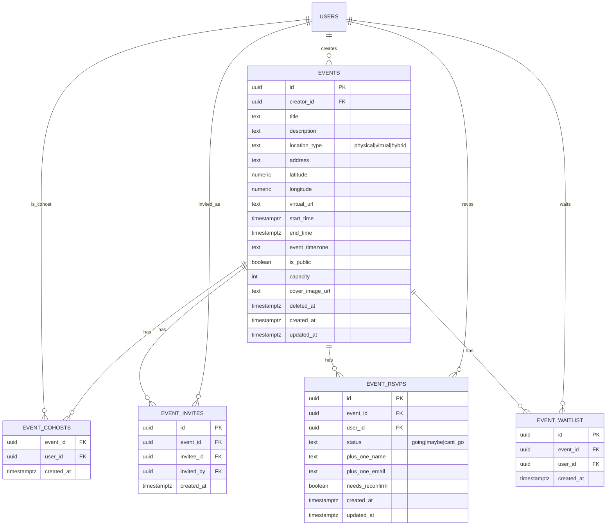
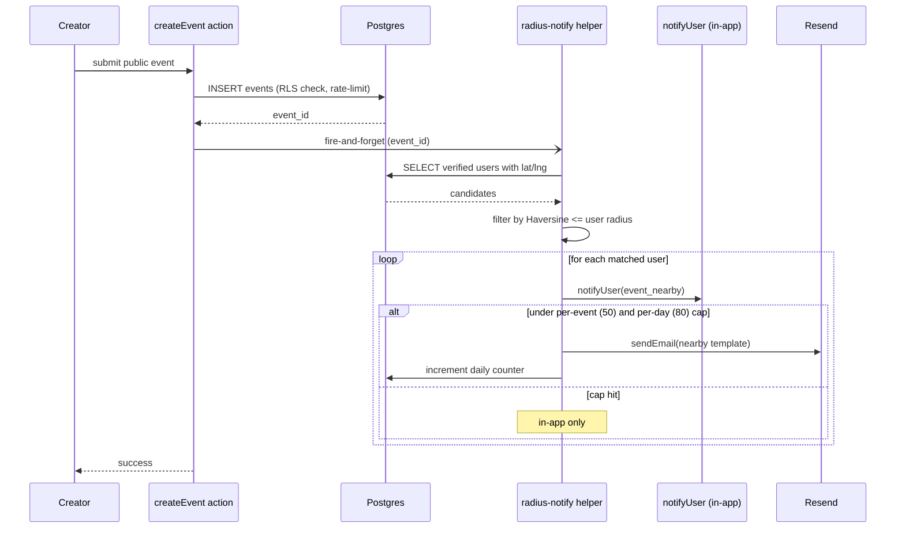

# AlumNet — Feature Requirements

> Deep-dive functional requirements for each feature. For status tracking, see `SPEC.md`. For build order, see `PLAN.md`.

---

## Table of Contents

1. [Core Concepts](#core-concepts)
2. [User Roles & Permissions](#user-roles--permissions)
3. [Features (F1–F13)](#features)
4. [Non-Functional Requirements](#non-functional-requirements)
5. [UI/UX Guidelines](#uiux-guidelines)
6. [Future Scaling Path](#future-scaling-path)

---

## Core Concepts

### What is AlumNet?
A web platform where verified alumni of a single school can discover and connect with each other based on career field, education, location, and professional interests. Think "LinkedIn, but scoped to your school and focused on alumni-to-alumni connections."

### Key Principles
- **Verified community**: Only confirmed alumni get full access. Trust is the foundation.
- **Progressive engagement**: Low-friction signup → nudge toward rich profiles → meaningful connections.
- **Privacy by default**: Contact details hidden until connected. Users control their visibility.
- **Ship lean, scale later**: Start with free-tier infrastructure and simple algorithms. Design for future upgrades.

---

## User Roles & Permissions

### Regular User (Unverified)
- Can sign up and create a basic profile
- Can browse alumni directory (names, photos, field, graduation year only)
- **Cannot** message, connect, or see detailed profiles
- Sees a banner prompting verification

### Regular User (Verified)
- Full directory access with search and filters
- Can send/accept connection requests
- Can message connected alumni (real-time)
- Can join groups
- Can set availability tags and visibility controls
- Can export and delete their account

### Moderator
- Everything a verified user can do, plus:
- Access to the **report queue** (flagged messages)
- Can **warn** or **mute** users (temporary)
- Cannot ban, delete users, or access admin settings

### Admin
- Everything a moderator can do, plus:
- **Verification queue**: approve/reject alumni signups
- **User management**: ban, suspend, delete accounts
- **Taxonomy management**: add/edit industry categories and specializations
- **Bulk invite**: upload CSV of alumni emails to send invitations
- **Announcements**: create platform-wide notices
- **Analytics dashboard**: signups, active users, connections, messages
- **Data export**: export platform data

---

## Features

### F1. Authentication
- **Signup**: email + password via Supabase Auth
- **Login**: email + password, with "forgot password" flow
- **OAuth**: Google (Sign in with Google). LinkedIn deferred.
- **Session management**: JWT-based via Supabase, auto-refresh
- After signup, user lands on onboarding flow (not the main app)

#### Server-Side Auth Details
- **`public.users` table**: A companion table to Supabase's `auth.users`. Stores app-specific fields (`role`, `verification_status`, `is_active`, `deleted_at`). Linked via `id` referencing `auth.users.id` with `on delete cascade`.
- **Auto-creation trigger**: A Postgres trigger (`on_auth_user_created`) fires after every `auth.users` insert and creates the corresponding `public.users` row with defaults (`role: 'user'`, `verification_status: 'unverified'`, `is_active: true`).
- **`updated_at` trigger**: A Postgres trigger (`on_users_updated`) automatically sets `updated_at = now()` on every `public.users` update. This pattern is reused for all tables with `updated_at`.
- **Email confirmation**: Disabled in development (Supabase default for local dev). In production, Supabase's email confirmation can be enabled via the dashboard — the signup flow already handles the case where `data.user` may not have a confirmed session.
- **Password reset flow**: Uses Supabase's `resetPasswordForEmail()` which sends a magic link. The link redirects to `/auth/callback?next=/reset-password` where a route handler exchanges the code for a session. The reset password response always returns success to prevent email enumeration.
- **Reset password page** (`/reset-password`): Dedicated page where users land after clicking the password reset email link. Authenticated page (user has a session from the code exchange).
- **Auth callback route** (`/auth/callback`): Handles code exchange for all Supabase email flows (password reset, email verification). Redirects to the `next` query param on success, or `/login` on failure.
- **Middleware session refresh**: The Next.js middleware calls `supabase.auth.getUser()` on every request. This is mandatory — it refreshes the JWT token and ensures Server Components receive a valid session.
- **RLS dependency**: All RLS policies on `public.users` (and future tables) use `auth.uid()` to identify the current user. The middleware's session refresh ensures `auth.uid()` is always current.
- **Validation**: All auth Server Actions validate input with Zod before calling Supabase. The signup action validates email format, password min length (8 chars), and password confirmation match. Login validates email format and password presence.
- **Error handling**: Auth Server Actions return `ActionResult<T>`. Supabase errors are logged server-side with structured format (`[ServerAction:actionName]`) and sanitized before returning to the client. Specific errors (e.g., "already registered") are mapped to user-friendly messages.

#### Production Email Configuration
- **Supabase Auth emails** (registration confirmation, password reset) use Supabase's built-in email service
- **Local dev**: Emails captured by Inbucket (http://localhost:54324) — no real emails sent
- **Production setup**:
  - Enable email confirmations in Supabase dashboard (Auth → Settings → Enable email confirmations)
  - Configure custom SMTP (recommended: SendGrid, AWS SES, or Resend) in Supabase dashboard for reliable delivery
  - Customize email templates in Supabase dashboard (branded registration confirmation, password reset emails)
  - Set `NEXT_PUBLIC_SITE_URL` to production URL (used in email redirect links)
- **Registration flow with confirmation enabled**:
  - User signs up → receives confirmation email → clicks link → redirected to `/auth/callback` → session created → redirected to onboarding
  - Until confirmed, user cannot log in (Supabase enforces this)
  - Signup page should show "Check your email" message after submission
- **Password reset flow** (already implemented):
  - User enters email on forgot-password page → Supabase sends reset link → user clicks link → `/auth/callback?next=/reset-password` → user sets new password

#### Google OAuth Details
- **Flow**: Client-side initiation via `supabase.auth.signInWithOAuth({ provider: 'google' })`. Uses Supabase's PKCE flow — redirects to Google consent screen, then back to `/auth/callback?code=...` for code exchange. Same callback route and proxy code exchange logic as email flows.
- **Account linking**: Supabase "Automatic user linking" enabled — if Google email matches an existing email/password account, identities are merged. No duplicate `public.users` rows.
- **New user flow**: `handle_new_user()` trigger fires on OAuth signup, creating `public.users` row with defaults (`role: 'user'`, `verification_status: 'unverified'`). User redirected to `/onboarding` (proxy enforces profile requirement).
- **UI**: "Continue with Google" button on both `/login` and `/signup` pages, above the email/password form with an "or" divider.
- **No backend changes**: No new migrations, no server action, no proxy/callback changes. Existing PKCE infrastructure handles OAuth identically to email flows.
- **Configuration**: Google OAuth credentials (`GOOGLE_CLIENT_ID`, `GOOGLE_CLIENT_SECRET`) configured in Supabase dashboard (production) and `supabase/config.toml` via env vars (local dev).
- **Edge cases**: Cancelled consent → user stays on login page. Banned/suspended → proxy redirects to `/banned`. Self-deleted → proxy redirects to `/account-deleted`.

#### Google Profile Import (Onboarding)

When a user signs up via Google OAuth, Supabase stores their Google profile metadata in `auth.users.raw_user_meta_data` (fields: `full_name`, `avatar_url`, `picture`, `name`). This data should be used to pre-populate the onboarding form for a smoother experience.

**Behavior**:
- **Name pre-fill**: The `full_name` field on the onboarding form is pre-populated with the Google display name (from `user_metadata.full_name` or `user_metadata.name`). The field remains editable — user can change it.
- **Avatar pre-fill**: The Google profile picture URL (from `user_metadata.avatar_url` or `user_metadata.picture`) is shown as the photo preview on the onboarding form. If the user does not upload a custom photo, this URL is used as `profiles.photo_url`.
- **Custom photo takes priority**: If the user uploads a photo via the file input, it is uploaded to the `avatars` storage bucket as usual, and the Google avatar URL is ignored.
- **Remove option**: User can remove the pre-filled Google avatar (clear the preview), in which case no photo is set unless they upload one.
- **Email-password users**: No change — name field is blank, no photo preview. The feature only activates when Google metadata is present.

**Implementation approach**:
1. **`onboarding/page.tsx`** (Server Component): Read `user.user_metadata.full_name` and `user.user_metadata.avatar_url` from the authenticated Supabase user. Pass as `defaultName` and `googleAvatarUrl` props to `OnboardingForm`.
2. **`onboarding-form.tsx`** (Client Component): Accept new props. Set `defaultValue` on name input. Initialize photo preview with Google avatar URL. Include a hidden input `google_avatar_url` so the server action knows the fallback.
3. **`onboarding/actions.ts`** (Server Action): If no photo file is uploaded but `google_avatar_url` is present in form data, validate it's a Google-hosted URL (`lh3.googleusercontent.com` or similar) and use it as `photo_url`. No storage upload needed — Google URLs are publicly accessible.

**No schema changes**: `profiles.photo_url` already accepts any URL string. Google avatar URLs are stable, publicly accessible CDN links.

**Edge cases**:
- Google account without profile picture → no avatar pre-fill, behaves like email signup
- Google display name is empty or whitespace → no name pre-fill
- Google avatar URL is invalid/expired → profile created without photo (graceful degradation)
- User changes Google avatar after signup → `photo_url` still points to old URL (acceptable — user can update via profile edit)

### F2. Alumni Verification
- **Trigger**: user submits verification request with supporting info (graduation year, student ID, degree program)
- **Queue**: admins see pending requests in dashboard, can approve/reject with optional message
- **Status**: `unverified` → `pending` → `verified` or `rejected`
- **Rejected users**: can re-submit with updated info
- **Unverified access**: can browse directory (limited fields only), see the value of the platform, but cannot connect or message

### F3. Profile System

#### Required at signup (progressive — collect minimally, prompt for more later):
- Full name
- Graduation year
- One primary career field (from taxonomy)

#### Prompted after signup (onboarding quiz + progressive nudges):
- Profile photo
- Current job title & company
- Industry specialization (level 2 of taxonomy)
- Location (country → state/province → city)
- Education history
- Bio / "About me"

#### Career History (LinkedIn-style):
- Multiple entries, each with: job title, company, industry, specialization, start date, end date (or "Present"), description (optional)
- One entry marked as "current"
- Displayed as a timeline on the profile

#### Education History:
- Multiple entries: institution, degree, field of study, start year, end year
- School entry auto-populated from signup data

#### Availability Tags (checkboxes):
- Open to mentoring
- Open to coffee chats
- Hiring / looking for referrals
- Looking for work
- Open to collaboration
- Not currently available (hides from recommendations but profile still exists)

#### Visibility Controls (Phase 1 — Connected-only details):
- **Public to all verified alumni**: name, photo, graduation year, primary field, current job title
- **Visible only to connections**: email, phone, full career history, education details, location (city-level), bio
- **Phase 2 (future)**: per-field granular toggles

### F4. Industry Taxonomy (Two-Level)

**Level 1 — Industries** (~20):
Technology, Finance & Banking, Healthcare & Medicine, Education, Law, Engineering, Arts & Entertainment, Media & Communications, Government & Public Policy, Non-Profit, Consulting, Real Estate, Retail & E-commerce, Manufacturing, Energy & Environment, Agriculture, Transportation & Logistics, Hospitality & Tourism, Sports & Fitness, Research & Academia

**Level 2 — Specializations** (5-15 per industry, examples):
- Technology → Software Engineering, Data Science & AI/ML, Product Management, Cybersecurity, DevOps & Infrastructure, UX/UI Design, Mobile Development
- Finance → Investment Banking, Venture Capital, Financial Planning, Accounting, Fintech, Insurance
- Healthcare → Clinical Medicine, Nursing, Public Health, Pharmaceuticals, Biotech, Health Administration

Admin can add/edit/archive categories. Users select one primary + optional secondary field.

### F5. Alumni Directory & Search

#### Search bar:
- Full-text search across name, job title, company, bio
- Powered by Postgres `tsvector` / `ts_query` (Supabase)

#### Filters (combinable):
- Industry (level 1)
- Specialization (level 2)
- Graduation year (range)
- Location (country, state, city — hierarchical)
- Availability tags
- Currently employed at (company name)
- Degree type

#### Results:
- Card grid layout showing: photo, name, current title, company, field, location, grad year
- Pagination: cursor-based, 20 results per page
- Sort by: relevance (default), graduation year, name, recently active

### F6. Recommendation Engine

#### Rule-Based Scoring (Phase 1):
Each alumni pair gets a similarity score based on weighted factors:

| Factor | Weight | Logic |
|--------|--------|-------|
| Same specialization | +15 | Exact level-2 match |
| Same industry | +10 | Exact level-1 match |
| Same city | +8 | Exact match |
| Same state/province | +5 | If not same city |
| Same country | +3 | If not same state |
| Graduation year proximity | +5 to +1 | ±1 year = +5, ±2 = +4, ... ±5 = +1 |
| Same company (current) | +7 | Working at the same place |
| Availability match | +5 | Mentoring seeker ↔ mentor available |
| Mutual connections | +3 per | Social graph overlap |

#### Display:
- "Suggested Alumni" section on dashboard (top 10-20 scored profiles)
- "Alumni like you" carousel on profile pages
- Refreshed daily or on profile update

#### Cold-Start Strategy (new users with sparse profiles):
1. **Onboarding quiz** (immediately after signup): "What field are you in?", "What are you looking for?", "Where are you based?" — seeds the scoring
2. **Same-year classmates**: always available since graduation year is required
3. **Popular/active profiles**: most-connected or recently-active alumni as fallback

#### Phase 2 (future): Embedding-based similarity
- Encode profiles as vectors using pgvector
- Semantic matching: "Data Scientist" ≈ "ML Engineer"
- Hybrid: rule-based + vector similarity

### F7. Connection System
- **Send request**: with optional message ("Hi, I'd love to connect because...")
- **Receive request**: notification (in-app + email)
- **Actions**: accept, reject, or ignore
- **Connected state**: unlocks detailed profile view + messaging
- **Disconnect**: either party can remove connection at any time
- **Block**: prevents all future contact and hides from each other's search results

### F8. Real-Time Messaging
- **Powered by**: Supabase Realtime (WebSocket)
- **Access**: only between connected alumni
- **Features**:
  - 1-on-1 conversations
  - Message list with last message preview, unread count
  - Real-time typing indicators (stretch goal)
  - Read receipts (stretch goal)
  - Message timestamps
- **Rate limiting**:
  - New users (< 7 days verified): 10 messages/day, 5 new conversations/day
  - Established users: 50 messages/day, 20 new conversations/day
  - Rate limit warning shown before hitting cap
- **Moderation**:
  - "Report this message" button on each message
  - Reported messages go to moderator queue with context (full conversation)
  - Reporter stays anonymous to the reported user

### F9. Notifications

#### In-App:
- Bell icon in navbar with unread count badge
- Notification dropdown with recent items
- Full notification page for history
- Types: connection request, connection accepted, new message, profile view (stretch), group invite, admin announcement, verification status update

#### Email:
- Triggered by: new connection request, new message (if not read within 15 min), verification approved/rejected, weekly digest (optional)
- Unsubscribe link in every email
- Email service: Resend (free tier: 100 emails/day)
- User can configure email preferences (per notification type)

### F9b. Alumni World Map

Interactive geographic visualization of where alumni are located worldwide.

#### Access:
- **Verified users only** — unverified users redirected to `/directory`
- Aggregated counts only — no individual alumni identifiable from map data
- City-level data respects existing profile visibility rules (names not shown)

#### Map Technology:
- **Mapbox GL JS** via `react-map-gl` — vector tiles, smooth zoom/pan
- **Dark mode**: Mapbox light/dark style switching based on app theme
- **Env**: `NEXT_PUBLIC_MAPBOX_TOKEN` (public, restricted to domain in production)

#### Visual Design:
- **Country view**: Choropleth-style colored circles sized by alumni count (5 color buckets, light→dark blue)
- **Region/city view**: Bubble markers with count labels, radius proportional to `log(count)`
- **Transitions**: Smooth `flyTo` animations (1500ms) on drill-down, fade-in markers

#### Interaction:
- **Drill-down**: Country → State/Province → City (3 levels)
- **Click region**: Shows region stats in sidebar + "View in Directory" link (pre-filtered to that location)
- **Hover**: Tooltip with region name + alumni count
- **Zoom/pan**: Full Mapbox navigation controls + fullscreen

#### Filters (sidebar):
- Industry (level 1) + Specialization (level 2, dependent)
- Graduation year range (min/max)
- No name search (aggregated data only)
- URL state via `nuqs` for bookmarkable filtered views

#### Layout:
- **Desktop**: Full-width map + collapsible sidebar (320px, left side)
- **Mobile (<768px)**: Full-width map + bottom sheet (triggered by floating button)
- **Sidebar contents**: Overview stats (total alumni, total countries), breadcrumb navigation, filters, selected region stats card

#### Geocoding (Hybrid strategy):
- **Country level**: Static JSON lookup (~200 country name→centroid mappings) — no API needed
- **City/state level**: Nominatim geocoding on profile save — stores `latitude`, `longitude`, `location_geocoded_at` in profiles table
- **Integration**: Fire-and-forget geocoding in `updateProfile` and `completeOnboardingQuiz` server actions
- **Backfill**: `scripts/backfill-geocoding.ts` for existing profiles (Nominatim, 1 req/sec)

#### Admin Map (`/admin/map`):
- **Toggle**: "Include unverified users" switch (shows verified + unverified counts per country)
- **Trend data**: Monthly new-user counts per country (last 6 months)
- **Stats**: Verified vs unverified breakdown in sidebar
- Reuses same `MapView`, `MapSidebar`, `MapFilters` components from user map

#### Database:
- **Migration 00023**: Adds `latitude`, `longitude`, `location_geocoded_at` to profiles. Partial index on `(latitude, longitude) WHERE latitude IS NOT NULL`.
- **Migration 00024**: 5 RPC functions (`SECURITY DEFINER`):
  - `get_map_country_counts(p_filters)` — verified users by country
  - `get_map_region_counts(p_country, p_filters)` — states within country
  - `get_map_city_counts(p_country, p_state, p_filters)` — cities within state
  - `get_map_country_counts_admin(p_include_unverified, p_filters)` — admin with verified/unverified split
  - `get_map_trend_data(p_country, p_months)` — admin monthly growth

#### Navigation:
- Main navbar: Dashboard → Directory → **Map** → Connections → Messages → Groups → Verification
- Admin navbar: Verification → Users → Taxonomy → Analytics → **Map** → Back to App

### F10. Groups (Basic — Admin-Created)

- **Creation**: admins create groups with name, description, type (year-based, field-based, location-based, custom)
- **Membership**: verified alumni can browse and join groups
- **Group page**: member list with search/filter, group description
- **No group chat** in Phase 1 — just a member directory within the group
- **Auto-groups** (stretch): system auto-creates groups for each graduation year and each industry

#### Phase 2 (future): Full Community Groups
- User-created groups
- Group discussion boards / group chat
- Group events
- Group moderation

### F11. Admin Dashboard

#### Verification Queue:
- List of pending verification requests
- View submitted info (name, grad year, student ID, degree)
- Approve / reject with optional message to user
- Bulk approve (select multiple)

#### User Management:
- Searchable user list with filters (role, status, verification)
- View any user's full profile
- Actions: verify, ban (permanent), suspend (temporary with duration), promote to moderator, demote, delete account
- Action audit log (who did what, when)

#### Taxonomy Management:
- CRUD for industries and specializations
- Archive (soft-delete) categories that are no longer relevant
- See how many users are tagged with each category

#### Bulk Invite:
- Upload CSV with columns: email, name (optional), graduation year (optional)
- System sends invite emails with signup link
- Track: invited, signed up, verified

#### Announcements:
- Create platform-wide notices (title, body, optional link)
- Display as banner on main app or in notification feed
- Can be dismissed by users
- Schedule for future publication (stretch)

#### Analytics:
- Total users (by status: unverified, pending, verified)
- Signups over time (chart)
- Active users (daily/weekly/monthly)
- Connections made over time
- Messages sent over time
- Most popular industries/specializations
- Top locations

### F12. Moderator Dashboard

#### Report Queue:
- List of reported messages with status (pending, reviewed, actioned)
- View full conversation context
- Actions: dismiss report, warn user, mute user (1 day, 7 days, 30 days)
- Escalate to admin (for ban-worthy offenses)

#### Limited User Actions:
- Can warn users (sends notification)
- Can mute users (prevents messaging for duration)
- Cannot ban, suspend, delete, or modify user roles
- Cannot access analytics, taxonomy, or bulk invite

### F13. Account Management

#### Profile Update Prompts:
- In-app banner: "Your profile was last updated X months ago. Is it still accurate?"
- Email nudge every 6 months (configurable by admin)
- Quick-update flow: confirm or update key fields (job, location, availability)

#### Account Deletion:
1. User requests deletion from settings
2. Data export generated (JSON): profile, connections, messages, groups
3. Account soft-deleted: hidden from search, connections removed, messages anonymized ("Deleted User")
4. 30-day grace period: user can cancel and reactivate
5. After 30 days: hard delete of all personal data from database
6. Confirmation email at each step

---

### F14. Events (SPEC rows F47a–F47e)

A first-class Events system so verified alumni can organize meetups, reunions, workshops, and virtual gatherings, invite people from their connections, and surface public events to nearby alumni.

The feature is split into five session-sized sub-features. F47a is the core and blocks everything else. F47b–e can ship in any order after F47a, with F47d the heaviest.

**Design decisions locked during planning (see plan file `prancy-beaming-dongarra.md`):**

| Area | Decision |
|---|---|
| Who can create | Verified alumni only. Rate-limited to **3 active future events per rolling 7 days**. |
| Privacy | Public (listed on Events page + nearby-notify eligible) or Private (invite-only, never listed). |
| Location type | **Physical / Virtual / Hybrid**. Physical/hybrid require address + geocoded lat/lng. Virtual/hybrid require a meeting URL. |
| Timezones | Store as `timestamptz` UTC + a separate `event_timezone` (IANA string). Detail page shows event local time and viewer's local time. For virtual-only events, viewer local is primary. |
| RSVP | Going / Maybe / Can't go. Creator-set optional capacity. "Going" overflow → waitlist, auto-promoted on drops (transactional). |
| Invitations | Private events: creator invites from their verified connections. Each invitee may add **one +1 guest** (name + optional email, no account required). |
| Radius notify | User-set preference `notify_events_within_km` (default off). Creator does NOT choose who is notified. In-app + email, **hard-capped 50/event and 80/day**; overflow → in-app only. |
| Co-hosts | Creator + up to 3 co-hosts (must be verified connections). Co-hosts edit/invite/manage RSVPs; cannot delete the event or add more co-hosts. |
| Edit cascade | Editing start/end/location/location_type on an event with RSVPs → notify all invitees + attendees and **reset RSVPs** to `needs_reconfirm` (require re-confirmation). Title/description/cover edits notify without resetting. |
| Cancellation | Soft-delete. Notify all invitees + attendees via in-app + email. |
| Attendee privacy | Count visible to all viewers of a visible event. Names visible **only to other "Going" attendees**. |
| Past events | Auto-archive to "Past" tab once `end_time < now()`. RSVPs frozen. Host can post a recap comment (when F47c ships). |
| Discussion (F47c) | Flat append-only comment thread on each event. Reports integrate with existing moderation queue. |
| Recurring (F47d) | Weekly or monthly with an explicit end date. Materialized per-occurrence so RSVPs stay per-occurrence. Edit UI offers this-occurrence / this-and-following (series split) / all. |
| QR check-in (F47e) | Host displays a rotating signed QR token day-of. Attendees scan; server marks `checked_in = true` if they hold a Going RSVP and current time is inside the event window. |

#### F47a. Events: core (CRUD + RSVP + invites)

**User stories:**
- As a verified alumnus, I create a private reunion and invite 15 classmates from my connections so we can coordinate a dinner.
- As an invitee, I RSVP "Going" and add my spouse as a +1 with their email so they receive the calendar invite.
- As a creator, I edit the venue three days out; all RSVPs reset and everyone re-confirms.
- As a viewer, I see "42 going" on a public event but can only see the names once I RSVP Going myself.
- As an attendee, I download the `.ics` and add it to my calendar.

**Functional requirements:**
- Server actions for: `createEvent`, `updateEvent`, `cancelEvent`, `addCoHost`, `removeCoHost`, `inviteConnections`, `rsvp` (going/maybe/cant_go, includes optional +1 name/email), `cancelRsvp`, `promoteFromWaitlist` (internal).
- All actions return `ActionResult<T>` and validate with Zod. Creator/co-host auth enforced in RLS + action.
- Create gate: `verification_status = 'verified'` + rate-limit check (max 3 rows in `events` where `creator_id = me` AND `start_time >= now()` AND `deleted_at IS NULL`, within rolling 7 days of `created_at`).
- Geocoding: reuse the existing Nominatim helper used by `updateProfile` to populate `latitude`/`longitude` from the typed address on create/edit (fire-and-forget).
- Storage: cover image goes to a new `event-covers` bucket (public read, authenticated write, 2MB/image, JPEG/PNG/WebP).
- Waitlist promotion: when a Going RSVP changes to Can't go and `going_count < capacity`, promote the oldest waitlisted entry inside the same transaction. Notify the promoted user.
- Edit cascade helper: a single server function decides whether an edit is "major" (start_time, end_time, location_type, address, virtual_url) and, if so, marks `event_rsvps.needs_reconfirm = true` before sending notifications via `notifyUser()`. Users with `needs_reconfirm = true` count as "not going" until they re-confirm.
- `.ics` generation: server route `/api/events/[id]/ics` returns a signed iCalendar file built from the event fields + `event_timezone`. Viewers with access (public event OR invitee OR going) can fetch it.
- Events list page `/events` with Upcoming + Past tabs, search by title, optional `near me` filter that reuses the existing lat/lng on the viewer's profile (client-side filter for v1, RPC later).
- Detail page `/events/[id]` shows cover, title, times (event local + viewer local), location (Mapbox single-pin reusing F28 setup), description, RSVP buttons, attendee count, attendee names (Going only), `.ics` download, "Message the host" button.
- Navbar entry "Events" added next to Groups.

**Edge cases:**
- Capacity decrease: if new capacity is less than current Going count, push the tail of Going onto waitlist (ordered by earliest RSVP time preserved).
- Edit that moves an event into the past: reject with a validation error.
- Invitee removes themselves from the creator's connections after being invited: invitation remains valid (we don't retroactively un-invite).
- +1 email is optional; if provided it counts against the per-day Resend cap and shares the budget with radius notifications (F47b).
- Cover image deleted from storage: fall back to a gradient placeholder.
- Past-events tab is populated purely by `end_time < now()`; no pg_cron job needed.

**Acceptance criteria:**
- [ ] A verified user can create, edit, cancel, and list events.
- [ ] An unverified user cannot create an event; the rate-limit blocks a 4th future event in 7 days.
- [ ] Private events never appear on `/events`; only invitees see them on their profile/dashboard.
- [ ] RSVP state machine (going/maybe/cant_go/waitlist) behaves correctly under capacity constraints.
- [ ] A +1 guest with an email receives a calendar invite email (one-time, no account).
- [ ] Editing the start time marks all RSVPs `needs_reconfirm` and sends notifications.
- [ ] `.ics` file opens correctly in Apple Calendar, Google Calendar, and Outlook.
- [ ] Mapbox pin displays at the geocoded location on the detail page.
- [ ] Attendee names hidden from viewers who are not themselves Going.
- [ ] RLS prevents a random verified user from reading a private event they weren't invited to.
- [ ] Build is clean; happy-path + capacity + edit-cascade tests pass.

**Out of scope for F47a:** radius notifications, comments, recurring, QR check-in.

**Mermaid ER diagram (F47a tables):**



#### F47b. Events: radius notifications

**User stories:**
- As a verified alumnus living in Saigon, I set "notify me within 25 km" and receive an in-app alert when a reunion is posted 10 km away.
- As an organizer, I mark my event public and immediately have relevant nearby alumni surfaced in their notification bell — without doxxing them or letting me see who was reached.

**Functional requirements:**
- Add `notify_events_within_km` (integer, nullable) to `profiles`. Null = opt-out. Settings UI in `/settings/notifications`.
- On public event create (inside `createEvent`, fire-and-forget), query verified users whose `latitude`/`longitude` is non-null AND the great-circle distance to the event is ≤ their `notify_events_within_km`. Use a plain SQL RPC with Haversine; no PostGIS. Exclude the creator and blocked users.
- For each match: create an in-app notification (`type = 'event_nearby'`) via `notifyUser()`. If under the per-event (50) and per-day (80) email caps, also send a Resend email with a compact event summary and deep link.
- The email cap shares the same daily budget as +1 guest invites. Track daily sent count in a tiny `daily_email_counters` table (upsert `(date, counter_key)`).
- The creator never learns who was notified (no UI surface for it).

**Edge cases:**
- User has coordinates but `notify_events_within_km = null`: no notification.
- Cap hit mid-broadcast: remaining users still get in-app notifications, no email.
- Event edited to become private: future broadcasts stop; in-app notifications already sent remain in recipients' histories.

**Acceptance criteria:**
- [ ] Opt-in default off.
- [ ] Haversine filter returns only users within radius.
- [ ] Email hard-cap enforced; the 51st recipient for a given event gets in-app only.
- [ ] Creator has no UI to see the notified list.
- [ ] Tests cover the cap logic and the distance filter.

**Mermaid sequence diagram (radius-notify flow):**



#### F47c. Events: flat comment thread

**User stories:**
- As an attendee, I ask "is parking free?" in the event thread and the host replies.
- As the host, I post an update about a venue change and it appears as a regular comment; everyone who's RSVPed "Going" is notified.

**Functional requirements:**
- `event_comments` table: id, event_id, user_id, body, created_at, deleted_at.
- RLS: read if the user can see the event; insert if the user can see the event AND is not muted.
- New comment fires `notifyUserGrouped` to the host + all prior commenters in the thread (grouping so a busy thread doesn't spam).
- Report a comment from the detail page → feeds into existing moderation queue with `content_type = 'event_comment'`.
- Append-only for v1 (no edit, just soft-delete by author or moderator).

**Acceptance criteria:**
- [ ] Muted users cannot post comments.
- [ ] Notifications grouped per thread per user per hour.
- [ ] Reports integrate with the existing queue.

#### F47d. Events: recurring (weekly/monthly)

**User stories:**
- As an organizer, I schedule a weekly Saturday coffee meetup for three months; the system creates 13 occurrence rows automatically.
- I change the time of "this occurrence and all following" — the original series is closed and a new one spawns from my edit point.

**Functional requirements:**
- `event_series` table: id, creator_id, rrule (simple enum: `weekly` / `monthly`), interval, until_date, created_at.
- On series create: materialize N `events` rows, each linked via `events.series_id`.
- Edit UI offers three options: this occurrence / this-and-following / all.
- "This-and-following" splits the series: close the current series at the occurrence before the edit, create a new series starting at the edited occurrence.
- Cancel-one marks a single child event as canceled. Cancel-series soft-deletes the series AND every non-past occurrence.
- RSVPs and waitlists remain per-occurrence — no cross-occurrence RSVP.

**Edge cases:**
- Capacity change on a series: applies to the chosen scope (one / this-and-following / all).
- Past occurrences are never modified.

**Acceptance criteria:**
- [ ] Creating a weekly series for 3 months materializes exactly 13 child rows.
- [ ] Series-split on edit produces clean contiguous coverage with no overlap or gap.
- [ ] RSVPs from occurrence N are not leaked to occurrence N+1.

#### F47e. Events: day-of QR check-in

**User stories:**
- As a host, on the day of my reunion, I open a "Check-in" page that displays a QR code that rotates every 60 seconds.
- As an attendee, I scan the QR with my phone camera; a page opens and marks me "checked in".

**Functional requirements:**
- `event_checkins` table: id, event_id, user_id, checked_in_at. Unique on (event_id, user_id).
- Host page `/events/[id]/host` (visible only to creator and co-hosts) shows a signed rotating token encoded as a QR via a client-side library (e.g., `qrcode.react`). Token payload: `{ event_id, issued_at, nonce }` signed with a server secret; expires after 90 seconds.
- Scanner route `/events/[id]/checkin?token=…` validates the token signature + freshness, then inserts a checkin row if the current user has a Going RSVP and `now()` is within `[start_time - 2h, end_time + 2h]`.
- Host page shows live checked-in count + a searchable list.

**Acceptance criteria:**
- [ ] Replayed or expired tokens are rejected.
- [ ] Users without a Going RSVP cannot check in.
- [ ] Check-ins outside the time window are rejected with a clear error.
- [ ] Only the creator and co-hosts can open the host page.

#### F47f. Events: group linkage + bulk-invite members

The default F47a invite source is the creator's connections. That's the wrong model for a group-organized event — group members are usually *not* all connections of whoever is organizing. F47f adds a first-class link between an event and a group, plus a bulk-invite shortcut for group leaders.

**User stories:**
- As the owner of the "PTNK Class of 2012" group, I create a reunion event tied to the group and click "Invite all members" — every group member gets a notification and a bell ping, regardless of whether they are connected to me.
- As a group member scrolling the group detail page, I see an "Upcoming events" section listing group-linked events even if I wasn't explicitly invited.
- As a regular member of a group, I can create a group-linked event, but I cannot bulk-invite — only the owner or moderator can.

**Functional requirements:**
- Schema: add `events.group_id` (uuid, nullable, FK to `groups.id`, `ON DELETE SET NULL`). Indexed for group detail page lookups.
- Create/edit form: a "Link to group" picker showing groups the creator is a member of. Optional.
- RLS: if `group_id IS NOT NULL`, any active member of that group can read the event in addition to the existing visibility rules. Private events tied to a group become "visible to all group members" automatically — explicit invites are only about bell pings, not access control.
- New server action `bulkInviteGroupMembers(eventId)`:
  - Requires caller to have `group_members.role IN ('owner', 'moderator')` on the linked group.
  - Hard cap: the group must have ≤ 100 active members. Larger groups get a validation error directing them to use the per-member picker from F47a.
  - Rate limit: max 1 successful bulk invite per `group_id` per rolling 7 days (tracked via a `group_bulk_invite_log` table with `(group_id, invited_at)`).
  - Creates `event_invites` rows for every eligible member who doesn't already have one, then fires `notifyUser(type='event_invite')` + email via Resend for each. Email send respects the shared 80/day daily cap from F47b; overflow degrades to in-app only.
  - Group-linked invites do **not** get the `+1 guest` mechanic. `plus_one_name` / `plus_one_email` stay null on these RSVPs.
- Group detail page (`/groups/[slug]`) gets a new "Upcoming events" section listing `events WHERE group_id = :id AND start_time >= now() AND deleted_at IS NULL` ordered by `start_time`.
- Event detail page shows a "Organized by [Group name]" chip linking back to the group when `group_id` is set.
- A bulk-invite summary toast: "Invited 42 members. 3 were already invited or had blocked the creator."

**Edge cases:**
- Group soft-deleted after event creation: `group_id` remains set (FK is `ON DELETE SET NULL` only on hard delete). Group-scoped visibility stops working once the group's RLS hides it; the event falls back to its base public/private visibility.
- Member leaves the group after being bulk-invited: the invite remains valid — the member is still on `event_invites` and can still RSVP.
- Member joins the group after a bulk-invite has already happened: they gain read access automatically (visibility is group-derived) but do not receive a retroactive notification. The rate limit prevents the owner from re-running the bulk invite to catch new members within the 7-day window.
- Bulk-invite attempted on a group with 101+ members: server action returns a validation error with the member count and instructions to use the per-member picker.
- Creator is *not* a member of the group they try to link: reject at create time.
- Blocked users: bulk-invite skips any user who has blocked the event creator.

**Acceptance criteria:**
- [ ] An event can be optionally linked to a group at create time.
- [ ] A group-linked event is visible to all active members of that group via RLS, even without explicit invitation.
- [ ] Only `owner` / `moderator` roles can trigger `bulkInviteGroupMembers`; regular members get a permission error.
- [ ] Bulk invite on a 101-member group returns a hard error.
- [ ] A second bulk invite on the same group within 7 days returns a rate-limit error.
- [ ] Group detail page shows upcoming linked events.
- [ ] Event detail page shows the "Organized by [Group name]" chip when linked.
- [ ] Bulk-invited members do NOT have the +1 guest UI available on their RSVP form.
- [ ] Email cap is shared with F47b; overflow falls back to in-app only.

**Out of scope for F47f:** group calendars (a "calendar view" of all group events), cross-group event sharing, and making group linkage change after creation (v1 is create-time only).

---

### F15. Visual: Country Flags + Company Logos on Alumni Cards (SPEC row F48)

Improve visual scanning and professional feel of alumni cards by adding emoji country flags next to locations and company logos next to company names. Applies across all card types and location-displaying surfaces.

**Design decisions:**

| Area | Decision |
|---|---|
| Flags | Emoji flags — zero dependencies, map country name → ISO 3166-1 alpha-2 → regional indicator emoji |
| Logos | Logo.dev API (free tier 10K req/mo, API key required) |
| Domain mapping | `company_website` field on `career_entries` (preferred) + static map of ~100 major companies + guess (`companyname.com`) as fallback chain |
| Logo loading | Server-side proxy `/api/logo/[domain]` — keeps API key secret, enables HTTP caching |
| Caching | `Cache-Control: public, max-age=604800` (7 days) on proxy + `next/image` optimization at edge |
| Logo fallback | Styled company initial — first letter in a small indigo circle (consistent with existing avatar pattern) |
| Scope — flags | Everywhere location appears: directory, dashboard, profile page, connection list, group members |
| Scope — logos | All card types: directory `ProfileCard`, `RecommendationCard`, `PopularCard`, `RecommendationListItem` |
| Placement | Flag replaces the MapPin icon (flag itself implies location). Logo sits left of company name (~16-20px). |

**User stories:**
- As an alumnus browsing the directory, I can instantly see which country each person is based in by glancing at their flag emoji, without reading the full location text.
- As a user viewing recommendations, I recognize familiar company logos (Google, Meta, NVIDIA) at a glance, making the cards feel more professional and informative.
- When I add a career entry with a company website, the logo resolves reliably. When I don't provide one, the system guesses the domain or shows a clean initial fallback.
- As an unverified user, I don't see flags or logos (because I can't see location or company data per visibility tier rules).

**Functional requirements:**

#### 1. Country → flag utility (`src/lib/country-flags.ts`)
- Static map of ~250 country names → ISO 3166-1 alpha-2 codes.
- Function `countryToFlag(countryName: string): string | null`.
- Handle common variations: "United States" / "USA" / "US", "Vietnam" / "Viet Nam", "South Korea" / "Korea, Republic of", etc.
- Case-insensitive matching.
- Return `null` for unmapped or empty inputs.
- No external dependencies.

#### 2. Company → domain resolver (`src/lib/company-domain.ts`)
- Resolution chain (first match wins):
  1. `company_website` from the career entry (extract domain from URL if full URL provided).
  2. Static map for ~100 major companies (Google → google.com, Meta → meta.com, NVIDIA → nvidia.com, OpenAI → openai.com, VinAI → vinai.io, Cinnamon AI → cinnamon.is, Shopee → shopee.com, etc.).
  3. Guess: sanitize company name (lowercase, remove spaces/punctuation) → append `.com`.
- Function `companyToDomain(companyName: string, companyWebsite?: string | null): string | null`.

#### 3. Server-side logo proxy (`src/app/api/logo/[domain]/route.ts`)
- GET handler fetches from `https://img.logo.dev/{domain}?token={LOGO_DEV_API_KEY}&size=64`.
- Response headers: `Cache-Control: public, max-age=604800, stale-while-revalidate=86400`.
- On Logo.dev error/404: return HTTP 404 (let the client component handle fallback).
- Validate domain param: alphanumeric + dots + hyphens only (prevent SSRF).
- Env var: `LOGO_DEV_API_KEY` (server-only).

#### 4. `<CountryFlag>` component (`src/components/country-flag.tsx`)
- Server component (pure, no state).
- Props: `country: string | null`, `className?: string`.
- Renders `<span aria-label="{country} flag">{emoji}</span>` or `null` if no mapping.
- Emoji rendered at text size (inherits from parent).

#### 5. `<CompanyLogo>` component (`src/components/company-logo.tsx`)
- Client component (`"use client"` — needs `onError` for fallback).
- Props: `companyName: string`, `companyWebsite?: string | null`, `size?: number` (default 20).
- Renders `next/image` pointing to `/api/logo/${domain}` with `width={size}` and `height={size}`.
- On image error: falls back to styled initial circle — first letter of company name, indigo background, white text, rounded-full, matching `size`.
- If `companyToDomain()` returns null: render the initial directly (skip image attempt).

#### 6. Card updates
- **Directory `ProfileCard`** (`src/app/(main)/directory/directory-grid.tsx`): Replace `<MapPin>` icon with `<CountryFlag>`. Keep `<MapPin>` as fallback when country is null/unmapped. Add `<CompanyLogo>` before company name.
- **`RecommendationCard`** (`src/app/(main)/dashboard/recommendation-card.tsx`): Same changes.
- **`PopularCard`** (`src/app/(main)/dashboard/popular-card.tsx`): Same changes.
- **`RecommendationListItem`** (`src/app/(main)/dashboard/recommendation-list-item.tsx`): Same changes (smaller logo size for compact layout).

#### 7. Other surfaces (flags only)
- Profile view page: flag next to location.
- Connection list cards: flag next to location.
- Group member cards: flag next to location.
- (Logos are only on the main card types listed above — profile/connections/groups show company differently.)

#### 8. Schema change
- Migration: `ALTER TABLE career_entries ADD COLUMN company_website text;`
- No RLS changes (existing policies cover it).
- Update career entry form: add optional "Company website" text input.
- Update Zod schema + server action to accept `company_website`.

#### 9. Type updates
- Add `current_company_website: string | null` to `DirectoryProfile` in `src/lib/types.ts`.
- `RecommendedProfile` and `PopularProfile` inherit via `extends`.
- Update directory + recommendation queries to select `company_website` from the current career entry join.

**Edge cases:**
- Country is null or empty → no flag, show MapPin icon (current behavior).
- Country is a value not in the mapping (e.g., typo, rare territory) → no flag, show MapPin.
- Company is null → no logo, show briefcase icon (current behavior).
- Logo.dev returns 404 for unknown company → `<CompanyLogo>` renders styled initial.
- Logo.dev API is down or rate-limited → proxy returns 404 → fallback to initial.
- `LOGO_DEV_API_KEY` not set → proxy returns 500 → fallback to initial (graceful degradation in dev).
- `company_website` is a full URL (e.g., "https://google.com/careers") → extract just the domain.
- Very long company names → initial uses first character only.
- Visibility tier 1 (unverified) → company and location are stripped → no flag or logo rendered.
- Dark mode → initial circle should use `dark:` variants for contrast.

**Acceptance criteria:**
- [ ] Emoji flags render next to location for all mapped countries on directory, dashboard, profile, connections, and group member cards.
- [ ] Unmapped/null countries fall back to MapPin icon.
- [ ] Company logos render for known companies (Google, Meta, NVIDIA, OpenAI) on all card types.
- [ ] Unknown companies show a styled initial (first letter in indigo circle).
- [ ] Logo.dev proxy keeps the API key server-side (not in client bundle).
- [ ] Proxy responses are cached (7-day Cache-Control header).
- [ ] `company_website` field is saveable and loadable in career entry form.
- [ ] When `company_website` is provided, it takes priority for domain resolution.
- [ ] Visibility tiers respected: unverified viewers see neither flag nor logo.
- [ ] Flags have `aria-label` for screen reader accessibility.
- [ ] No layout shift when logos load or fall back (fixed dimensions).
- [ ] Build is clean; no new TypeScript errors.
- [ ] Works correctly in dark mode.

**Environment setup:**
- Sign up at logo.dev for a free API key (10K requests/month free tier).
- Add `LOGO_DEV_API_KEY=pk_...` to `.env.local` and Vercel environment variables.

---

### F16. UX: Toast-Before-Navigation Fix (SPEC row F49)

Fix the race condition where `toast.success()` fires immediately before `router.push()`, causing the page to navigate before the toast renders. Users never see confirmation feedback for their actions.

**Root cause:** `toast.success("Done")` queues a render in Sonner, but `router.push("/next")` starts navigation synchronously in the same call stack. The destination page loads (and the current component tree unmounts) before Sonner's render cycle completes.

**Design decisions:**

| Area | Decision |
|---|---|
| Pattern | URL search params — pass toast message as `?toast=...&toastType=success` to the destination page |
| Hook | `useToastFromUrl()` — reads params, fires toast, cleans URL via `window.history.replaceState` |
| Placement | Hook in `src/hooks/use-toast-from-url.ts`, called in shared layout or each destination page |
| URL cleanup | `window.history.replaceState` (not `router.replace`) to avoid a re-render cycle |
| Encoding | `encodeURIComponent` for message text; supports `toastType` param (`success` | `error`, default `success`) |
| nuqs | Not needed — this is a fire-once side effect, not persistent URL state |

**User stories:**
- As an alumnus completing the onboarding quiz, I want to see "Profile updated!" confirmation after being redirected to the dashboard.
- As a user creating an event, I want to see "Event created" after being redirected to the event detail page.
- As a new user signing up, I want to see the success message after being redirected to the onboarding page.

**Functional requirements:**

#### 1. `useToastFromUrl` hook (`src/hooks/use-toast-from-url.ts`)

- Client-only hook (`"use client"` file).
- On mount, reads `toast` and `toastType` from `window.location.search` (or `URLSearchParams`).
- If `toast` param exists, calls `toast.success(message)` or `toast.error(message)` based on `toastType`.
- Immediately cleans both params from the URL using `window.history.replaceState` (no navigation, no re-render).
- Runs only once (empty dependency array or `useRef` guard).

#### 2. Hook placement

- Call `useToastFromUrl()` in each destination page that receives toast-bearing navigations, or in a shared client wrapper in the `(main)` layout group.
- Preferred: shared wrapper in `(main)` layout so all authenticated pages support it without per-page changes.

#### 3. Refactor affected forms

Replace `toast.success(...); router.push(url)` with `router.push(url + "?toast=...&toastType=success")` in these files:

| # | File | Lines | Current pattern | Destination |
|---|---|---|---|---|
| 1 | `src/app/(main)/onboarding/onboarding-form.tsx` | 40-41 | `useEffect` → `toast.success` → `router.push` | `/onboarding/quiz` |
| 2 | `src/app/(main)/onboarding/quiz/quiz-form.tsx` | 80-81 | `startTransition` → `toast.success` → `router.push` | `/dashboard` |
| 3 | `src/app/(auth)/signup/signup-form.tsx` | 29-30, 34-35 | `useEffect` → `toast.success` → `router.push` | `/onboarding`, `/login` |
| 4 | `src/app/(main)/settings/quick-update/quick-update-form.tsx` | 44-45 | `useEffect` → `toast.success` → `router.push` | `/dashboard` |
| 5 | `src/app/(main)/events/event-form.tsx` | 92-95, 112-114 | `startTransition` → `toast.success` → `router.push` | `/events/{id}` |
| 6 | `src/app/(main)/events/[id]/host-actions.tsx` | 45-50 | `startTransition` → `toast.success` → `router.push` | `/events` |

For each file:
- Remove the `toast.success(...)` / `toast.error(...)` call before `router.push`.
- Append `?toast=${encodeURIComponent(message)}&toastType=success` to the `router.push` URL.
- Keep error toasts that do NOT navigate (those are fine as-is).

#### 4. Helper utility (optional)

A small `buildUrlWithToast(url: string, message: string, type?: "success" | "error"): string` utility to avoid repeating the URL construction logic in every form. Place in `src/lib/utils.ts` or co-locate with the hook.

#### 5. Auth layout coverage

The signup form redirects to `/onboarding` (in the `(main)` group) and `/login` (in the `(auth)` group). If the hook is only in the `(main)` layout, the `/login` redirect toast won't fire. Either:
- Also call the hook in the `(auth)` layout, or
- Accept that the `/login` redirect doesn't show a toast (it currently says "Check your email" which is important — so prefer adding it).

**Acceptance criteria:**
- [ ] `useToastFromUrl` hook exists and fires toasts from URL params on page load.
- [ ] URL params are cleaned after toast fires (no `?toast=...` visible in address bar).
- [ ] All 6 affected forms use URL-param pattern instead of pre-navigation toast.
- [ ] Toast appears reliably on the destination page after form submission.
- [ ] Error toasts that do NOT navigate are unchanged (still fire inline).
- [ ] No duplicate toasts on page refresh (params cleaned before re-read).
- [ ] Hook handles missing/empty params gracefully (no-op).
- [ ] Build is clean; no new TypeScript errors.
- [ ] Works in both light and dark mode.

---

## Non-Functional Requirements

### Performance
- **Core Web Vitals**: LCP < 2.5s, FID < 100ms, CLS < 0.1
- **Bundle size**: Target < 200KB initial JavaScript bundle
- **API response**: Server Actions < 500ms p95
- **Recharts lazy-loading** (P5, done 2026-03-14): Analytics dashboard dynamically imported — ~130KB removed from non-admin bundles
- **Supabase client singleton** (P8, done 2026-03-14): Browser client cached at module level — WebSocket connections reduced from 3-4 to 1
- **Missing database indexes** (P9, done 2026-03-14): 4 indexes for notifications, reports, announcements, warnings
- **Proxy query reduction** (P4, done 2026-03-14): Combined user status + profile existence into single nested select — 2 queries → 1 per request
- **Cached taxonomy data** (P6, done 2026-03-14): School, industries, specializations, and availability tag types cached via `unstable_cache` + service client — eliminates repeated DB queries for shared data (1h revalidation)
- **Dashboard parallelization** (P3, done 2026-03-14): Profile, recommendations, and popular alumni fetched in parallel — cold-start detection moved into RPC, eliminating ~200-400ms sequential wait
- **Query consolidation** (P2, done 2026-03-14): Directory uses PostgREST nested select for career + tags inline; recommendation RPCs include career/tags via LEFT JOIN LATERAL — dashboard 8→4 queries, directory 3→1
- **Message unread N+1** (P0, done 2026-03-14): Single `get_unread_counts` RPC replaces N per-conversation queries — biggest single improvement
- **Conversations RPC** (P10, done 2026-03-14): Single `get_user_conversations` RPC replaces 4+ sequential queries for conversation list
- **Profile page parallelization** (P7, done 2026-03-14): Visibility tier and relationship fetched in parallel — saves ~100-200ms per profile view
- **Image optimization** (P1, done 2026-03-14): All `` tags replaced with `next/image` `<Image>` — auto lazy-loading, WebP conversion, responsive srcSet. Message attachments kept as raw `` (signed URLs)
- **Performance plan**: See `docs/PERFORMANCE_PLAN.md` for full optimization roadmap (P0–P10)

### Accessibility
- **WCAG 2.1 AA** compliance
- Keyboard-navigable for all core flows
- Screen reader compatible

### SEO (F43)

Since most app content is behind authentication, SEO focuses on making the **public-facing pages** discoverable and shareable. The goal is to help alumni find the platform via Google when searching for their school's alumni network.

#### 1. `robots.txt` (Next.js convention file: `src/app/robots.ts`)
- Allow crawling of public pages: `/`, `/login`, `/signup`
- Disallow crawling of authenticated app routes: `/dashboard`, `/directory`, `/messages`, `/connections`, `/groups`, `/settings`, `/admin`, `/moderation`, `/onboarding`, `/verification`, `/reset-password`, `/account-deleted`, `/banned`
- Disallow crawling of API/auth routes: `/api/*`, `/auth/*`
- Reference the sitemap URL: `https://ptnkalum.com/sitemap.xml`

#### 2. `sitemap.xml` (Next.js convention file: `src/app/sitemap.ts`)
- Static entries only (no dynamic/authenticated content):
  - `/` — landing page (priority 1.0, changeFrequency: monthly)
  - `/login` — login page (priority 0.5, changeFrequency: yearly)
  - `/signup` — signup page (priority 0.8, changeFrequency: yearly)
- `lastModified` set to build date or hardcoded date
- Base URL from `NEXT_PUBLIC_SITE_URL` env var (fallback: `https://ptnkalum.com`)

#### 3. Per-Page Metadata (Next.js `metadata` export)
- **Root layout** (`src/app/layout.tsx`):
  - `metadataBase`: `new URL(process.env.NEXT_PUBLIC_SITE_URL || 'https://ptnkalum.com')`
  - `title.template`: `"%s | PTNKAlum"` (allows per-page titles)
  - `title.default`: `"PTNKAlum — Alumni Network"`
  - `description`: school-specific, keyword-rich (e.g., "Connect with PTNK alumni worldwide. Search by career, location, and graduation year.")
  - `openGraph`: type `website`, locale `vi_VN`, siteName `PTNKAlum`, default image (OG image)
  - `twitter`: card `summary_large_image`, default image
  - `robots.index`: true (default), individual pages override as needed
- **Login page**: title "Log In", `robots: { index: false }` (no indexing auth pages)
- **Signup page**: title "Sign Up", `robots: { index: false }`
- **Landing page** (`/`): title "PTNKAlum — PTNK Alumni Network", full description with keywords
- **All authenticated pages**: `robots: { index: false, follow: false }` (prevent indexing if crawlers reach them)

#### 4. Open Graph Image
- Static OG image at `src/app/opengraph-image.png` (or `.jpg`)
  - Dimensions: 1200×630px
  - Content: school logo/name + "Alumni Network" + tagline
  - Used as default when pages are shared on social media
- Alt text: "PTNKAlum — PTNK Alumni Network"

#### 5. JSON-LD Structured Data (on landing page)
- `Organization` schema on the landing page (`/`):
  ```json
  {
    "@context": "https://schema.org",
    "@type": "Organization",
    "name": "PTNKAlum",
    "url": "https://ptnkalum.com",
    "description": "Alumni network for PTNK graduates",
    "logo": "https://ptnkalum.com/logo.png"
  }
  ```
- Rendered as `<script type="application/ld+json">` in the page component
- `WebSite` schema with `potentialAction` for site search (optional, only if public search exists)

#### 6. Technical SEO Checklist
- Canonical URLs via `metadataBase` (Next.js auto-generates `<link rel="canonical">`)
- `lang` attribute on `<html>` (already set via `next-intl`)
- No duplicate content issues (authenticated routes disallowed in robots.txt)
- Fast page loads (LCP < 2.5s on landing page — already optimized)
- Mobile-friendly (already responsive)

#### Implementation Notes
- All SEO files use **Next.js App Router convention files** (`robots.ts`, `sitemap.ts`, `opengraph-image.png`) — no manual route handlers needed
- No schema changes or migrations required
- No new dependencies
- OG image can be a static file or generated with `next/og` (ImageResponse) — static preferred for simplicity
- Google Search Console verification via DNS TXT record in Cloudflare (manual step, not code)

### i18n Readiness
- English only for Phase 1
- Extract user-facing strings to constants (cheap now, expensive to retrofit later)

### Visual Theme (F44)

App-wide color palette: **indigo + warm amber accent** (see [ADR-024](docs/adrs/024-indigo-warm-accent-theme.md)).

- **Primary color**: indigo (`oklch(0.65 0.16 270)` light, `oklch(0.78 0.12 270)` dark)
- **Accent color**: warm amber (`oklch(0.94 0.04 75)` light, `oklch(0.32 0.04 75)` dark)
- **Color space**: oklch throughout for perceptual uniformity
- **Scope**: All CSS custom properties (light + dark + sidebar + charts), landing page, auth layout, 23 component files
- **Custom utilities**: `.landing-gradient-text` (indigo → amber gradient), `.glass-card` (glassmorphism)
- Full implementation notes: [docs/features/visual-refresh-indigo-theme.md](docs/features/visual-refresh-indigo-theme.md)

### Post-Launch Hardening (Phase 2)

Identified during pre-deploy architecture audit ([ADR-019](docs/adrs/019-pre-deploy-security-hardening.md)). These items were assessed as acceptable risk for soft launch (<100 users) but should be addressed before scaling:

- **Redis-based rate limiting**: Replace DB-query rate limiting in messaging with atomic Redis counters. Current approach has a race condition window where two rapid requests can both pass the check.
- **Security headers**: Add CSP, X-Frame-Options, X-Content-Type-Options, and Referrer-Policy via `next.config.ts` `headers()`. Important for XSS protection with user-generated content.
- **Storage cleanup job**: Soft-deleted message attachments remain in Supabase Storage indefinitely. Add a scheduled function to purge files where `is_deleted = true` and `deleted_at` is older than 30 days.
- ~~**Missing database indexes**: `notifications(user_id, is_read)` for bulk mark-all-read, `message_reports(reporter_id)`, `dismissed_announcements(user_id)`, `user_warnings(moderator_id)`.~~ **Done** (2026-03-14, migration `00033`).
- **Message soft-delete at RLS level**: Currently `messages.is_deleted` is filtered by app code only. Add RLS policy `WHERE is_deleted = false` so direct API queries also respect deletion.
- **Mute enforcement at RLS level**: Currently checked in `sendMessage()` server action only. Add a trigger or RLS check on `messages` INSERT to enforce at DB level.
- **Unit test fixes**: 10 failing tests (4 in profile-completeness scoring, 6 in onboarding actions). Mocks need updating after schema changes.
- **Unread count query optimization**: Current implementation runs N queries for N conversations (O(n)). Replace with a single batch RPC using `GROUP BY conversation_id`.
- **E2E test suite**: Playwright is configured but has zero test files. Critical paths to cover: signup → onboarding → verification, connection → messaging, admin approve/reject, moderator warn/mute.

---

## UI/UX Guidelines

### Layout
- **Responsive**: mobile-first design, breakpoints at sm(640), md(768), lg(1024), xl(1280)
- **Navigation**: top navbar (logo, search, notifications bell, profile avatar, admin link if applicable)
- **Sidebar** (desktop only): quick filters, groups, connections
- **Main content area**: search results / feed / profile / messaging

### Key Pages
1. **Landing / Marketing page** — for logged-out users
2. **Signup → Onboarding quiz** — progressive profile creation
3. **Dashboard / Home** — recommended alumni, recent activity, announcements
4. **Directory** — search + filter + results grid
5. **Profile page** — public view (for others) and edit view (for self)
6. **Connections** — pending requests, connected alumni list
7. **Messages** — conversation list + active chat
8. **Groups** — browse, join, view members
9. **Settings** — profile, privacy, notifications, account deletion
10. **Admin Dashboard** — verification, users, analytics, taxonomy, invites, announcements
11. **Moderator Dashboard** — report queue, moderation actions

### Design Principles
- Clean, professional aesthetic (not social-media-flashy)
- Consistent card-based layouts for alumni listings
- Skeleton loading states for all async content
- Empty states with helpful CTAs ("No connections yet? Start by searching for classmates")
- Toast notifications for actions (connected, message sent, etc.)
- Dark mode support (via Tailwind `dark:` classes)

---

## Future Scaling Path

These features are designed into the architecture but not built in Phase 1:

| Feature | Phase | Prerequisites |
|---------|-------|---------------|
| Granular per-field privacy controls | 2 | Connected-only details working |
| Embedding-based recommendations (pgvector) | 2 | Rule-based engine, sufficient user data |
| Full community groups (user-created, discussion boards) | 2 | Basic groups working |
| OAuth login (Google — done, LinkedIn — deferred) | 2 | Email auth working |
| LinkedIn profile import | 2 | Career history data model |
| Native mobile apps (React Native) | 3 | Responsive web stable |
| Push notifications | 3 | Email + in-app notifications working |
| Events system (alumni meetups) | 3 | Groups working |
| Mentorship matching program | 3 | Availability tags + connections |
| Job board | 3 | Career history + availability tags |
| Dedicated search engine (Algolia/Meilisearch) | 3 | >10K users, Postgres search insufficient |
| Multi-school support / multi-tenancy | 4 | Entire platform stable |

### Budget & Infrastructure Scaling

| Stage | Users | Infra | Cost |
|-------|-------|-------|------|
| Launch | 0-500 | Vercel Free + Supabase Free + Resend Free | $0/mo |
| Growth | 500-5K | Vercel Pro + Supabase Pro + Resend Pro | ~$45/mo |
| Scale | 5K+ | Evaluate dedicated hosting, CDN, search | ~$100+/mo |
