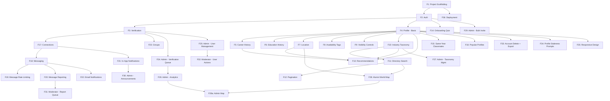

# AlumNet — Product Specification

> Alumni network platform for connecting school graduates by career field, education, location, and shared interests.
> Single-school deployment. Next.js + Supabase + shadcn/ui + Tailwind CSS.

---

## Table of Contents

1. [Feature Log](#feature-log)
2. [Data Model](#data-model)
3. [Technical Architecture](#technical-architecture)
4. [Feature Dependency Graph](#feature-dependency-graph)

> For detailed functional requirements (F1–F13), see `FEATURES.md`.
> For implementation strategy and build order, see `PLAN.md`.

---

## Feature Log

> **This section tracks implementation progress.** Update status after each feature is completed. Each session should check this section first to know where we left off.


| #   | Feature                                              | Status | Notes                                                                                                                           |
| --- | ---------------------------------------------------- | ------ | ------------------------------------------------------------------------------------------------------------------------------- |
| 1   | Project scaffolding (Next.js + Supabase + shadcn/ui) | `DONE` | 2026-03-08                                                                                                                      |
| 2   | Auth: signup, login, logout                          | `DONE` | 2026-03-08. Supabase Auth + public.users table + proxy + forgot password                                                        |
| 3   | Alumni verification workflow                         | `DONE` | 2026-03-09. Verification request form + admin queue with sheet detail panel + approve/reject/bulk approve + status banner.      |
| 3a  | Verification: document upload (transcripts, diploma) | `DONE` | 2026-03-09. Private storage bucket + verification_documents table. Up to 4 files (2MB each, PDF/JPEG/PNG/WebP). Admin sees docs with signed URLs in review sheet. |
| 3b  | Schools table + school-aware validation              | `DONE` | 2026-03-09. `schools` table with PTNK seed, `school_id` FK on profiles/verification_requests, dynamic graduation year validation (1999–current+3), renamed `degree_program` → `specialization_name`. |
| 4   | Profile: create & edit (progressive)                 | `DONE` | 2026-03-09. Profiles table + RLS + avatars bucket + onboarding flow + edit page + completeness tracking.                        |
| 5   | Profile: career history (LinkedIn-style)             | `DONE` | 2026-03-09. career_entries table + RLS + CRUD actions + inline add/edit/delete forms + timeline display on profile view.        |
| 6   | Profile: education history                           | `DONE` | 2026-03-09. education_entries table + RLS + CRUD actions + inline add/edit/delete forms + display on profile view.              |
| 7   | Profile: location (region/country/state/city)        | `DONE` | 2026-03-09. Free-text inputs (country/state/city) already functional. Hierarchical dropdown upgrade deferred to Phase 2.        |
| 8   | Profile: availability tags                           | `DONE` | 2026-03-09. availability_tag_types + user_availability_tags junction table + RLS + checkbox UI + badge display on profile view. |
| 9   | Profile: visibility controls                         | `DONE` | 2026-03-09. 3-tier visibility (unverified/verified/connected). `profile_contact_details` table with RLS. `is_connected_to()` reusable Postgres function. App-layer filtering for directory. |
| 10  | Industry taxonomy (two-level)                        | `DONE` | 2026-03-09. Schema + RLS + seed (20 industries, 132 specializations) + query helpers. No UI yet.                                |
| 11  | Alumni directory: search + filters                   | `DONE` | 2026-03-09. Full-text search (tsvector), combinable filters (industry, specialization, grad year range, country, city), sort (name, grad year, recently active), nuqs URL state. |
| 12  | Alumni directory: pagination                         | `DONE` | 2026-03-09. Offset-based pagination (20/page), smart page number display with ellipsis. Cursor-based deferred to Phase 3 (100k+ scale). |
| 13  | Recommendation engine (rule-based scoring)           | `DONE` | 2026-03-10. Postgres function `get_recommended_alumni()` with weighted scoring (specialization +15, industry +10, location +8/5/3, grad year +5→+1, company +7, availability +5, mutual connections +3). Dashboard UI with grid/list toggle, staggered animations, match badges, profile completeness nudge. Fallback to recently active alumni for cold-start. |
| 14  | Cold-start: onboarding quiz                          | `DONE` | 2026-03-10. 3-step post-signup quiz (location, availability tags, bio+job). Writes to existing profile fields. Skippable. Redirects from onboarding → quiz → dashboard. |
| 15  | Cold-start: same-year classmates                     | `DONE` | 2026-03-10. Blended into recommendation engine via `p_is_cold_start` param. Exact grad year match boosted from +5 to +20 for cold-start users (profile_completeness < 40). |
| 16  | Cold-start: popular/active profiles                  | `DONE` | 2026-03-10. `profile_views` table with daily dedup. `get_popular_alumni()` function: composite score (views 30d + connections*3 + recency bonus). "Trending Alumni" dashboard section. View tracking on profile pages. |
| 17  | Connection system: send/accept/reject requests       | `DONE` | 2026-03-09. connections + blocks tables, RLS, 6 server actions, connections page with tabs, profile action buttons, directory status dots, navbar badge. |
| 18  | Real-time messaging (WebSocket)                      | `DONE` | 2026-03-10. Supabase Realtime. conversations + messages tables, optimistic UI, 5-min timestamp grouping, tap-to-toggle timestamps. |
| 19  | Message rate limiting                                | `DONE` | 2026-03-10. Tier-based: 20/day (new), 500/day (established), unlimited (admin). 5 new convos/day (new), 20/day (established).   |
| 20  | Message reporting                                    | `DONE` | 2026-03-10. Anonymous reports to moderator queue. UNIQUE(message_id, reporter_id). Status workflow: pending → reviewed → action_taken/dismissed. |
| 21  | Notifications: in-app                                | `DONE` | 2026-03-10. notifications table + RLS + SECURITY DEFINER insert + Realtime. Bell icon with popover dropdown, /notifications page with pagination, mark read/delete. Triggers on connection request/accept, new message, verification approve/reject. |
| 22  | Notifications: email                                 | `DONE` | 2026-03-10. Resend integration. Templates for connection request/accepted, new message, verification update. `notification_preferences` table with per-type email opt-out. One-click unsubscribe. Settings page at `/settings/notifications`. Graceful skip if no API key. |
| 23  | Groups: basic (admin-created)                        | `DONE` | 2026-03-10. `groups` + `group_members` tables. Admin CRUD (create/update/soft-delete). Verified users browse/join/leave. Type enum (year_based, field_based, location_based, custom). Browse page with search + type filter + pagination. Group detail page with member directory. Future-ready: `role` column on members (member/moderator/owner), `cover_image_url`, `max_members` columns. |
| 24  | Admin dashboard: verification queue                  | `DONE` | 2026-03-10. Admin hub page with stats cards. Verification queue was already functional from F3a.                                |
| 25  | Admin dashboard: user management                     | `DONE` | 2026-03-10. Searchable user list with role/status/active filters, pagination. User detail sheet with contextual actions (verify, ban/unban, suspend/unsuspend, promote/demote, delete). `admin_audit_log` table with timeline display. Ban/suspension enforcement in proxy → `/banned` page. |
| 26  | Admin dashboard: analytics                           | `DONE` | 2026-03-10. shadcn/ui Charts (Recharts). 6 Postgres RPC functions. Stat cards (total/verified/pending/unverified, DAU/WAU/MAU). Area chart (signups), donut (status), line (connections+messages), horizontal bars (industries, locations). Empty states, loading skeletons. |
| 27  | Admin dashboard: taxonomy management                 | `DONE` | 2026-03-10. CRUD for industries & specializations. Expandable rows, search, archive/restore (cascade), user counts, audit logging. |
| 28  | Alumni world map                                     | `DONE` | 2026-03-10. Interactive Mapbox GL map with country→state→city drill-down. Choropleth + bubble markers. Hybrid geocoding (static country lookup + Nominatim on profile save). Filters (industry, specialization, grad year). Full-width map + collapsible sidebar. Admin variant with unverified toggle + trend data. Backfill script for existing profiles. |
| 29  | Admin dashboard: bulk invite                         | `TODO` | CSV upload of alumni emails                                                                                                     |
| 30  | Admin dashboard: announcements                       | `TODO` | Platform-wide notices                                                                                                           |
| 31  | Moderator role: report queue                         | `TODO` | Review flagged messages                                                                                                         |
| 32  | Moderator role: limited user actions                 | `TODO` | Warn, mute (no ban/delete)                                                                                                      |
| 33  | Account: soft delete + data export                   | `TODO` | 30-day grace → hard delete                                                                                                      |
| 34  | Profile staleness: periodic update prompts           | `TODO` | Email/in-app nudge                                                                                                              |
| 35  | Responsive design (mobile-first)                     | `TODO` | All pages                                                                                                                       |
| 35a | Navigation: main navbar + admin navbar               | `DONE` | 2026-03-09. Separate navbars for main app and admin. Mobile hamburger menu. User dropdown with profile/logout.                  |
| 35b | Accessibility: aria-describedby + banner roles       | `DONE` | 2026-03-09. All form error messages linked via aria-describedby. Verification banners have role="status"/"alert".               |
| 36  | Deployment: Vercel + Supabase                        | `TODO` | Free tier initial                                                                                                               |
| 37  | i18n: user-selectable display language               | `TODO` | Phase 2. Vietnamese/English toggle. Labels currently English with Vietnamese in parentheses for school-specific terms.           |
| 38  | Multi-school support                                 | `TODO` | Phase 4. School-scoped RLS, school-scoped routing (`/schools/:slug/...`), school admin roles, `school_id` on `users`.           |
| 39  | Admin: school management UI                          | `TODO` | Phase 4. CRUD for schools table. Currently seed-only.                                                                           |


---

## Data Model

### Core Tables

```
users
├── id (uuid, PK)
├── email (unique)
├── password_hash (managed by Supabase Auth)
├── role (enum: user, moderator, admin)
├── verification_status (enum: unverified, pending, verified, rejected)
├── is_active (boolean — soft delete flag)
├── deleted_at (timestamp, nullable)
├── created_at
└── updated_at

schools
├── id (uuid, PK)
├── name (text)
├── name_en (text, nullable)
├── abbreviation (text, nullable)
├── slug (text, UNIQUE)
├── school_type (text: high_school, university, college)
├── program_duration_years (integer)
├── founded_year (integer)
├── first_graduating_year (integer)
├── country, state_province, city (text, nullable)
├── website_url, logo_url (text, nullable)
├── is_active (boolean)
├── created_at
└── updated_at

profiles
├── id (uuid, PK)
├── user_id (FK → users)
├── full_name
├── photo_url
├── bio
├── graduation_year (integer)
├── school_id (FK → schools)
├── primary_industry_id (FK → industries)
├── primary_specialization_id (FK → specializations, nullable)
├── secondary_industry_id (FK → industries, nullable)
├── secondary_specialization_id (FK → specializations, nullable)
├── country
├── state_province
├── city
├── latitude (double precision, nullable — geocoded from city/country)
├── longitude (double precision, nullable — geocoded from city/country)
├── location_geocoded_at (timestamptz, nullable)
├── has_contact_details (boolean, default false)
├── profile_completeness (integer, 0-100)
├── last_active_at
├── last_profile_update_at
├── created_at
└── updated_at

profile_contact_details
├── id (uuid, PK)
├── profile_id (FK → profiles, UNIQUE, ON DELETE CASCADE)
├── personal_email (text, nullable)
├── phone (text, nullable, max 30)
├── linkedin_url (text, nullable)
├── github_url (text, nullable)
├── website_url (text, nullable)
├── created_at
└── updated_at

career_entries
├── id (uuid, PK)
├── profile_id (FK → profiles, ON DELETE CASCADE)
├── job_title (text, NOT NULL)
├── company (text, NOT NULL)
├── industry_id (FK → industries, nullable)
├── specialization_id (FK → specializations, nullable)
├── start_date (date, NOT NULL)
├── end_date (date, nullable — null = current)
├── description (text, nullable, max 500)
├── is_current (boolean, default false)
├── sort_order (integer, default 0)
├── created_at
└── updated_at

education_entries
├── id (uuid, PK)
├── profile_id (FK → profiles, ON DELETE CASCADE)
├── institution (text, NOT NULL)
├── degree (text, nullable)
├── field_of_study (text, nullable)
├── start_year (integer, nullable)
├── end_year (integer, nullable)
├── sort_order (integer, default 0)
├── created_at
└── updated_at

industries
├── id (uuid, PK)
├── name
├── slug (unique)
├── is_archived (boolean)
├── sort_order (integer)
├── created_at
└── updated_at

specializations
├── id (uuid, PK)
├── industry_id (FK → industries)
├── name
├── slug (unique)
├── is_archived (boolean)
├── sort_order (integer)
├── created_at
└── updated_at

availability_tag_types
├── id (uuid, PK)
├── name (text, NOT NULL, UNIQUE)
├── slug (text, NOT NULL, UNIQUE)
├── description (text, nullable)
├── is_archived (boolean, default false)
├── sort_order (integer, default 0)
├── created_at
└── updated_at

user_availability_tags
├── id (uuid, PK)
├── profile_id (FK → profiles, ON DELETE CASCADE)
├── tag_type_id (FK → availability_tag_types, ON DELETE CASCADE)
├── created_at
└── UNIQUE(profile_id, tag_type_id)
```

### Connection & Messaging Tables

```
connections
├── id (uuid, PK)
├── requester_id (FK → users)
├── receiver_id (FK → users)
├── status (enum: pending, accepted, rejected)
├── message (text, nullable — intro message)
├── created_at
└── updated_at
UNIQUE(requester_id, receiver_id)

blocks
├── id (uuid, PK)
├── blocker_id (FK → users)
├── blocked_id (FK → users)
├── created_at
UNIQUE(blocker_id, blocked_id)

conversations
├── id (uuid, PK)
├── created_at
└── updated_at

conversation_participants
├── conversation_id (FK → conversations)
├── user_id (FK → users)
├── last_read_at (timestamp)
PRIMARY KEY(conversation_id, user_id)

messages
├── id (uuid, PK)
├── conversation_id (FK → conversations)
├── sender_id (FK → users)
├── content (text, encrypted at rest)
├── is_reported (boolean)
├── created_at
└── updated_at
```

### Admin & Moderation Tables

```
verification_requests
├── id (uuid, PK)
├── user_id (FK → users)
├── graduation_year (integer)
├── student_id (text, nullable)
├── specialization_name (text)
├── school_id (FK → schools)
├── supporting_info (text, nullable)
├── status (enum: pending, approved, rejected)
├── reviewed_by (FK → users, nullable)
├── review_message (text, nullable)
├── created_at
└── reviewed_at

message_reports
├── id (uuid, PK)
├── message_id (FK → messages)
├── reporter_id (FK → users)
├── reason (text)
├── status (enum: pending, reviewed, actioned, dismissed)
├── reviewed_by (FK → users, nullable)
├── action_taken (text, nullable)
├── created_at
└── reviewed_at

moderation_actions
├── id (uuid, PK)
├── target_user_id (FK → users)
├── action_by (FK → users)
├── action_type (enum: warn, mute, unmute, ban, suspend, unsuspend)
├── reason (text)
├── duration_hours (integer, nullable — for mute/suspend)
├── expires_at (timestamp, nullable)
├── created_at

admin_audit_log
├── id (uuid, PK)
├── admin_id (FK → users)
├── action (text)
├── target_type (text — user, group, taxonomy, etc.)
├── target_id (uuid)
├── details (jsonb)
├── created_at

notifications
├── id (uuid, PK)
├── user_id (FK → users)
├── type (enum: connection_request, connection_accepted, new_message, verification_update, announcement, report_action, group_invite)
├── title (text)
├── body (text)
├── link (text, nullable)
├── is_read (boolean)
├── created_at

announcements
├── id (uuid, PK)
├── title
├── body (text)
├── link (text, nullable)
├── created_by (FK → users)
├── is_active (boolean)
├── published_at (timestamp)
├── created_at
└── updated_at

groups
├── id (uuid, PK)
├── name (text, UNIQUE)
├── slug (text, UNIQUE)
├── description (text, nullable)
├── type (enum: year_based, field_based, location_based, custom)
├── cover_image_url (text, nullable — Phase 2)
├── max_members (integer, nullable — Phase 2)
├── created_by (FK → users)
├── is_active (boolean)
├── deleted_at (timestamp, nullable)
├── created_at
└── updated_at

group_members
├── id (uuid, PK)
├── group_id (FK → groups)
├── user_id (FK → users)
├── role (enum: member, moderator, owner — default 'member')
├── created_at
└── updated_at
UNIQUE(group_id, user_id)

bulk_invites
├── id (uuid, PK)
├── email
├── name (text, nullable)
├── graduation_year (integer, nullable)
├── invited_by (FK → users)
├── status (enum: invited, signed_up, verified)
├── invited_at
└── signed_up_at (timestamp, nullable)
```

### Database Indexes (Key)

- `profiles(graduation_year)` — year-based filtering
- `profiles(primary_industry_id, primary_specialization_id)` — field filtering
- `profiles(country, state_province, city)` — location filtering
- `profiles(latitude, longitude) WHERE latitude IS NOT NULL` — map spatial queries
- `profiles(full_name) USING gin(to_tsvector(...))` — full-text search
- `career_history(profile_id, is_current)` — current job lookup
- `connections(requester_id, status)` and `connections(receiver_id, status)` — connection queries
- `messages(conversation_id, created_at)` — message ordering
- `notifications(user_id, is_read, created_at)` — notification feed
- `groups(type)` — type-based filtering
- `groups(is_active) WHERE is_active = true` — active groups partial index
- `group_members(group_id)` and `group_members(user_id)` — membership lookups

---

## Technical Architecture

### Stack

- **Frontend**: Next.js (App Router) + TypeScript
- **UI**: shadcn/ui + Tailwind CSS
- **Backend**: Supabase (Postgres + Auth + Realtime + Storage + Edge Functions)
- **Email**: Resend
- **Maps**: Mapbox GL JS (`react-map-gl`) + Nominatim (geocoding)
- **Deployment**: Vercel (frontend) + Supabase (backend)
- **State management**: React Server Components + `nuqs` for URL state + React Context for client state

### Key Architecture Decisions

1. **Server Components by default**: fetch data on the server, minimize client-side JS. Use client components only for interactivity (messaging, real-time, forms).
2. **Supabase Row-Level Security (RLS)**: enforce access control at the database level. Unverified users physically cannot query restricted columns.
3. **Real-time messaging via Supabase Realtime**: subscribe to the `messages` table filtered by `conversation_id`. No custom WebSocket server needed.
4. **Edge Functions for background jobs**: recommendation scoring, email sending, data export generation. Triggered by database webhooks or cron.
5. **Image storage**: profile photos stored in Supabase Storage with public URLs. Resized on upload via Edge Function.

### API Design

- **No separate API layer**: use Next.js Server Actions for mutations, Server Components for reads, and Supabase client for real-time subscriptions.
- **Supabase client**: use `@supabase/ssr` for server-side auth, `@supabase/supabase-js` for client-side real-time.

### Security

- RLS policies on every table
- Input sanitization on all user-generated content
- Rate limiting via Supabase Edge Functions or middleware
- CSRF protection via Next.js built-in
- Content Security Policy headers
- Message content encrypted at rest (Supabase default encryption + optional column-level)

---

## Feature Dependency Graph




