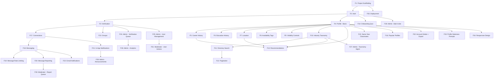

# AlumNet — Product Specification

> Alumni network platform for connecting school graduates by career field, education, location, and shared interests.
> Single-school deployment. Next.js + Supabase + shadcn/ui + Tailwind CSS.

---

## Table of Contents

1. [Feature Log](#feature-log)
2. [Core Concepts](#core-concepts)
3. [User Roles & Permissions](#user-roles--permissions)
4. [Features](#features)
5. [Data Model](#data-model)
6. [Technical Architecture](#technical-architecture)
7. [UI/UX Guidelines](#uiux-guidelines)
8. [Future Scaling Path](#future-scaling-path)

---

## Feature Log

> **This section tracks implementation progress.** Update status after each feature is completed. Each session should check this section first to know where we left off.

| # | Feature | Status | Notes |
|---|---------|--------|-------|
| 1 | Project scaffolding (Next.js + Supabase + shadcn/ui) | `DONE` | 2026-03-08 |
| 2 | Auth: signup, login, logout | `DONE` | 2026-03-08. Supabase Auth + public.users table + proxy + forgot password |
| 3 | Alumni verification workflow | `TODO` | Admin approval queue |
| 4 | Profile: create & edit (progressive) | `TODO` | Name, grad year, photo |
| 5 | Profile: career history (LinkedIn-style) | `TODO` | Multiple positions, timeline |
| 6 | Profile: education history | `TODO` | Multiple entries |
| 7 | Profile: location (region/country/state/city) | `TODO` | Hierarchical selection |
| 8 | Profile: availability tags | `TODO` | Open to mentoring, hiring, etc. |
| 9 | Profile: visibility controls | `TODO` | Connected-only details first |
| 10 | Industry taxonomy (two-level) | `TODO` | Seed data + admin management |
| 11 | Alumni directory: search + filters | `TODO` | Server-side Supabase queries |
| 12 | Alumni directory: pagination | `TODO` | Cursor-based |
| 13 | Recommendation engine (rule-based scoring) | `TODO` | Same field, location, year weights |
| 14 | Cold-start: onboarding quiz | `TODO` | 3-4 questions post-signup |
| 15 | Cold-start: same-year classmates | `TODO` | Default fallback |
| 16 | Cold-start: popular/active profiles | `TODO` | Most-viewed, most-connected |
| 17 | Connection system: send/accept/reject requests | `TODO` | |
| 18 | Real-time messaging (WebSocket) | `TODO` | Supabase Realtime |
| 19 | Message rate limiting | `TODO` | Daily caps for new users |
| 20 | Message reporting | `TODO` | Flag to moderator queue |
| 21 | Notifications: in-app | `TODO` | Bell icon, unread count |
| 22 | Notifications: email | `TODO` | Connection requests, new messages |
| 23 | Groups: basic (admin-created) | `TODO` | By year, field, location |
| 24 | Admin dashboard: verification queue | `TODO` | Approve/reject signups |
| 25 | Admin dashboard: user management | `TODO` | Ban, suspend, view profiles |
| 26 | Admin dashboard: analytics | `TODO` | Signups, active users, connections |
| 27 | Admin dashboard: taxonomy management | `TODO` | Add/edit industries & specializations |
| 28 | Admin dashboard: bulk invite | `TODO` | CSV upload of alumni emails |
| 29 | Admin dashboard: announcements | `TODO` | Platform-wide notices |
| 30 | Moderator role: report queue | `TODO` | Review flagged messages |
| 31 | Moderator role: limited user actions | `TODO` | Warn, mute (no ban/delete) |
| 32 | Account: soft delete + data export | `TODO` | 30-day grace → hard delete |
| 33 | Profile staleness: periodic update prompts | `TODO` | Email/in-app nudge |
| 34 | Responsive design (mobile-first) | `TODO` | All pages |
| 35 | Deployment: Vercel + Supabase | `TODO` | Free tier initial |

---

## Core Concepts

### What is AlumNet?
A web platform where verified alumni of a single school can discover and connect with each other based on career field, education, location, and professional interests. Think "LinkedIn, but scoped to your school and focused on alumni-to-alumni connections."

### Key Principles
- **Verified community**: Only confirmed alumni get full access. Trust is the foundation.
- **Progressive engagement**: Low-friction signup → nudge toward rich profiles → meaningful connections.
- **Privacy by default**: Contact details hidden until connected. Users control their visibility.
- **Ship lean, scale later**: Start with free-tier infrastructure and simple algorithms. Design for future upgrades.

---

## User Roles & Permissions

### Regular User (Unverified)
- Can sign up and create a basic profile
- Can browse alumni directory (names, photos, field, graduation year only)
- **Cannot** message, connect, or see detailed profiles
- Sees a banner prompting verification

### Regular User (Verified)
- Full directory access with search and filters
- Can send/accept connection requests
- Can message connected alumni (real-time)
- Can join groups
- Can set availability tags and visibility controls
- Can export and delete their account

### Moderator
- Everything a verified user can do, plus:
- Access to the **report queue** (flagged messages)
- Can **warn** or **mute** users (temporary)
- Cannot ban, delete users, or access admin settings

### Admin
- Everything a moderator can do, plus:
- **Verification queue**: approve/reject alumni signups
- **User management**: ban, suspend, delete accounts
- **Taxonomy management**: add/edit industry categories and specializations
- **Bulk invite**: upload CSV of alumni emails to send invitations
- **Announcements**: create platform-wide notices
- **Analytics dashboard**: signups, active users, connections, messages
- **Data export**: export platform data

---

## Features

### F1. Authentication
- **Signup**: email + password via Supabase Auth
- **Login**: email + password, with "forgot password" flow
- **OAuth** (future): Google, LinkedIn
- **Session management**: JWT-based via Supabase, auto-refresh
- After signup, user lands on onboarding flow (not the main app)

#### Server-Side Auth Details
- **`public.users` table**: A companion table to Supabase's `auth.users`. Stores app-specific fields (`role`, `verification_status`, `is_active`, `deleted_at`). Linked via `id` referencing `auth.users.id` with `on delete cascade`.
- **Auto-creation trigger**: A Postgres trigger (`on_auth_user_created`) fires after every `auth.users` insert and creates the corresponding `public.users` row with defaults (`role: 'user'`, `verification_status: 'unverified'`, `is_active: true`).
- **`updated_at` trigger**: A Postgres trigger (`on_users_updated`) automatically sets `updated_at = now()` on every `public.users` update. This pattern is reused for all tables with `updated_at`.
- **Email confirmation**: Disabled in development (Supabase default for local dev). In production, Supabase's email confirmation can be enabled via the dashboard — the signup flow already handles the case where `data.user` may not have a confirmed session.
- **Password reset flow**: Uses Supabase's `resetPasswordForEmail()` which sends a magic link. The link redirects to `/auth/callback?next=/reset-password` where a route handler exchanges the code for a session. The reset password response always returns success to prevent email enumeration.
- **Auth callback route** (`/auth/callback`): Handles code exchange for all Supabase email flows (password reset, email verification). Redirects to the `next` query param on success, or `/login` on failure.
- **Middleware session refresh**: The Next.js middleware calls `supabase.auth.getUser()` on every request. This is mandatory — it refreshes the JWT token and ensures Server Components receive a valid session.
- **RLS dependency**: All RLS policies on `public.users` (and future tables) use `auth.uid()` to identify the current user. The middleware's session refresh ensures `auth.uid()` is always current.
- **Validation**: All auth Server Actions validate input with Zod before calling Supabase. The signup action validates email format, password min length (8 chars), and password confirmation match. Login validates email format and password presence.
- **Error handling**: Auth Server Actions return `ActionResult<T>`. Supabase errors are logged server-side with structured format (`[ServerAction:actionName]`) and sanitized before returning to the client. Specific errors (e.g., "already registered") are mapped to user-friendly messages.

### F2. Alumni Verification
- **Trigger**: user submits verification request with supporting info (graduation year, student ID, degree program)
- **Queue**: admins see pending requests in dashboard, can approve/reject with optional message
- **Status**: `unverified` → `pending` → `verified` or `rejected`
- **Rejected users**: can re-submit with updated info
- **Unverified access**: can browse directory (limited fields only), see the value of the platform, but cannot connect or message

### F3. Profile System

#### Required at signup (progressive — collect minimally, prompt for more later):
- Full name
- Graduation year
- One primary career field (from taxonomy)

#### Prompted after signup (onboarding quiz + progressive nudges):
- Profile photo
- Current job title & company
- Industry specialization (level 2 of taxonomy)
- Location (country → state/province → city)
- Education history
- Bio / "About me"

#### Career History (LinkedIn-style):
- Multiple entries, each with: job title, company, industry, specialization, start date, end date (or "Present"), description (optional)
- One entry marked as "current"
- Displayed as a timeline on the profile

#### Education History:
- Multiple entries: institution, degree, field of study, start year, end year
- School entry auto-populated from signup data

#### Availability Tags (checkboxes):
- Open to mentoring
- Open to coffee chats
- Hiring / looking for referrals
- Looking for work
- Open to collaboration
- Not currently available (hides from recommendations but profile still exists)

#### Visibility Controls (Phase 1 — Connected-only details):
- **Public to all verified alumni**: name, photo, graduation year, primary field, current job title
- **Visible only to connections**: email, phone, full career history, education details, location (city-level), bio
- **Phase 2 (future)**: per-field granular toggles

### F4. Industry Taxonomy (Two-Level)

**Level 1 — Industries** (~20):
Technology, Finance & Banking, Healthcare & Medicine, Education, Law, Engineering, Arts & Entertainment, Media & Communications, Government & Public Policy, Non-Profit, Consulting, Real Estate, Retail & E-commerce, Manufacturing, Energy & Environment, Agriculture, Transportation & Logistics, Hospitality & Tourism, Sports & Fitness, Research & Academia

**Level 2 — Specializations** (5-15 per industry, examples):
- Technology → Software Engineering, Data Science & AI/ML, Product Management, Cybersecurity, DevOps & Infrastructure, UX/UI Design, Mobile Development
- Finance → Investment Banking, Venture Capital, Financial Planning, Accounting, Fintech, Insurance
- Healthcare → Clinical Medicine, Nursing, Public Health, Pharmaceuticals, Biotech, Health Administration

Admin can add/edit/archive categories. Users select one primary + optional secondary field.

### F5. Alumni Directory & Search

#### Search bar:
- Full-text search across name, job title, company, bio
- Powered by Postgres `tsvector` / `ts_query` (Supabase)

#### Filters (combinable):
- Industry (level 1)
- Specialization (level 2)
- Graduation year (range)
- Location (country, state, city — hierarchical)
- Availability tags
- Currently employed at (company name)
- Degree type

#### Results:
- Card grid layout showing: photo, name, current title, company, field, location, grad year
- Pagination: cursor-based, 20 results per page
- Sort by: relevance (default), graduation year, name, recently active

### F6. Recommendation Engine

#### Rule-Based Scoring (Phase 1):
Each alumni pair gets a similarity score based on weighted factors:

| Factor | Weight | Logic |
|--------|--------|-------|
| Same specialization | +15 | Exact level-2 match |
| Same industry | +10 | Exact level-1 match |
| Same city | +8 | Exact match |
| Same state/province | +5 | If not same city |
| Same country | +3 | If not same state |
| Graduation year proximity | +5 to +1 | ±1 year = +5, ±2 = +4, ... ±5 = +1 |
| Same company (current) | +7 | Working at the same place |
| Availability match | +5 | Mentoring seeker ↔ mentor available |
| Mutual connections | +3 per | Social graph overlap |

#### Display:
- "Suggested Alumni" section on dashboard (top 10-20 scored profiles)
- "Alumni like you" carousel on profile pages
- Refreshed daily or on profile update

#### Cold-Start Strategy (new users with sparse profiles):
1. **Onboarding quiz** (immediately after signup): "What field are you in?", "What are you looking for?", "Where are you based?" — seeds the scoring
2. **Same-year classmates**: always available since graduation year is required
3. **Popular/active profiles**: most-connected or recently-active alumni as fallback

#### Phase 2 (future): Embedding-based similarity
- Encode profiles as vectors using pgvector
- Semantic matching: "Data Scientist" ≈ "ML Engineer"
- Hybrid: rule-based + vector similarity

### F7. Connection System
- **Send request**: with optional message ("Hi, I'd love to connect because...")
- **Receive request**: notification (in-app + email)
- **Actions**: accept, reject, or ignore
- **Connected state**: unlocks detailed profile view + messaging
- **Disconnect**: either party can remove connection at any time
- **Block**: prevents all future contact and hides from each other's search results

### F8. Real-Time Messaging
- **Powered by**: Supabase Realtime (WebSocket)
- **Access**: only between connected alumni
- **Features**:
  - 1-on-1 conversations
  - Message list with last message preview, unread count
  - Real-time typing indicators (stretch goal)
  - Read receipts (stretch goal)
  - Message timestamps
- **Rate limiting**:
  - New users (< 7 days verified): 10 messages/day, 5 new conversations/day
  - Established users: 50 messages/day, 20 new conversations/day
  - Rate limit warning shown before hitting cap
- **Moderation**:
  - "Report this message" button on each message
  - Reported messages go to moderator queue with context (full conversation)
  - Reporter stays anonymous to the reported user

### F9. Notifications

#### In-App:
- Bell icon in navbar with unread count badge
- Notification dropdown with recent items
- Full notification page for history
- Types: connection request, connection accepted, new message, profile view (stretch), group invite, admin announcement, verification status update

#### Email:
- Triggered by: new connection request, new message (if not read within 15 min), verification approved/rejected, weekly digest (optional)
- Unsubscribe link in every email
- Email service: Resend (free tier: 100 emails/day)
- User can configure email preferences (per notification type)

### F10. Groups (Basic — Admin-Created)

- **Creation**: admins create groups with name, description, type (year-based, field-based, location-based, custom)
- **Membership**: verified alumni can browse and join groups
- **Group page**: member list with search/filter, group description
- **No group chat** in Phase 1 — just a member directory within the group
- **Auto-groups** (stretch): system auto-creates groups for each graduation year and each industry

#### Phase 2 (future): Full Community Groups
- User-created groups
- Group discussion boards / group chat
- Group events
- Group moderation

### F11. Admin Dashboard

#### Verification Queue:
- List of pending verification requests
- View submitted info (name, grad year, student ID, degree)
- Approve / reject with optional message to user
- Bulk approve (select multiple)

#### User Management:
- Searchable user list with filters (role, status, verification)
- View any user's full profile
- Actions: verify, ban (permanent), suspend (temporary with duration), promote to moderator, demote, delete account
- Action audit log (who did what, when)

#### Taxonomy Management:
- CRUD for industries and specializations
- Archive (soft-delete) categories that are no longer relevant
- See how many users are tagged with each category

#### Bulk Invite:
- Upload CSV with columns: email, name (optional), graduation year (optional)
- System sends invite emails with signup link
- Track: invited, signed up, verified

#### Announcements:
- Create platform-wide notices (title, body, optional link)
- Display as banner on main app or in notification feed
- Can be dismissed by users
- Schedule for future publication (stretch)

#### Analytics:
- Total users (by status: unverified, pending, verified)
- Signups over time (chart)
- Active users (daily/weekly/monthly)
- Connections made over time
- Messages sent over time
- Most popular industries/specializations
- Top locations

### F12. Moderator Dashboard

#### Report Queue:
- List of reported messages with status (pending, reviewed, actioned)
- View full conversation context
- Actions: dismiss report, warn user, mute user (1 day, 7 days, 30 days)
- Escalate to admin (for ban-worthy offenses)

#### Limited User Actions:
- Can warn users (sends notification)
- Can mute users (prevents messaging for duration)
- Cannot ban, suspend, delete, or modify user roles
- Cannot access analytics, taxonomy, or bulk invite

### F13. Account Management

#### Profile Update Prompts:
- In-app banner: "Your profile was last updated X months ago. Is it still accurate?"
- Email nudge every 6 months (configurable by admin)
- Quick-update flow: confirm or update key fields (job, location, availability)

#### Account Deletion:
1. User requests deletion from settings
2. Data export generated (JSON): profile, connections, messages, groups
3. Account soft-deleted: hidden from search, connections removed, messages anonymized ("Deleted User")
4. 30-day grace period: user can cancel and reactivate
5. After 30 days: hard delete of all personal data from database
6. Confirmation email at each step

---

## Data Model

### Core Tables

```
users
├── id (uuid, PK)
├── email (unique)
├── password_hash (managed by Supabase Auth)
├── role (enum: user, moderator, admin)
├── verification_status (enum: unverified, pending, verified, rejected)
├── is_active (boolean — soft delete flag)
├── deleted_at (timestamp, nullable)
├── created_at
└── updated_at

profiles
├── id (uuid, PK)
├── user_id (FK → users)
├── full_name
├── photo_url
├── bio
├── graduation_year (integer)
├── primary_industry_id (FK → industries)
├── primary_specialization_id (FK → specializations, nullable)
├── secondary_industry_id (FK → industries, nullable)
├── secondary_specialization_id (FK → specializations, nullable)
├── country
├── state_province
├── city
├── profile_completeness (integer, 0-100)
├── last_active_at
├── last_profile_update_at
├── created_at
└── updated_at

career_history
├── id (uuid, PK)
├── profile_id (FK → profiles)
├── job_title
├── company
├── industry_id (FK → industries, nullable)
├── specialization_id (FK → specializations, nullable)
├── start_date (date)
├── end_date (date, nullable — null = current)
├── is_current (boolean)
├── description (text, nullable)
├── sort_order (integer)
├── created_at
└── updated_at

education_history
├── id (uuid, PK)
├── profile_id (FK → profiles)
├── institution
├── degree
├── field_of_study
├── start_year (integer)
├── end_year (integer, nullable)
├── created_at
└── updated_at

industries
├── id (uuid, PK)
├── name
├── slug (unique)
├── is_archived (boolean)
├── sort_order (integer)
├── created_at
└── updated_at

specializations
├── id (uuid, PK)
├── industry_id (FK → industries)
├── name
├── slug (unique)
├── is_archived (boolean)
├── sort_order (integer)
├── created_at
└── updated_at

availability_tags
├── id (uuid, PK)
├── profile_id (FK → profiles)
├── tag (enum: mentoring, coffee_chat, hiring, looking_for_work, collaboration, not_available)
├── created_at
└── updated_at
```

### Connection & Messaging Tables

```
connections
├── id (uuid, PK)
├── requester_id (FK → users)
├── receiver_id (FK → users)
├── status (enum: pending, accepted, rejected)
├── message (text, nullable — intro message)
├── created_at
└── updated_at
UNIQUE(requester_id, receiver_id)

blocks
├── id (uuid, PK)
├── blocker_id (FK → users)
├── blocked_id (FK → users)
├── created_at
UNIQUE(blocker_id, blocked_id)

conversations
├── id (uuid, PK)
├── created_at
└── updated_at

conversation_participants
├── conversation_id (FK → conversations)
├── user_id (FK → users)
├── last_read_at (timestamp)
PRIMARY KEY(conversation_id, user_id)

messages
├── id (uuid, PK)
├── conversation_id (FK → conversations)
├── sender_id (FK → users)
├── content (text, encrypted at rest)
├── is_reported (boolean)
├── created_at
└── updated_at
```

### Admin & Moderation Tables

```
verification_requests
├── id (uuid, PK)
├── user_id (FK → users)
├── graduation_year (integer)
├── student_id (text, nullable)
├── degree_program (text)
├── supporting_info (text, nullable)
├── status (enum: pending, approved, rejected)
├── reviewed_by (FK → users, nullable)
├── review_message (text, nullable)
├── created_at
└── reviewed_at

message_reports
├── id (uuid, PK)
├── message_id (FK → messages)
├── reporter_id (FK → users)
├── reason (text)
├── status (enum: pending, reviewed, actioned, dismissed)
├── reviewed_by (FK → users, nullable)
├── action_taken (text, nullable)
├── created_at
└── reviewed_at

moderation_actions
├── id (uuid, PK)
├── target_user_id (FK → users)
├── action_by (FK → users)
├── action_type (enum: warn, mute, unmute, ban, suspend, unsuspend)
├── reason (text)
├── duration_hours (integer, nullable — for mute/suspend)
├── expires_at (timestamp, nullable)
├── created_at

admin_audit_log
├── id (uuid, PK)
├── admin_id (FK → users)
├── action (text)
├── target_type (text — user, group, taxonomy, etc.)
├── target_id (uuid)
├── details (jsonb)
├── created_at

notifications
├── id (uuid, PK)
├── user_id (FK → users)
├── type (enum: connection_request, connection_accepted, new_message, verification_update, announcement, report_action, group_invite)
├── title (text)
├── body (text)
├── link (text, nullable)
├── is_read (boolean)
├── created_at

announcements
├── id (uuid, PK)
├── title
├── body (text)
├── link (text, nullable)
├── created_by (FK → users)
├── is_active (boolean)
├── published_at (timestamp)
├── created_at
└── updated_at

groups
├── id (uuid, PK)
├── name
├── description (text)
├── type (enum: year, field, location, custom)
├── created_by (FK → users)
├── is_active (boolean)
├── created_at
└── updated_at

group_members
├── group_id (FK → groups)
├── user_id (FK → users)
├── joined_at
PRIMARY KEY(group_id, user_id)

bulk_invites
├── id (uuid, PK)
├── email
├── name (text, nullable)
├── graduation_year (integer, nullable)
├── invited_by (FK → users)
├── status (enum: invited, signed_up, verified)
├── invited_at
└── signed_up_at (timestamp, nullable)
```

### Database Indexes (Key)
- `profiles(graduation_year)` — year-based filtering
- `profiles(primary_industry_id, primary_specialization_id)` — field filtering
- `profiles(country, state_province, city)` — location filtering
- `profiles(full_name) USING gin(to_tsvector(...))` — full-text search
- `career_history(profile_id, is_current)` — current job lookup
- `connections(requester_id, status)` and `connections(receiver_id, status)` — connection queries
- `messages(conversation_id, created_at)` — message ordering
- `notifications(user_id, is_read, created_at)` — notification feed

---

## Technical Architecture

### Stack
- **Frontend**: Next.js (App Router) + TypeScript
- **UI**: shadcn/ui + Tailwind CSS
- **Backend**: Supabase (Postgres + Auth + Realtime + Storage + Edge Functions)
- **Email**: Resend
- **Deployment**: Vercel (frontend) + Supabase (backend)
- **State management**: React Server Components + `nuqs` for URL state + React Context for client state

### Key Architecture Decisions

1. **Server Components by default**: fetch data on the server, minimize client-side JS. Use client components only for interactivity (messaging, real-time, forms).

2. **Supabase Row-Level Security (RLS)**: enforce access control at the database level. Unverified users physically cannot query restricted columns.

3. **Real-time messaging via Supabase Realtime**: subscribe to the `messages` table filtered by `conversation_id`. No custom WebSocket server needed.

4. **Edge Functions for background jobs**: recommendation scoring, email sending, data export generation. Triggered by database webhooks or cron.

5. **Image storage**: profile photos stored in Supabase Storage with public URLs. Resized on upload via Edge Function.

### API Design
- **No separate API layer**: use Next.js Server Actions for mutations, Server Components for reads, and Supabase client for real-time subscriptions.
- **Supabase client**: use `@supabase/ssr` for server-side auth, `@supabase/supabase-js` for client-side real-time.

### Security
- RLS policies on every table
- Input sanitization on all user-generated content
- Rate limiting via Supabase Edge Functions or middleware
- CSRF protection via Next.js built-in
- Content Security Policy headers
- Message content encrypted at rest (Supabase default encryption + optional column-level)

---

## UI/UX Guidelines

### Layout
- **Responsive**: mobile-first design, breakpoints at sm(640), md(768), lg(1024), xl(1280)
- **Navigation**: top navbar (logo, search, notifications bell, profile avatar, admin link if applicable)
- **Sidebar** (desktop only): quick filters, groups, connections
- **Main content area**: search results / feed / profile / messaging

### Key Pages
1. **Landing / Marketing page** — for logged-out users
2. **Signup → Onboarding quiz** — progressive profile creation
3. **Dashboard / Home** — recommended alumni, recent activity, announcements
4. **Directory** — search + filter + results grid
5. **Profile page** — public view (for others) and edit view (for self)
6. **Connections** — pending requests, connected alumni list
7. **Messages** — conversation list + active chat
8. **Groups** — browse, join, view members
9. **Settings** — profile, privacy, notifications, account deletion
10. **Admin Dashboard** — verification, users, analytics, taxonomy, invites, announcements
11. **Moderator Dashboard** — report queue, moderation actions

### Design Principles
- Clean, professional aesthetic (not social-media-flashy)
- Consistent card-based layouts for alumni listings
- Skeleton loading states for all async content
- Empty states with helpful CTAs ("No connections yet? Start by searching for classmates")
- Toast notifications for actions (connected, message sent, etc.)
- Dark mode support (via Tailwind `dark:` classes)

---

## Non-Functional Requirements

### Performance
- **Core Web Vitals**: LCP < 2.5s, FID < 100ms, CLS < 0.1
- **Bundle size**: Target < 200KB initial JavaScript bundle
- **API response**: Server Actions < 500ms p95

### Accessibility
- **WCAG 2.1 AA** compliance
- Keyboard-navigable for all core flows
- Screen reader compatible

### SEO
- Meta tags (`title`, `description`, `og:*`) on all public pages
- `robots.txt` and `sitemap.xml` for public pages
- Auth pages excluded from indexing (`noindex`)

### i18n Readiness
- English only for Phase 1
- Extract user-facing strings to constants (cheap now, expensive to retrofit later)

---

## Feature Dependency Graph



---

## Future Scaling Path

These features are designed into the architecture but not built in Phase 1:

| Feature | Phase | Prerequisites |
|---------|-------|---------------|
| Granular per-field privacy controls | 2 | Connected-only details working |
| Embedding-based recommendations (pgvector) | 2 | Rule-based engine, sufficient user data |
| Full community groups (user-created, discussion boards) | 2 | Basic groups working |
| OAuth login (Google, LinkedIn) | 2 | Email auth working |
| LinkedIn profile import | 2 | Career history data model |
| Native mobile apps (React Native) | 3 | Responsive web stable |
| Push notifications | 3 | Email + in-app notifications working |
| Events system (alumni meetups) | 3 | Groups working |
| Mentorship matching program | 3 | Availability tags + connections |
| Job board | 3 | Career history + availability tags |
| Dedicated search engine (Algolia/Meilisearch) | 3 | >10K users, Postgres search insufficient |
| Multi-school support / multi-tenancy | 4 | Entire platform stable |

---

## Budget & Infrastructure Scaling

| Stage | Users | Infra | Cost |
|-------|-------|-------|------|
| Launch | 0-500 | Vercel Free + Supabase Free + Resend Free | $0/mo |
| Growth | 500-5K | Vercel Pro + Supabase Pro + Resend Pro | ~$45/mo |
| Scale | 5K+ | Evaluate dedicated hosting, CDN, search | ~$100+/mo |
