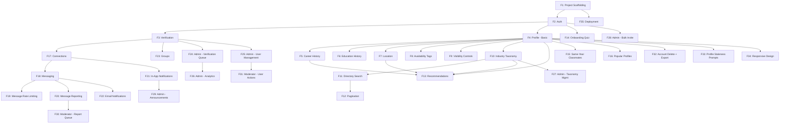

# AlumNet — Product Specification

> Alumni network platform for connecting school graduates by career field, education, location, and shared interests.
> Single-school deployment. Next.js + Supabase + shadcn/ui + Tailwind CSS.

---

## Table of Contents

1. [Feature Log](#feature-log)
2. [Data Model](#data-model)
3. [Technical Architecture](#technical-architecture)
4. [Feature Dependency Graph](#feature-dependency-graph)

> For detailed functional requirements (F1–F13), see `FEATURES.md`.
> For implementation strategy and build order, see `PLAN.md`.

---

## Feature Log

> **This section tracks implementation progress.** Update status after each feature is completed. Each session should check this section first to know where we left off.

| # | Feature | Status | Notes |
|---|---------|--------|-------|
| 1 | Project scaffolding (Next.js + Supabase + shadcn/ui) | `DONE` | 2026-03-08 |
| 2 | Auth: signup, login, logout | `DONE` | 2026-03-08. Supabase Auth + public.users table + proxy + forgot password |
| 3 | Alumni verification workflow | `TODO` | Admin approval queue |
| 4 | Profile: create & edit (progressive) | `DONE` | 2026-03-09. Profiles table + RLS + avatars bucket + onboarding flow + edit page + completeness tracking. |
| 5 | Profile: career history (LinkedIn-style) | `TODO` | Multiple positions, timeline |
| 6 | Profile: education history | `TODO` | Multiple entries |
| 7 | Profile: location (region/country/state/city) | `TODO` | Hierarchical selection |
| 8 | Profile: availability tags | `TODO` | Open to mentoring, hiring, etc. |
| 9 | Profile: visibility controls | `TODO` | Connected-only details first |
| 10 | Industry taxonomy (two-level) | `DONE` | 2026-03-09. Schema + RLS + seed (20 industries, 132 specializations) + query helpers. No UI yet. |
| 11 | Alumni directory: search + filters | `TODO` | Server-side Supabase queries |
| 12 | Alumni directory: pagination | `TODO` | Cursor-based |
| 13 | Recommendation engine (rule-based scoring) | `TODO` | Same field, location, year weights |
| 14 | Cold-start: onboarding quiz | `TODO` | 3-4 questions post-signup |
| 15 | Cold-start: same-year classmates | `TODO` | Default fallback |
| 16 | Cold-start: popular/active profiles | `TODO` | Most-viewed, most-connected |
| 17 | Connection system: send/accept/reject requests | `TODO` | |
| 18 | Real-time messaging (WebSocket) | `TODO` | Supabase Realtime |
| 19 | Message rate limiting | `TODO` | Daily caps for new users |
| 20 | Message reporting | `TODO` | Flag to moderator queue |
| 21 | Notifications: in-app | `TODO` | Bell icon, unread count |
| 22 | Notifications: email | `TODO` | Connection requests, new messages |
| 23 | Groups: basic (admin-created) | `TODO` | By year, field, location |
| 24 | Admin dashboard: verification queue | `TODO` | Approve/reject signups |
| 25 | Admin dashboard: user management | `TODO` | Ban, suspend, view profiles |
| 26 | Admin dashboard: analytics | `TODO` | Signups, active users, connections |
| 27 | Admin dashboard: taxonomy management | `TODO` | Add/edit industries & specializations |
| 28 | Admin dashboard: bulk invite | `TODO` | CSV upload of alumni emails |
| 29 | Admin dashboard: announcements | `TODO` | Platform-wide notices |
| 30 | Moderator role: report queue | `TODO` | Review flagged messages |
| 31 | Moderator role: limited user actions | `TODO` | Warn, mute (no ban/delete) |
| 32 | Account: soft delete + data export | `TODO` | 30-day grace → hard delete |
| 33 | Profile staleness: periodic update prompts | `TODO` | Email/in-app nudge |
| 34 | Responsive design (mobile-first) | `TODO` | All pages |
| 35 | Deployment: Vercel + Supabase | `TODO` | Free tier initial |

---

## Data Model

### Core Tables

```
users
├── id (uuid, PK)
├── email (unique)
├── password_hash (managed by Supabase Auth)
├── role (enum: user, moderator, admin)
├── verification_status (enum: unverified, pending, verified, rejected)
├── is_active (boolean — soft delete flag)
├── deleted_at (timestamp, nullable)
├── created_at
└── updated_at

profiles
├── id (uuid, PK)
├── user_id (FK → users)
├── full_name
├── photo_url
├── bio
├── graduation_year (integer)
├── primary_industry_id (FK → industries)
├── primary_specialization_id (FK → specializations, nullable)
├── secondary_industry_id (FK → industries, nullable)
├── secondary_specialization_id (FK → specializations, nullable)
├── country
├── state_province
├── city
├── profile_completeness (integer, 0-100)
├── last_active_at
├── last_profile_update_at
├── created_at
└── updated_at

career_history
├── id (uuid, PK)
├── profile_id (FK → profiles)
├── job_title
├── company
├── industry_id (FK → industries, nullable)
├── specialization_id (FK → specializations, nullable)
├── start_date (date)
├── end_date (date, nullable — null = current)
├── is_current (boolean)
├── description (text, nullable)
├── sort_order (integer)
├── created_at
└── updated_at

education_history
├── id (uuid, PK)
├── profile_id (FK → profiles)
├── institution
├── degree
├── field_of_study
├── start_year (integer)
├── end_year (integer, nullable)
├── created_at
└── updated_at

industries
├── id (uuid, PK)
├── name
├── slug (unique)
├── is_archived (boolean)
├── sort_order (integer)
├── created_at
└── updated_at

specializations
├── id (uuid, PK)
├── industry_id (FK → industries)
├── name
├── slug (unique)
├── is_archived (boolean)
├── sort_order (integer)
├── created_at
└── updated_at

availability_tags
├── id (uuid, PK)
├── profile_id (FK → profiles)
├── tag (enum: mentoring, coffee_chat, hiring, looking_for_work, collaboration, not_available)
├── created_at
└── updated_at
```

### Connection & Messaging Tables

```
connections
├── id (uuid, PK)
├── requester_id (FK → users)
├── receiver_id (FK → users)
├── status (enum: pending, accepted, rejected)
├── message (text, nullable — intro message)
├── created_at
└── updated_at
UNIQUE(requester_id, receiver_id)

blocks
├── id (uuid, PK)
├── blocker_id (FK → users)
├── blocked_id (FK → users)
├── created_at
UNIQUE(blocker_id, blocked_id)

conversations
├── id (uuid, PK)
├── created_at
└── updated_at

conversation_participants
├── conversation_id (FK → conversations)
├── user_id (FK → users)
├── last_read_at (timestamp)
PRIMARY KEY(conversation_id, user_id)

messages
├── id (uuid, PK)
├── conversation_id (FK → conversations)
├── sender_id (FK → users)
├── content (text, encrypted at rest)
├── is_reported (boolean)
├── created_at
└── updated_at
```

### Admin & Moderation Tables

```
verification_requests
├── id (uuid, PK)
├── user_id (FK → users)
├── graduation_year (integer)
├── student_id (text, nullable)
├── degree_program (text)
├── supporting_info (text, nullable)
├── status (enum: pending, approved, rejected)
├── reviewed_by (FK → users, nullable)
├── review_message (text, nullable)
├── created_at
└── reviewed_at

message_reports
├── id (uuid, PK)
├── message_id (FK → messages)
├── reporter_id (FK → users)
├── reason (text)
├── status (enum: pending, reviewed, actioned, dismissed)
├── reviewed_by (FK → users, nullable)
├── action_taken (text, nullable)
├── created_at
└── reviewed_at

moderation_actions
├── id (uuid, PK)
├── target_user_id (FK → users)
├── action_by (FK → users)
├── action_type (enum: warn, mute, unmute, ban, suspend, unsuspend)
├── reason (text)
├── duration_hours (integer, nullable — for mute/suspend)
├── expires_at (timestamp, nullable)
├── created_at

admin_audit_log
├── id (uuid, PK)
├── admin_id (FK → users)
├── action (text)
├── target_type (text — user, group, taxonomy, etc.)
├── target_id (uuid)
├── details (jsonb)
├── created_at

notifications
├── id (uuid, PK)
├── user_id (FK → users)
├── type (enum: connection_request, connection_accepted, new_message, verification_update, announcement, report_action, group_invite)
├── title (text)
├── body (text)
├── link (text, nullable)
├── is_read (boolean)
├── created_at

announcements
├── id (uuid, PK)
├── title
├── body (text)
├── link (text, nullable)
├── created_by (FK → users)
├── is_active (boolean)
├── published_at (timestamp)
├── created_at
└── updated_at

groups
├── id (uuid, PK)
├── name
├── description (text)
├── type (enum: year, field, location, custom)
├── created_by (FK → users)
├── is_active (boolean)
├── created_at
└── updated_at

group_members
├── group_id (FK → groups)
├── user_id (FK → users)
├── joined_at
PRIMARY KEY(group_id, user_id)

bulk_invites
├── id (uuid, PK)
├── email
├── name (text, nullable)
├── graduation_year (integer, nullable)
├── invited_by (FK → users)
├── status (enum: invited, signed_up, verified)
├── invited_at
└── signed_up_at (timestamp, nullable)
```

### Database Indexes (Key)
- `profiles(graduation_year)` — year-based filtering
- `profiles(primary_industry_id, primary_specialization_id)` — field filtering
- `profiles(country, state_province, city)` — location filtering
- `profiles(full_name) USING gin(to_tsvector(...))` — full-text search
- `career_history(profile_id, is_current)` — current job lookup
- `connections(requester_id, status)` and `connections(receiver_id, status)` — connection queries
- `messages(conversation_id, created_at)` — message ordering
- `notifications(user_id, is_read, created_at)` — notification feed

---

## Technical Architecture

### Stack
- **Frontend**: Next.js (App Router) + TypeScript
- **UI**: shadcn/ui + Tailwind CSS
- **Backend**: Supabase (Postgres + Auth + Realtime + Storage + Edge Functions)
- **Email**: Resend
- **Deployment**: Vercel (frontend) + Supabase (backend)
- **State management**: React Server Components + `nuqs` for URL state + React Context for client state

### Key Architecture Decisions

1. **Server Components by default**: fetch data on the server, minimize client-side JS. Use client components only for interactivity (messaging, real-time, forms).

2. **Supabase Row-Level Security (RLS)**: enforce access control at the database level. Unverified users physically cannot query restricted columns.

3. **Real-time messaging via Supabase Realtime**: subscribe to the `messages` table filtered by `conversation_id`. No custom WebSocket server needed.

4. **Edge Functions for background jobs**: recommendation scoring, email sending, data export generation. Triggered by database webhooks or cron.

5. **Image storage**: profile photos stored in Supabase Storage with public URLs. Resized on upload via Edge Function.

### API Design
- **No separate API layer**: use Next.js Server Actions for mutations, Server Components for reads, and Supabase client for real-time subscriptions.
- **Supabase client**: use `@supabase/ssr` for server-side auth, `@supabase/supabase-js` for client-side real-time.

### Security
- RLS policies on every table
- Input sanitization on all user-generated content
- Rate limiting via Supabase Edge Functions or middleware
- CSRF protection via Next.js built-in
- Content Security Policy headers
- Message content encrypted at rest (Supabase default encryption + optional column-level)

---

## Feature Dependency Graph


