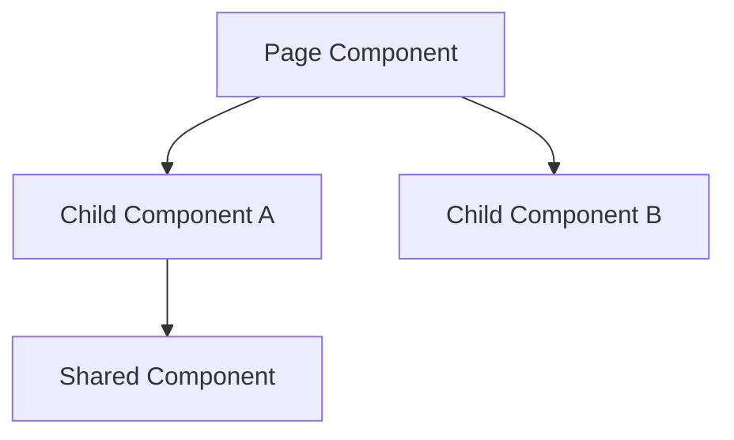
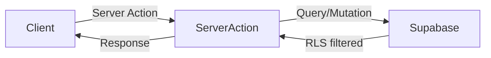
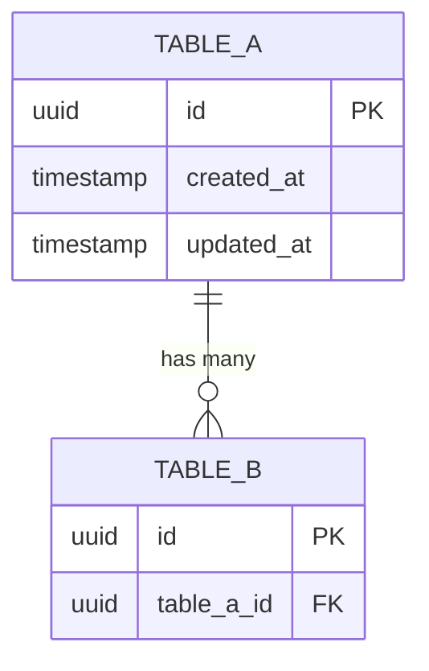
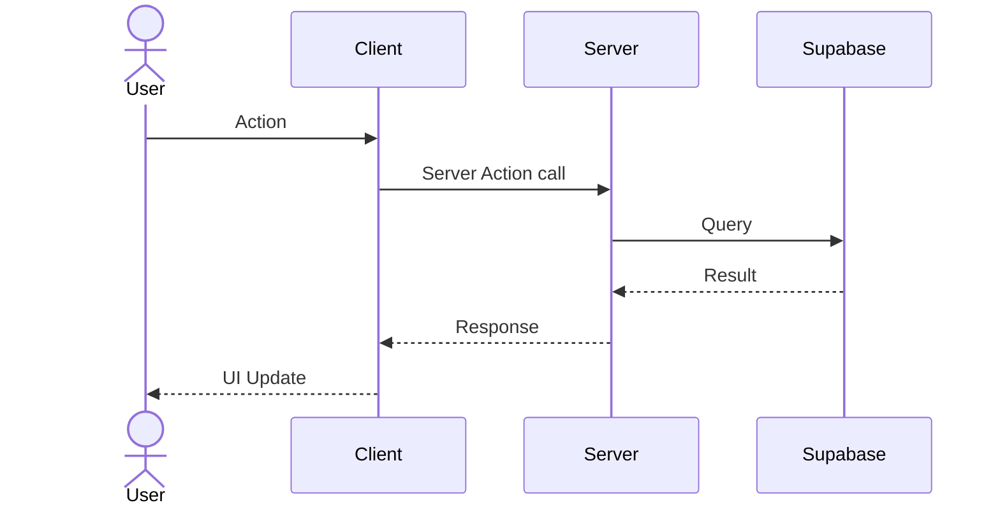

# Feature: [Feature Name]

**Date Implemented**: YYYY-MM-DD
**Status**: Complete | In Progress
**Related ADRs**: ADR-XXX, ADR-YYY

## Overview

Brief description of what this feature does and which user roles it serves.

## Architecture

### Component Hierarchy

### Data Flow

### Database Schema *(if applicable)*

### Sequence Diagram *(for multi-step flows)*

## Key Files

| File | Purpose |
|------|---------|
| `app/(group)/route/page.tsx` | Main page component |
| `app/(group)/route/actions.ts` | Server actions |
| `app/(group)/route/components/` | Route-specific components |
| `supabase/migrations/XXXXX_name.sql` | Schema migration |

## RLS Policies

| Table | Policy | Roles | Description |
|-------|--------|-------|-------------|
| `table_name` | `select` | authenticated | Users can read their own rows |

## Edge Cases and Error Handling

- **Case 1**: Description and how it's handled.
- **Case 2**: Description and how it's handled.

## Design Decisions

Brief notes on why things were built this way. Link to ADRs for significant decisions.

## Future Considerations

Known limitations or planned improvements for later phases.
