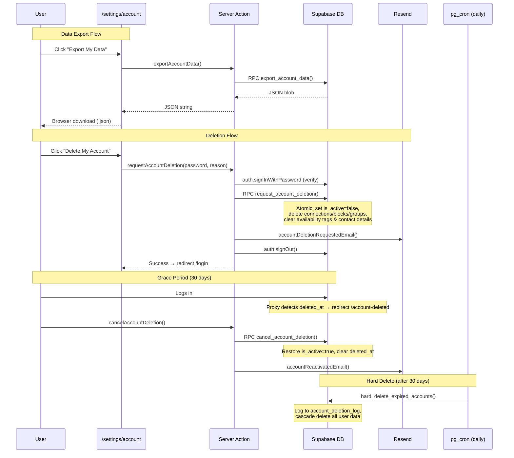
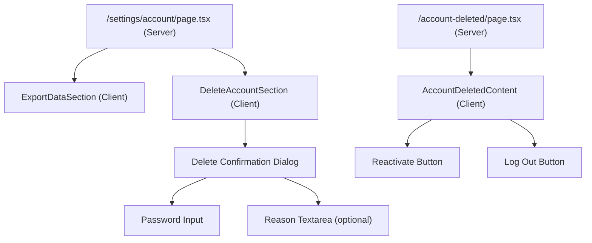
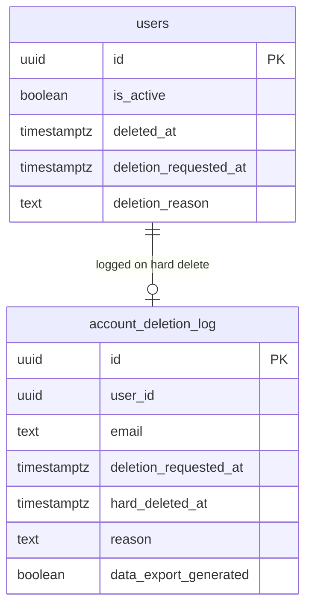

# Account Soft Delete & Data Export

> Feature #33 — Self-service account deletion with 30-day grace period and JSON data export.

## Architecture Overview

Users can export their data and delete their accounts from `/settings/account`. Deletion is a multi-step process with a 30-day grace period before permanent removal.

### Data Flow

### Component Tree

### Settings Navigation

Added a tab navigation to the settings layout with two tabs:
- **Notifications** — existing email notification preferences
- **Account** — data export + account deletion (new)

## Database Schema Changes

### New Columns on `users`
| Column | Type | Purpose |
|--------|------|---------|
| `deletion_requested_at` | timestamptz | When user requested deletion |
| `deletion_reason` | text | Optional reason for leaving |

### New Table: `account_deletion_log`
Persists after user is hard-deleted for audit purposes.

| Column | Type | Purpose |
|--------|------|---------|
| `id` | uuid PK | |
| `user_id` | uuid | Original user ID (no FK — user will be gone) |
| `email` | text | User's email at time of deletion |
| `deletion_requested_at` | timestamptz | When soft-delete was requested |
| `hard_deleted_at` | timestamptz | When hard-delete executed |
| `reason` | text | User-provided reason |
| `data_export_generated` | boolean | Whether user exported data before deleting |

### ER Diagram (Deletion-related)

## RPC Functions

### `request_account_deletion(p_user_id, p_reason)`
SECURITY DEFINER. Called by the user themselves. Atomically:
1. Sets `is_active = false`, `deleted_at = now()`, `deletion_requested_at = now()`
2. Deletes connections, blocks, group memberships, availability tags, contact details, dismissed announcements

### `cancel_account_deletion(p_user_id)`
SECURITY DEFINER. Validates grace period (30 days). Restores `is_active = true` and clears deletion fields.

### `export_account_data(p_user_id)`
SECURITY DEFINER. Returns JSONB with: account info, profile, contact details, career history, education history, connections, messages (sent, up to 10k), groups, availability tags.

### `hard_delete_expired_accounts()`
SECURITY DEFINER. Called by pg_cron daily at 3 AM UTC. Finds users where `deleted_at < now() - 30 days`, logs them to `account_deletion_log`, then cascade-deletes all dependent rows.

## Proxy Routing

Updated `src/proxy.ts` to distinguish between three states:

| State | Condition | Redirect |
|-------|-----------|----------|
| Self-deleted | `is_active=false AND deleted_at IS NOT NULL` | `/account-deleted` |
| Admin banned | `is_active=false AND deleted_at IS NULL` | `/banned` |
| Suspended | `suspended_until > now()` | `/banned` |

## Email Templates

Two new transactional templates (no unsubscribe — mandatory emails):
- **`accountDeletionRequestedEmail`** — Confirms deletion, mentions 30-day grace, CTA to reactivate
- **`accountReactivatedEmail`** — Confirms reactivation, mentions connections need re-establishing

## Messaging After Deletion

When a user deletes their account, the other party in any conversation:
- **Can still view the conversation** and all message history
- **Sees "Deleted User"** as the other participant's name (grey "?" avatar, no profile link)
- **Cannot send new messages** — input is replaced with: *"This person is no longer available."*
- **Conversation appears in sidebar** with "Deleted User" label

Detection is done via explicit `is_active` check on the `users` table (not RLS-based, since admins bypass RLS).

### Files changed for messaging integration:
- `src/lib/queries/messages.ts` — `getConversations` shows "Deleted User" when profile is missing; `getMessages` uses "Deleted User" for sender fallback
- `src/app/(main)/messages/[conversationId]/page.tsx` — Queries `users.is_active` for the other participant
- `src/app/(main)/messages/components/chat-view.tsx` — Conditional header (grey avatar vs profile link) and input (banner vs text input)
- `src/app/(main)/messages/actions.ts` — `sendMessage` blocks with "This person is no longer available"

## Known Gotchas & Design Decisions

### Admin RLS Bypass
Admin users have `admins_select_all` policy on `users` and `profiles_admin_select` on `profiles`, which lets them read inactive users' data. This means:
- **Do NOT rely on RLS returning null** to detect deleted users. Admins will still get the full row.
- **Always check `is_active` explicitly** when determining if a user is deleted.
- This applies to both server pages and server actions.

### shadcn/ui v4 Nested Buttons
`DialogTrigger` and `DialogClose` from base-ui render `<button>` elements. Wrapping a shadcn `Button` inside them creates invalid nested `<button>` HTML and hydration errors. Solution: use controlled `open` state with `onOpenChange` instead of `DialogTrigger`/`DialogClose` wrapping `Button`.

### `user_availability_tags` uses `profile_id`, not `user_id`
Several tables use `profile_id` (FK to `profiles.id`) rather than `user_id` directly. When writing cross-table deletion queries, always check the actual FK column:
- `user_availability_tags.profile_id`
- `career_entries.profile_id`
- `education_entries.profile_id`
- `profile_contact_details.profile_id`
- `profile_views.profile_id` (for the viewed profile) and `profile_views.viewer_id` (for the viewer user)

### pg_cron Exception Handling
`cron.schedule()` raises `invalid_schema_name` (SQLSTATE `3F000`) when pg_cron isn't installed — not `undefined_table`. Use `WHEN OTHERS` to catch all errors gracefully in the `DO $$ ... EXCEPTION` block.

## What Reactivation Does NOT Restore

- **Connections** — Permanently removed during soft-delete. User must send new requests.
- **Group memberships** — Removed. User must rejoin groups.
- **Availability tags** — Cleared. User must re-select.
- **Contact details** — Cleared. User must re-enter.
- **Anonymized message display names** — Not restored (would require backup table).

This is by design — it keeps the deletion atomic and avoids complex "undo" logic.

## Deferred to Phase 2

### Edge Function for Hard Delete
- **What**: Replace the pg_cron raw SQL call with a Supabase Edge Function
- **Why**: Storage cleanup (avatars, message attachments, verification documents) requires the Supabase Storage API, which isn't accessible from raw SQL
- **Impact**: Currently, orphaned files remain in storage buckets after hard delete. They're harmless (no URLs exposed) but waste space
- **Buckets to clean**: `avatars`, `message-attachments`, `verification-documents`

### 7-Day Reminder Email
- **What**: Email warning users 7 days before permanent deletion
- **Why**: Industry standard (Google, LinkedIn, etc.) — gives users a final chance
- **Implementation**: The Edge Function (above) can check `deleted_at < now() - 23 days` and send via Resend
- **Alternative**: Vercel Cron hitting a Next.js API route

### Storage Bucket Cleanup
- **What**: Delete actual files from Supabase Storage during hard delete
- **Buckets**:
  - `avatars/{user_id}/*`
  - `message-attachments/{user_id}/*`
  - `verification-documents/{request_id}/*`
- **Blocked by**: Edge Function implementation (Storage API not available in pg_cron)

### Admin View of Pending Deletions
- **What**: Section in admin dashboard showing users in deletion grace period
- **Why**: Admins may want to intervene (e.g., contact users, prevent accidental deletions)
- **Implementation**: Simple query: `users WHERE deleted_at IS NOT NULL AND is_active = false`

### Scheduled Hard Delete via Vercel Cron (Alternative)
- **What**: If pg_cron is unavailable (e.g., Supabase free tier), use Vercel Cron
- **Implementation**: `vercel.json` → `{ "crons": [{ "path": "/api/cron/hard-delete", "schedule": "0 3 * * *" }] }`
- **The API route**: Calls `hard_delete_expired_accounts()` RPC + sends reminder emails + cleans storage

### Data Export Enhancements
- **PDF export**: Formatted profile summary as PDF
- **Include received messages**: Currently only exports sent messages
- **Include attachments**: Download actual files, not just metadata
- **Background generation**: For large accounts, generate async and email a download link
