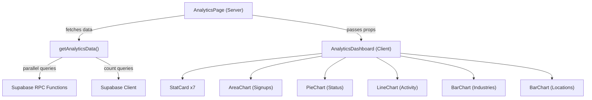
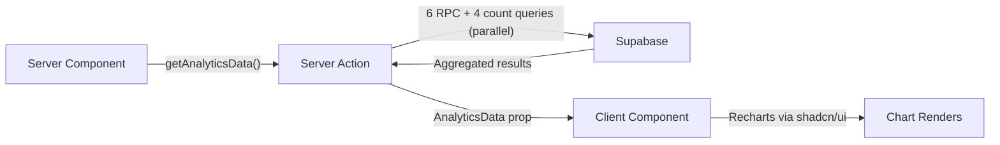
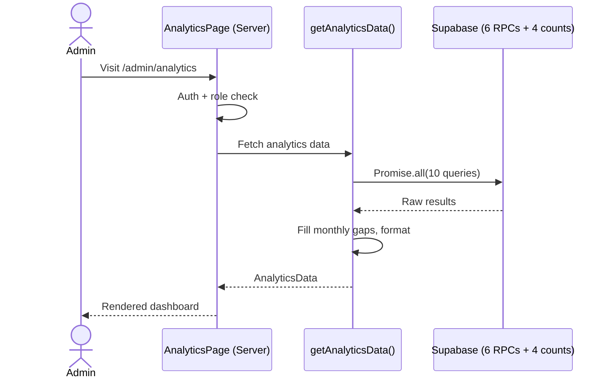

# Feature: Admin Analytics Dashboard

**Date Implemented**: 2026-03-10
**Status**: Complete
**Related ADRs**: None (no significant architectural decisions — standard charting pattern)

## Overview

A read-only analytics dashboard for admin users showing platform usage statistics, trends, and demographics. Accessible at `/admin/analytics` and linked from the admin hub and navbar.

## Architecture

### Component Hierarchy

### Data Flow

### Sequence Diagram

## Key Files

| File | Purpose |
|------|---------|
| `src/app/(admin)/admin/analytics/page.tsx` | Server page with auth check |
| `src/app/(admin)/admin/analytics/actions.ts` | Data fetching (10 parallel queries) |
| `src/app/(admin)/admin/analytics/analytics-dashboard.tsx` | Client component with all charts |
| `src/app/(admin)/admin/analytics/loading.tsx` | Skeleton loading state |
| `supabase/migrations/00022_analytics_rpc_functions.sql` | 6 Postgres RPC functions |
| `src/components/navbar/admin-navbar.tsx` | Updated with Analytics link |
| `src/app/(admin)/admin/page.tsx` | Updated hub with Analytics card |

## Database Functions

| Function | Parameters | Returns | Description |
|----------|-----------|---------|-------------|
| `get_user_status_counts()` | none | `(status, count)[]` | Users grouped by verification_status |
| `get_signups_over_time(start_date)` | `date` | `(month, count)[]` | Monthly signup counts |
| `get_connections_over_time(start_date)` | `date` | `(month, count)[]` | Monthly accepted connection counts |
| `get_messages_over_time(start_date)` | `date` | `(month, count)[]` | Monthly message counts |
| `get_top_industries(limit_count)` | `int` | `(name, count)[]` | Industries by user count (top N) |
| `get_top_locations(limit_count)` | `int` | `(name, count)[]` | Countries by user count (top N) |

All functions use `SECURITY DEFINER` with `search_path = public`. Active user counts (DAU/WAU/MAU) use direct Supabase client count queries on `profiles.last_active_at`.

## RLS Policies

No new RLS policies. The RPC functions use `SECURITY DEFINER` to bypass RLS (they aggregate across all users). The page itself enforces admin-only access at the application layer (role check + redirect).

## Charts

| Chart Type | Data | Library |
|------------|------|---------|
| Area chart | Signups over time (12 months) | Recharts via shadcn/ui ChartContainer |
| Donut chart | User status breakdown | Recharts PieChart with innerRadius |
| Line chart (dual) | Connections + messages over time | Recharts LineChart |
| Horizontal bar (x2) | Top industries, top locations | Recharts BarChart (vertical layout) |

## Edge Cases and Error Handling

- **Empty data**: All charts display a centered "No data yet" message when counts are zero.
- **Month gaps**: `fillMonthlyGaps()` ensures all 12 months appear in time-series charts, even months with zero activity.
- **Fresh deployment**: Gracefully handles zero rows from all queries.
- **Non-admin access**: Redirects to `/dashboard`.

## Design Decisions

- **Server-side aggregation**: All GROUP BY operations happen in Postgres via RPC functions, not in JavaScript. Efficient even at scale.
- **Parallel queries**: All 10 data queries run via `Promise.all()` for minimal page load time.
- **shadcn/ui Chart over raw Recharts**: Automatic dark mode support and consistent styling with the rest of the UI.
- **No caching**: Admin analytics pages always show fresh data (consistent with CLAUDE.md rule for authenticated pages).

## Future Considerations

- Date range picker (currently fixed to last 12 months)
- CSV/PDF export of analytics data
- Real-time updates via Supabase Realtime subscriptions
- Drill-down views (click a bar to see users in that industry/location)
- Comparison periods (this month vs last month)
