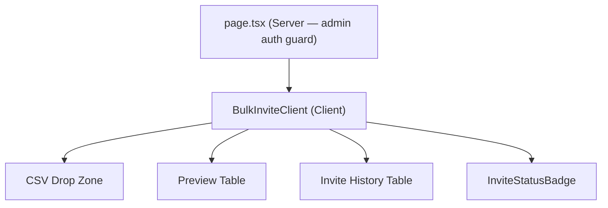
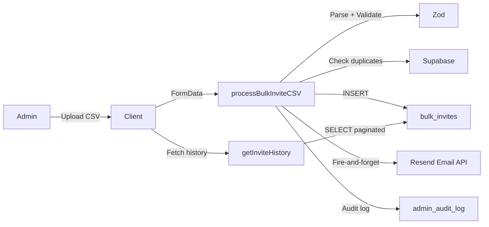
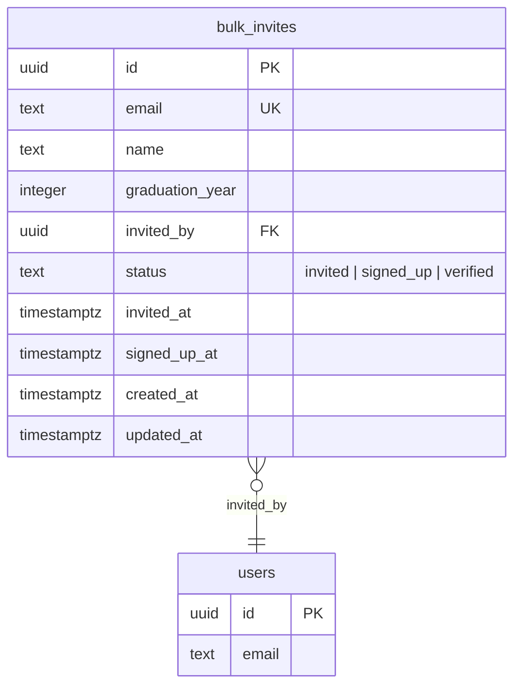
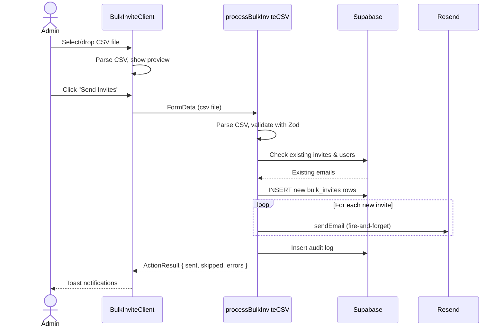
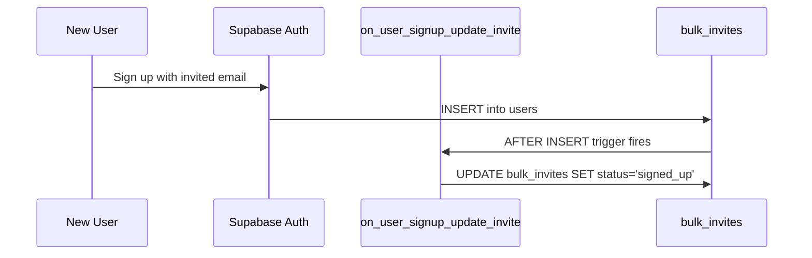

# Feature: Admin Bulk Invite

**Date Implemented**: 2026-03-10
**Status**: Complete
**Related ADRs**: ADR-013

## Overview

Admins can upload a CSV file containing alumni email addresses to send bulk invite emails. The system validates the CSV, deduplicates against existing invites and users, inserts records, and sends invite emails via Resend. Invite status is tracked automatically as recipients sign up and get verified.

## Architecture

### Component Hierarchy

### Data Flow

### Database Schema

### Sequence Diagram — CSV Upload Flow

### Sequence Diagram — Auto Status Update on Signup

## Key Files

| File | Purpose |
|------|---------|
| `src/app/(admin)/admin/bulk-invite/page.tsx` | Server page with admin auth guard |
| `src/app/(admin)/admin/bulk-invite/actions.ts` | Server actions: processBulkInviteCSV, getInviteHistory, resendInvite |
| `src/app/(admin)/admin/bulk-invite/bulk-invite-client.tsx` | Client component with upload, preview, history |
| `src/lib/email-templates.ts` | `bulkInviteEmail()` template |
| `supabase/migrations/00025_create_bulk_invites.sql` | Table, RLS, triggers, audit log constraint update |

## RLS Policies

| Table | Policy | Roles | Description |
|-------|--------|-------|-------------|
| `bulk_invites` | INSERT | admin | Admins can insert invite rows |
| `bulk_invites` | SELECT | admin | Admins can view all invites |
| `bulk_invites` | UPDATE | admin | Admins can update invite status |

## Edge Cases and Error Handling

- **Duplicate emails in CSV**: Deduplicated during parsing, reported as skipped.
- **Email already invited**: Checked against `bulk_invites` table, skipped with message.
- **Email already a user**: Checked against `users` table, skipped with message.
- **Invalid email format**: Caught by Zod validation, shown in preview as error.
- **Invalid graduation year**: Validated against 1999–current+3 range.
- **Empty CSV / no email column**: Returns field error before any processing.
- **CSV too large**: 2MB limit enforced server-side.
- **Too many rows**: 500 row limit enforced server-side.
- **No Resend API key**: Emails silently skipped (local dev friendly).
- **Resend for non-invited**: Only allows resend for invites with status "invited".

## Design Decisions

- **Fire-and-forget emails**: Matches existing pattern in `sendEmail()`. Failures are logged but don't block the invite insertion.
- **UNIQUE constraint on email**: Prevents duplicate invites at the DB level. One invite per email.
- **Auto-status trigger**: A Postgres trigger on `users` INSERT automatically updates `bulk_invites.status` to `signed_up` when someone signs up with an invited email. No application-level coordination needed.
- **Simplified email layout**: Invite emails don't use the standard `emailLayout()` with unsubscribe link since recipients aren't users yet.

## Future Considerations

- **Queued email sending**: For 500+ invites, consider background processing via Edge Functions or a job queue to avoid request timeouts.
- **CSV download template**: Provide a downloadable CSV template for admins.
- **Batch progress indicator**: Show real-time progress for large uploads.
- **Invite expiration**: Add an `expires_at` column to auto-expire stale invites.
