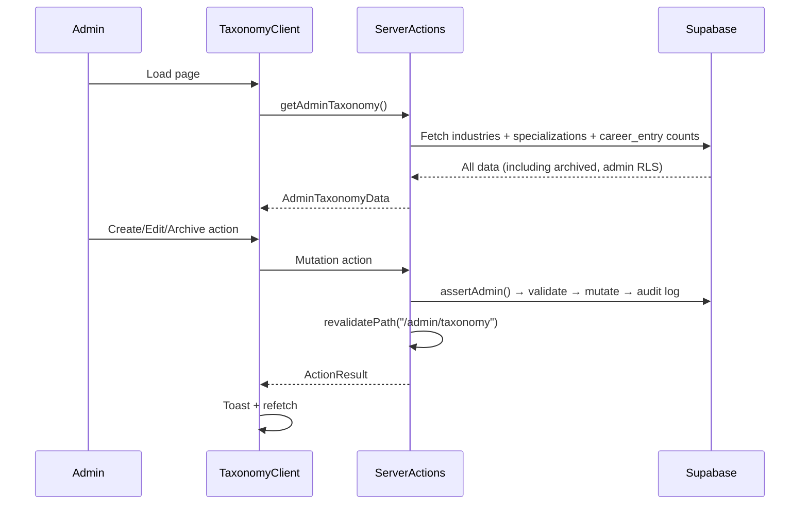

# Admin Taxonomy Management

## Overview
Admin interface for managing the two-level industry taxonomy (industries + specializations). Supports full CRUD, archive/restore with cascade, search, user count display, and audit logging.

## Architecture

### Component Tree
```
/admin/taxonomy/page.tsx (Server Component — auth guard)
└── TaxonomyClient (Client Component)
    ├── Stats cards (4x: industries, specializations, archived counts)
    ├── Search + "Show archived" toggle
    ├── Industry rows (expandable)
    │   ├── Name, spec count, user count badge, status badge, Edit/Archive buttons
    │   └── Expanded: Specialization sub-rows
    │       ├── Name, user count badge, status badge, Edit/Archive buttons
    │       └── "+ Add Specialization" button
    └── TaxonomyDialog (shared create/edit dialog)
```

### Data Flow


### Server Actions
| Action | Purpose |
|--------|---------|
| `getAdminTaxonomy()` | Fetch all industries/specs with user counts |
| `createIndustry(name)` | Create with auto-slug, duplicate check |
| `updateIndustry(id, name)` | Rename + update slug |
| `toggleIndustryArchive(id, archive)` | Archive/restore; cascade to children on archive |
| `createSpecialization(industryId, name)` | Create under specific industry |
| `updateSpecialization(id, name)` | Rename + update slug |
| `toggleSpecializationArchive(id, archive)` | Archive/restore individual spec |

### User Count Calculation
- **Industry count**: `career_entries.industry_id` + `profiles.primary_industry_id` (deduplicated per source)
- **Specialization count**: `career_entries.specialization_id`

### Archive Behavior
- Archiving an industry cascades to all its specializations
- Restoring an industry does NOT auto-restore specializations (admin restores individually)
- Archived items keep their FK references intact — existing career entries are unaffected
- Admin RLS allows reading archived items; regular users only see active items

### Audit Logging
All mutations log to `admin_audit_log` via `insert_audit_log` RPC with taxonomy-specific action types (`taxonomy_create_industry`, `taxonomy_archive_specialization`, etc.).

## Key Files
| File | Purpose |
|------|---------|
| `src/app/(admin)/admin/taxonomy/page.tsx` | Server component, auth guard |
| `src/app/(admin)/admin/taxonomy/actions.ts` | 7 server actions |
| `src/app/(admin)/admin/taxonomy/taxonomy-client.tsx` | Main UI component |
| `src/app/(admin)/admin/taxonomy/taxonomy-dialog.tsx` | Create/edit dialog |
| `src/components/navbar/admin-navbar.tsx` | Updated with Taxonomy link |
| `src/lib/types.ts` | AdminIndustryRow, AdminSpecializationRow, AdminTaxonomyData |

## No Migration Required
Existing schema already had `is_archived`, `sort_order`, and admin INSERT/UPDATE RLS policies on both `industries` and `specializations` tables.
