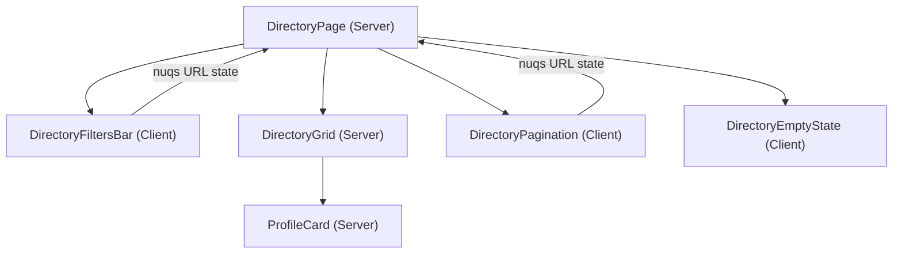
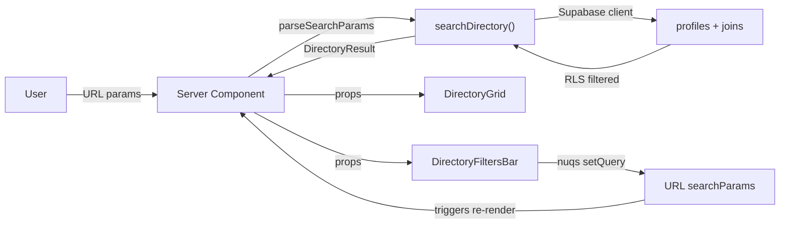
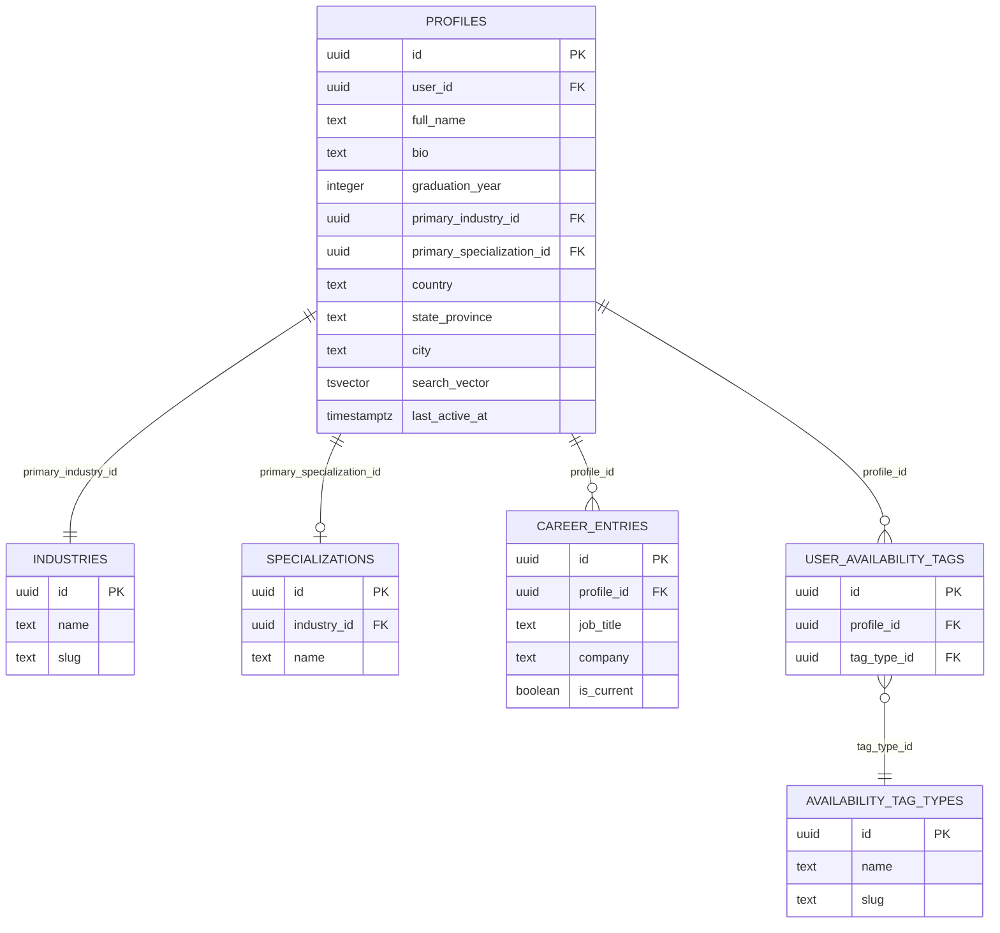
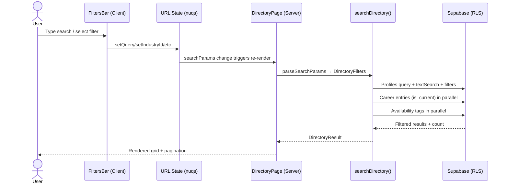

# Feature: Alumni Directory — Search, Filters & Pagination

**Date Implemented**: 2026-03-09
**Status**: Complete
**Related ADRs**: ADR-005

## Overview

Full-text searchable alumni directory with combinable filters, sorting, and pagination. All authenticated users can browse; verified users see richer profile cards. URL state is managed via `nuqs` for bookmarkable/shareable filter URLs.

## Architecture

### Component Hierarchy

### Data Flow

### Database Schema

### Search Flow

## Key Files

| File | Purpose |
|------|---------|
| `src/app/(main)/directory/page.tsx` | Server Component — parses searchParams, fetches data, renders layout |
| `src/app/(main)/directory/directory-filters.tsx` | Client component — search bar, filter panel, sort, nuqs URL state |
| `src/app/(main)/directory/directory-grid.tsx` | Profile card grid (responsive 1/2/3 cols) |
| `src/app/(main)/directory/directory-pagination.tsx` | Client pagination with smart page numbers |
| `src/app/(main)/directory/directory-empty-state.tsx` | Empty state with contextual messaging |
| `src/app/(main)/directory/loading.tsx` | Skeleton loading state |
| `src/lib/queries/directory.ts` | `searchDirectory()` — main query with filters, joins, pagination |
| `src/lib/types.ts` | `DirectoryFilters`, `DirectoryProfile`, `DirectoryResult` types |
| `supabase/migrations/00010_add_directory_search.sql` | tsvector column, GIN index, trigger, backfill |

## RLS Policies

No new RLS policies — directory queries rely on existing profile/career/tag SELECT policies:

| Table | Policy | Effect |
|-------|--------|--------|
| `profiles` | `profiles_select_active` | Only active users' profiles visible |
| `career_entries` | `career_entries_select_active` | Only active users' career entries |
| `user_availability_tags` | `user_availability_tags_select_active` | Only active users' tags |

## Edge Cases and Error Handling

- **No results**: Shows contextual empty state — "No alumni found" (with filters) vs "No alumni yet" (without).
- **Invalid search params**: `parseSearchParams()` safely ignores non-numeric year values, invalid sort keys.
- **Special characters in search**: Supabase `websearch_to_tsquery` handles natural language input safely.
- **Missing career entry**: Cards show no job info gracefully (no crash).
- **Availability tag filter**: Post-query filtering on junction table since Supabase JS can't filter on many-to-many in a single query.

## Design Decisions

- **Native `<select>` over shadcn Select**: The `@base-ui/react` Select doesn't properly render labels for values set externally (e.g., from URL params). Native selects always display correctly. See ADR-005.
- **Offset-based pagination**: Simpler than cursor-based for filtered/sorted queries. Allows "jump to page N". Cursor-based deferred to Phase 3 (100k+ profiles).
- **tsvector on name + bio only**: Career data (job title, company) lives in a separate table — searched via joined subquery rather than denormalizing into the vector.
- **`nuqs` for URL state**: Provides type-safe URL ↔ state sync with throttling, replacing manual searchParams parsing on the client side.

## Future Considerations

- **Cursor-based pagination**: Swap when dataset > 100k rows and offset performance degrades.
- **Full-text search expansion**: Add career entries (job_title, company) to the tsvector via a materialized view or denormalized column.
- **Search service migration**: Replace Supabase query with Typesense/Elasticsearch for faceted search at scale.
- **Availability tag filter UX**: Currently not exposed in the filter panel (data ready, UI deferred).
- **Relevance sort**: Currently falls back to name sort. True relevance ranking needs `ts_rank()` in a raw SQL query.
