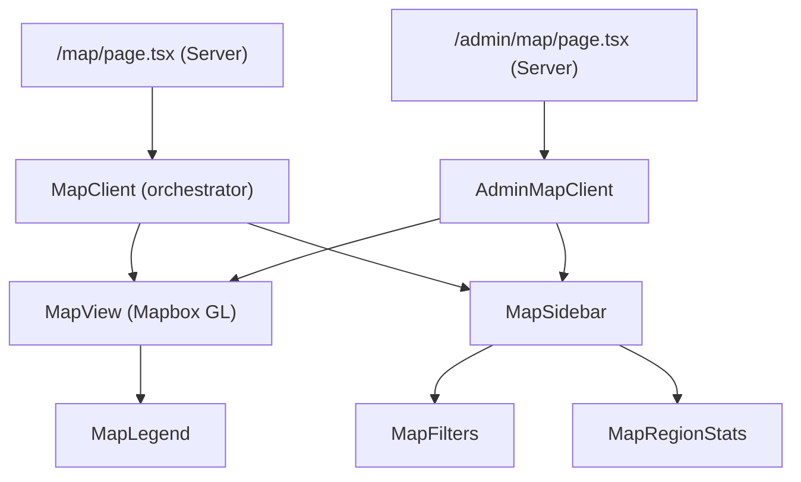
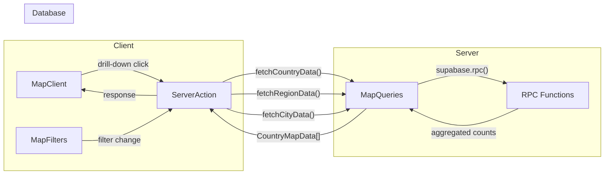
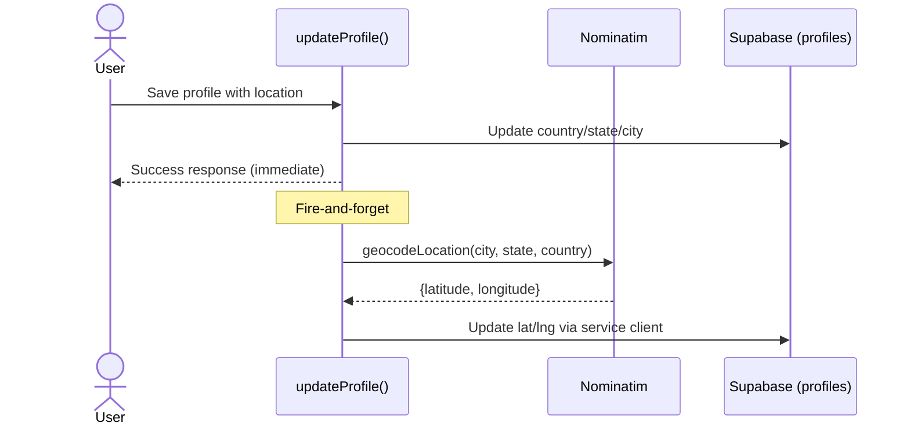
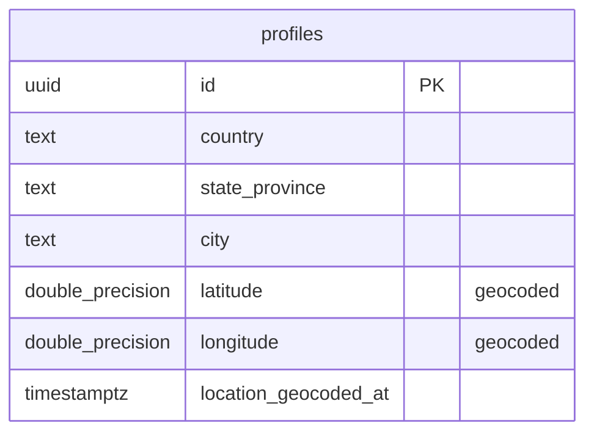

# Feature: Alumni World Map

**Date Implemented**: 2026-03-10
**Status**: Complete
**Related ADRs**: None (straightforward technology choice — Mapbox GL JS)

## Overview

Interactive world map showing where alumni are located geographically. Verified users can explore alumni distribution via country → state → city drill-down, view aggregate stats, and link to the directory pre-filtered by location. Admins have an extended version with unverified user counts and growth trend data.

## Architecture

### Component Hierarchy

### Data Flow

### Geocoding Flow

### Database Schema

No new tables — extends `profiles` with 3 columns + 5 RPC functions.

## Key Files

| File | Purpose |
|------|---------|
| `supabase/migrations/00023_add_geocoding_columns.sql` | Adds lat/lng/geocoded_at to profiles |
| `supabase/migrations/00024_map_aggregation_functions.sql` | 5 RPC functions for map data |
| `src/lib/geocoding.ts` | Static country centroids + Nominatim geocoder |
| `src/lib/queries/map.ts` | Query layer calling map RPCs |
| `src/lib/types.ts` | MapFilters, CountryMapData, RegionMapData, CityMapData, etc. |
| `src/app/(main)/map/page.tsx` | Server component — auth + verification check |
| `src/app/(main)/map/map-client.tsx` | Client orchestrator — state, filters, drill-down |
| `src/app/(main)/map/map-view.tsx` | Mapbox GL rendering — choropleth + bubbles |
| `src/app/(main)/map/map-sidebar.tsx` | Sidebar (desktop) / bottom sheet (mobile) |
| `src/app/(main)/map/map-filters.tsx` | Filter controls (industry, specialization, grad year) |
| `src/app/(main)/map/map-legend.tsx` | Color scale legend |
| `src/app/(main)/map/actions.ts` | Server actions for drill-down data |
| `src/app/(admin)/admin/map/page.tsx` | Admin map page |
| `src/app/(admin)/admin/map/admin-map-client.tsx` | Admin map with unverified toggle + trends |
| `src/app/(admin)/admin/map/actions.ts` | Admin server actions |
| `src/app/(main)/profile/edit/actions.ts` | Modified — geocoding on profile save |
| `src/app/(main)/onboarding/quiz/actions.ts` | Modified — geocoding on onboarding |
| `scripts/backfill-geocoding.ts` | One-time backfill for existing profiles |
| `src/components/navbar/main-navbar-client.tsx` | Modified — added "Map" nav link |
| `src/components/navbar/admin-navbar.tsx` | Modified — added "Map" admin link |

## RLS Policies

No new RLS policies. Existing `profiles` SELECT/UPDATE policies cover the new columns. Map RPC functions are `SECURITY DEFINER` and enforce access internally:
- User functions: filter by `verification_status = 'verified'` and `is_active = true`
- Admin functions: check `auth.uid()` has `role = 'admin'`, raise exception if not

## Edge Cases and Error Handling

- **Missing geocoded coordinates**: Region/city views filter out rows where `avg_latitude IS NULL`. Country view falls back to static centroid lookup when DB coordinates are null.
- **Free-text location inconsistency**: "Vietnam" vs "Viet Nam" vs "VN" — static lookup covers common variants. Nominatim handles fuzzy matching for geocoding. Long-term fix: structured country dropdown (Phase 2).
- **No Mapbox token**: Map renders but tiles won't load. Token is `NEXT_PUBLIC_MAPBOX_TOKEN` in `.env.local`.
- **Nominatim rate limits**: 1 req/sec max. Backfill script enforces 1.1s delay. Profile save geocoding is fire-and-forget (doesn't block user).
- **Empty map**: If no profiles have location data, shows empty map with "Click a location" prompt.
- **Unverified user access**: Redirected to `/directory` from map page.

## Design Decisions

- **Mapbox GL over React Simple Maps**: User requested maximum interactivity (zoom, pan, click). Mapbox provides vector tiles with smooth UX. Bundle size mitigated by `next/dynamic` with `ssr: false`.
- **Hybrid geocoding**: Static country lookup avoids API calls for the most common view (country level). Nominatim on profile save gives city-level precision without runtime cost.
- **Fire-and-forget geocoding**: Profile save should not wait for geocoding API. Coordinates are updated asynchronously via service role client.
- **RPC functions over client queries**: Aggregation logic in Postgres is faster and doesn't expose individual profile data. SECURITY DEFINER ensures admin checks happen server-side.
- **No individual profiles on map**: Privacy requirement — map only shows aggregate counts. "View in Directory" link respects existing visibility tiers.

## Future Considerations

- **Structured location input**: Replace free-text country/city with dropdowns (Phase 2 per SPEC.md). Would eliminate inconsistency issues.
- **Heatmap layer**: Mapbox GL supports heatmap layers — could replace choropleth dots with true density visualization.
- **Event map overlay**: When events feature ships (Phase 3), overlay upcoming events on the map.
- **Real-time map**: Supabase Realtime subscription on profile location changes for live updates (not needed at current scale).
- **Mapbox token restrictions**: In production, restrict token to specific referrer URLs via Mapbox dashboard settings.
