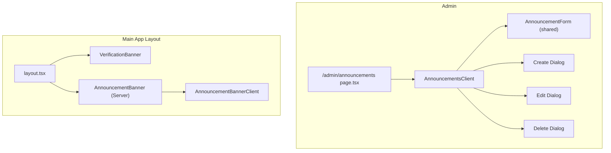
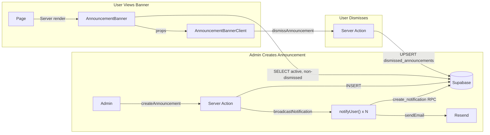
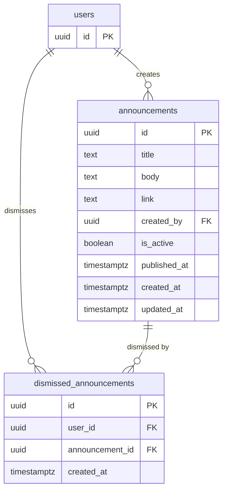
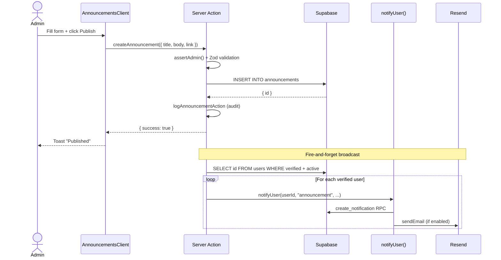

# Feature: Admin Announcements

**Date Implemented**: 2026-03-11
**Status**: Complete
**Related ADRs**: ADR-015

## Overview

Platform-wide announcements created by admins. Displayed as a dismissible banner across all main app pages and broadcast as notifications to all verified users. Supports CRUD operations from the admin dashboard.

## Architecture

### Component Hierarchy

### Data Flow

### Database Schema

### Sequence Diagram — Publish Announcement

## Key Files

| File | Purpose |
|------|---------|
| `supabase/migrations/00027_create_announcements.sql` | Schema: tables, RLS, indexes, audit log constraint |
| `app/(admin)/admin/announcements/page.tsx` | Admin page with auth guard |
| `app/(admin)/admin/announcements/actions.ts` | CRUD server actions + notification broadcast |
| `app/(admin)/admin/announcements/announcements-client.tsx` | Admin UI: list, create/edit/delete dialogs |
| `app/(main)/announcement-banner.tsx` | Server Component: fetches active non-dismissed announcement |
| `app/(main)/announcement-banner-client.tsx` | Client Component: dismissible banner UI |
| `app/(main)/announcements/actions.ts` | dismissAnnouncement server action |
| `lib/types.ts` | `Announcement`, `AnnouncementWithAuthor` types |
| `lib/notifications.ts` | Updated with `announcementBody` email context |
| `lib/email-templates.ts` | `announcementEmail()` template |

## RLS Policies

| Table | Operation | Roles | Description |
|-------|-----------|-------|-------------|
| `announcements` | SELECT | authenticated | Active + published announcements only |
| `announcements` | ALL | admin | Full CRUD for admins |
| `dismissed_announcements` | SELECT | authenticated | Own dismissals only |
| `dismissed_announcements` | INSERT | authenticated | Can dismiss announcements |

## Edge Cases and Error Handling

- **No active announcements**: Banner returns `null` (nothing rendered)
- **Multiple active announcements**: Only the most recent non-dismissed one shows
- **User dismisses, admin deactivates then reactivates**: Dismissal persists
- **Admin deletes announcement**: CASCADE deletes dismissed_announcements rows
- **Notifications already sent**: Deactivating/deleting does NOT remove sent notifications (by design — notifications are historical)
- **Large user count for broadcast**: Uses `Promise.allSettled` — individual failures don't block others

## Design Decisions

- **Banner + notifications** (not notifications only) — banners are more visible for important notices
- **Server Component banner** — fetches fresh on every navigation, no real-time subscription needed
- **Scheduling deferred** — `published_at` column exists (defaults to `now()`), but no date picker UI yet
- **No FK between notifications and announcements** — keeps notification system generic; tradeoff is no retroactive cleanup

## Future Considerations

- **Scheduling**: Add date picker to set future `published_at`, filter by `published_at <= now()` (column already exists)
- **Batched broadcast**: At scale (10k+ users), move notification broadcast to Edge Function or queue
- **Multiple banner display**: Currently shows only the most recent — could show a stack or carousel
- **Announcement categories**: Priority levels (info, warning, critical) with different banner colors
