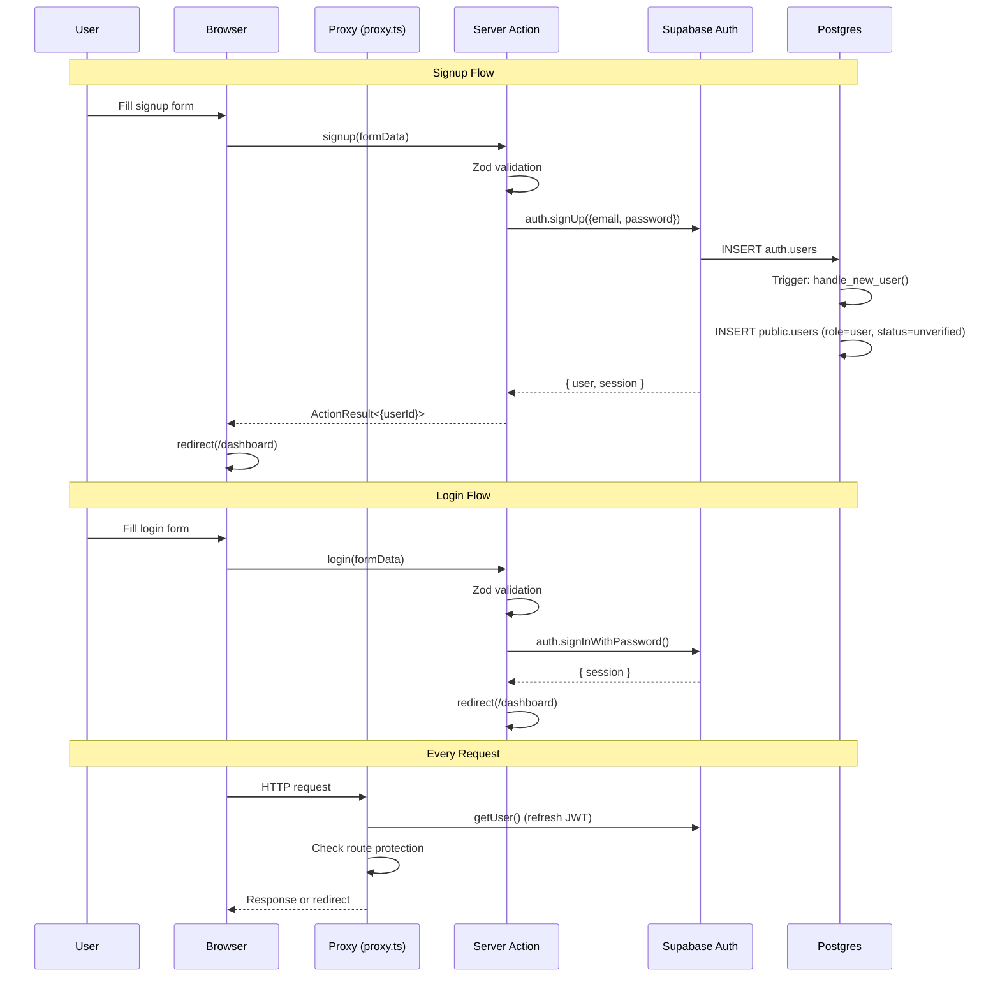
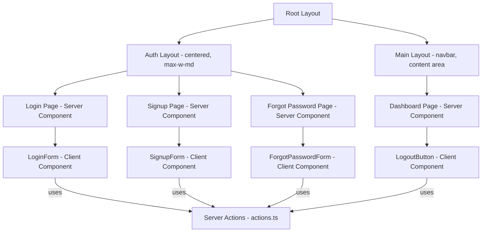
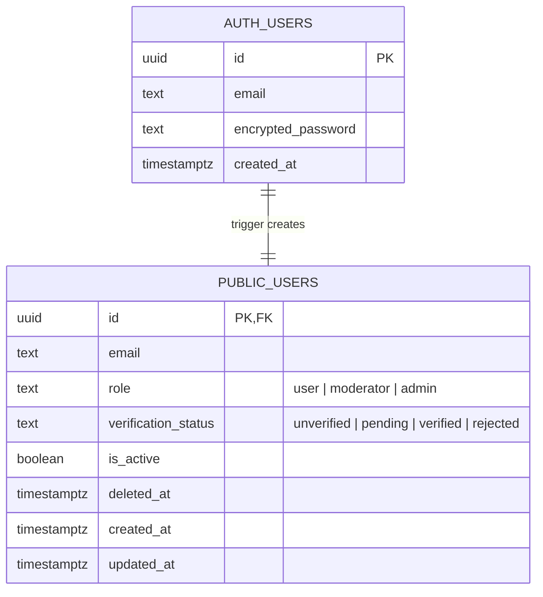

# Feature: Authentication (Signup, Login, Logout)

**Feature #2** | Completed: 2026-03-08

## Overview

Email/password authentication using Supabase Auth with a companion `public.users` table for app-specific fields (role, verification status). Includes signup, login, logout, and forgot-password flows.

## Architecture

### Data Flow

### Component Tree

### ER Diagram

## Key Files

| File | Purpose |
|------|---------|
| `supabase/migrations/00001_create_users_table.sql` | Schema, triggers, RLS policies |
| `src/proxy.ts` | Auth session refresh + route protection |
| `src/app/(auth)/actions.ts` | Server Actions: signup, login, logout, resetPassword |
| `src/app/(auth)/login/login-form.tsx` | Login form (client component) |
| `src/app/(auth)/signup/signup-form.tsx` | Signup form (client component) |
| `src/app/(auth)/forgot-password/forgot-password-form.tsx` | Password reset form |
| `src/app/auth/callback/route.ts` | Code exchange for email flows |
| `src/app/(auth)/actions.test.ts` | Unit tests (13 tests) |

## RLS Policies

| Policy | Table | Effect |
|--------|-------|--------|
| `users_select_own` | public.users | Users can always read their own row |
| `users_select_active` | public.users | Authenticated users can read active users |
| `users_update_own` | public.users | Users can update their own row |
| `admins_select_all` | public.users | Admins can read all users (including inactive) |
| `admins_update_all` | public.users | Admins can update any user |

## Design Decisions

- **No email confirmation in dev**: Simplifies local development. Can be enabled in Supabase dashboard for production.
- **Reset password always returns success**: Prevents email enumeration attacks.
- **Proxy over middleware**: Next.js 16 uses `proxy.ts` convention (default export named `proxy`).
- **`public.users` separate from `profiles`**: Auth/role concerns are distinct from profile data. Profiles (Feature #4) will be a separate table.
- **Trigger-based user creation**: Guarantees `public.users` row exists for every authenticated user, even if signup flow is interrupted.

## Test Coverage

- Signup: validation (email, password length, password match), success, duplicate email, generic errors
- Login: validation (email, password), success (redirect), invalid credentials
- Reset password: validation, success regardless of email existence (anti-enumeration)
