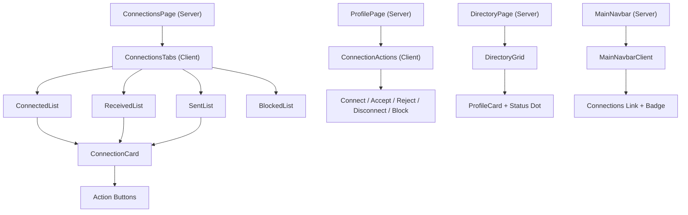
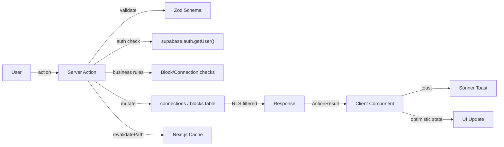
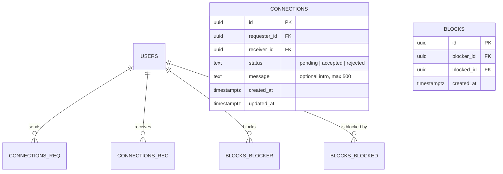

# Feature: Connection System

**Date Implemented**: 2026-03-09
**Status**: Complete
**Related ADRs**: None (standard pattern, no novel decisions)

## Overview

Social connection system allowing verified alumni to send, accept, reject, and manage connections. Includes blocking functionality. Connection status is reflected across the profile view, directory cards, connections page, and navbar.

## Architecture

### Component Hierarchy

### Data Flow

### Database Schema

## Key Files

| File | Purpose |
|------|---------|
| `supabase/migrations/00012_create_connections_and_blocks_tables.sql` | Schema, indexes, RLS |
| `src/lib/types.ts` | Connection, Block, RelationshipInfo types |
| `src/lib/queries/connections.ts` | Query helpers (relationship, lists, counts, status map) |
| `src/app/(main)/connections/actions.ts` | 6 server actions |
| `src/app/(main)/connections/page.tsx` | Connections page (server) |
| `src/app/(main)/connections/connections-tabs.tsx` | Tabbed UI (client) |
| `src/app/(main)/connections/loading.tsx` | Skeleton loading |
| `src/app/(main)/profile/[id]/connection-actions.tsx` | Profile connection buttons |
| `src/app/(main)/directory/directory-grid.tsx` | Status dots on cards |
| `src/components/navbar/main-navbar.tsx` | Pending count fetch |
| `src/components/navbar/main-navbar-client.tsx` | Badge display |
| `docs/design-system.md` | UI design system reference |

## Server Actions

| Action | Auth | Description |
|--------|------|-------------|
| `sendConnectionRequest` | Verified | Creates pending connection. Validates no block, no duplicate, not self. |
| `acceptConnectionRequest` | Authenticated | Receiver accepts pending request. |
| `rejectConnectionRequest` | Authenticated | Receiver rejects pending request. |
| `disconnectUser` | Authenticated | Either party deletes connection. |
| `blockUser` | Verified | Blocks user, removes any existing connection. |
| `unblockUser` | Authenticated | Removes own block. |

## RLS Policies

| Table | Operation | Rule |
|-------|-----------|------|
| connections | SELECT | User is requester or receiver |
| connections | INSERT | User is requester AND verified AND active |
| connections | UPDATE | User is receiver AND status is pending |
| connections | DELETE | User is requester or receiver |
| blocks | SELECT | User is blocker |
| blocks | INSERT | User is blocker AND verified AND active |
| blocks | DELETE | User is blocker |
| Both | ALL | Admin override |

## UI States

| Relationship | Profile View | Directory Card |
|-------------|-------------|----------------|
| None | Gradient "Connect" button | No indicator |
| Pending (sent) | Amber "Request Sent" with pulse | Amber dot |
| Pending (received) | Green "Accept" + Red "Reject" | Amber dot |
| Connected | Green "Connected" badge | Green dot with checkmark |
| Blocked by me | "Unblock" button | Not shown (hidden) |
| Unverified viewer | Disabled "Verify to Connect" | No indicator |

## Animation Details

- **Connect button**: `bg-gradient-to-r from-blue-500 to-purple-600`, hover scale + glow shadow
- **Accept button**: `bg-emerald-500`, hover scale-105
- **Pending indicator**: Animated ping dot (amber)
- **Card entrance**: Staggered fade-in-slide-up with 75ms delay per card
- **Tab switch**: Fade-in transition
- **Navbar badge**: zoom-in animation on count > 0
