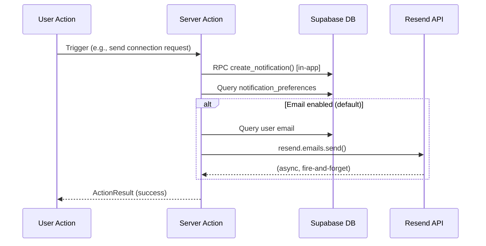
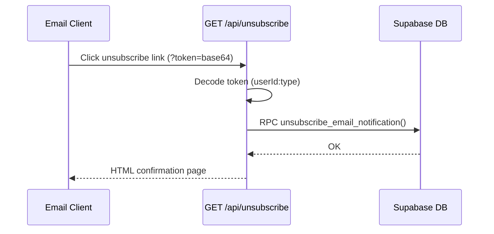
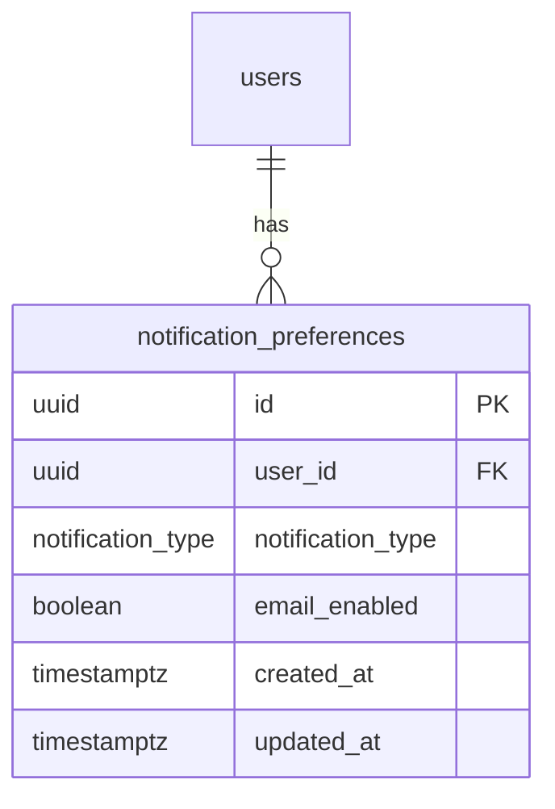

# Feature: Email Notifications

## Overview
Sends email notifications to users for key events: connection requests, connection accepted, new messages, and verification status updates. Users can opt out per notification type via settings or one-click unsubscribe links.

## Architecture

### Data Flow



### Unsubscribe Flow



## Component Tree

```
/settings/notifications (Server Component)
  └─ NotificationPreferencesForm (Client Component)
       └─ Toggle switches per notification type
            └─ updateNotificationPreference() Server Action
```

## Schema

### notification_preferences table



- UNIQUE(user_id, notification_type)
- No row = default email enabled
- Row with `email_enabled = false` = opted out

### RLS Policies
- Users can SELECT/INSERT/UPDATE/DELETE their own rows
- SECURITY DEFINER function `unsubscribe_email_notification()` for unauthenticated unsubscribe

## Key Files

| File | Purpose |
|------|---------|
| `supabase/migrations/00019_notification_preferences.sql` | Schema + RLS + unsubscribe function |
| `src/lib/email.ts` | Resend client wrapper |
| `src/lib/email-templates.ts` | HTML email templates per notification type |
| `src/lib/notifications.ts` | Extended `notifyUser()` with email support |
| `src/lib/queries/notification-preferences.ts` | Preference + email query helpers |
| `src/lib/supabase/service.ts` | Service role client (for unsubscribe) |
| `src/app/api/unsubscribe/route.ts` | One-click unsubscribe endpoint |
| `src/app/(main)/settings/notifications/page.tsx` | Settings page (Server Component) |
| `src/app/(main)/settings/notifications/notification-preferences-form.tsx` | Toggle UI (Client Component) |
| `src/app/(main)/settings/notifications/actions.ts` | Preference update Server Action |

## Email Templates
- `connectionRequestEmail` — "{name} wants to connect"
- `connectionAcceptedEmail` — "{name} accepted your connection"
- `newMessageEmail` — "New message from {name}"
- `verificationUpdateEmail` — approved/rejected variants

All templates use:
- Inline CSS (email-safe, no external stylesheets)
- Consistent header/footer layout via `emailLayout()`
- CTA button linking to the relevant app page
- Unsubscribe link in footer

## Environment Variables
- `RESEND_API_KEY` — required in production, optional in dev (skips email if missing)
- `RESEND_FROM_EMAIL` — sender address (defaults to `onboarding@resend.dev` for dev)
- `NEXT_PUBLIC_SITE_URL` — used in email links and unsubscribe URLs

## Testing Status

### What's verified (local dev, 2026-03-10)
- Build passes with all new files
- `/settings/notifications` renders 4 toggle switches, persists preferences to DB
- `/api/unsubscribe` decodes tokens, upserts preferences, returns HTML confirmation
- `notifyUser()` integrates email path — gracefully skips when `RESEND_API_KEY` is not set
- All existing notification call sites (connections, messages, verification) pass `emailContext`

### What's NOT yet tested (deferred to deployment)
- **Actual email delivery** — requires `RESEND_API_KEY` + verified sending domain
- **Email rendering** across clients (Gmail, Outlook, Apple Mail, mobile)
- **Unsubscribe link click-through** with real emails
- **Rate limits** — Resend free tier is 100 emails/day; untested under load
- **Bounce handling** — no suppression list yet

## Production Deployment Checklist

When deploying (Feature #35), complete these steps to enable email notifications:

### 1. Resend Setup
- [ ] Create account at [resend.com](https://resend.com)
- [ ] Add and verify your sending domain (e.g., `alumnet.app`)
- [ ] Create an API key (use `re_live_` prefix for production)
- [ ] Note: `re_test_` keys accept API calls but don't deliver emails — useful for staging

### 2. Environment Variables (Vercel)
```
RESEND_API_KEY=re_live_xxxxxxxxxxxx
RESEND_FROM_EMAIL=AlumNet <notifications@alumnet.app>
NEXT_PUBLIC_SITE_URL=https://alumnet.app
```

### 3. Verify End-to-End
- [ ] Trigger a connection request between two test users → recipient gets email
- [ ] Click the CTA button in the email → opens correct app page
- [ ] Click unsubscribe link → preference updated, confirmation page shown
- [ ] Toggle off in `/settings/notifications` → no more emails for that type
- [ ] Check email rendering in Gmail + Outlook (major clients)

### 4. Monitor
- [ ] Check Resend dashboard for delivery rates, bounces, complaints
- [ ] Watch server logs for `[Email:send]` errors
- [ ] Track daily send volume vs. free tier limit (100/day)

### 5. When to Upgrade
- **Resend paid plan**: when daily volume exceeds 100 emails consistently
- **Delivery tracking**: when you need open/click rates or bounce suppression (see ADR Option 4)
- **Delayed emails**: when users complain about too many message notification emails (see ADR Option 3)

## Future Scaling Notes

See [ADR 011](../adrs/011-email-notifications-resend-direct.md) for detailed evaluation of 4 scaling options:

| Trigger | Recommended Upgrade |
|---------|-------------------|
| Email latency impacts Server Actions | Option 2: Supabase Edge Functions (decouple from request cycle) |
| Need "email only if unread after 15 min" | Option 3: pg_cron + `email_sent_at` column |
| Need weekly digest emails | Option 3: pg_cron batch job |
| Need bounce/open/click tracking | Option 4: Resend webhooks + `email_delivery_log` table |
| Volume exceeds 100/day | Upgrade Resend plan (Pro: 50k/month) |
| Need richer email templates | Migrate from inline HTML to [React Email](https://react.email) components |

## Design Decisions
- See [ADR 011](../adrs/011-email-notifications-resend-direct.md) for approach evaluation and future scaling options
