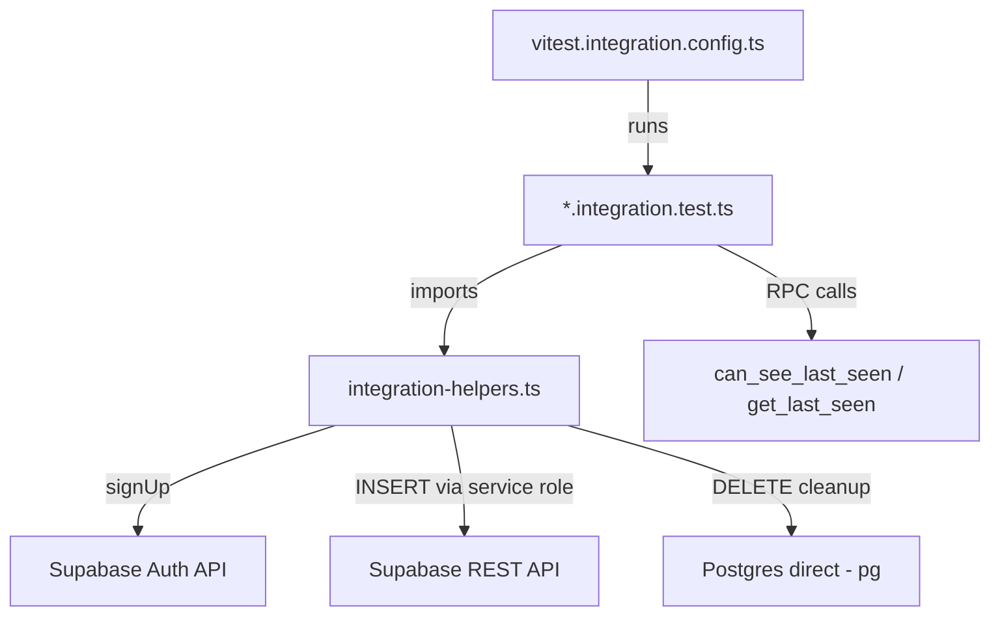
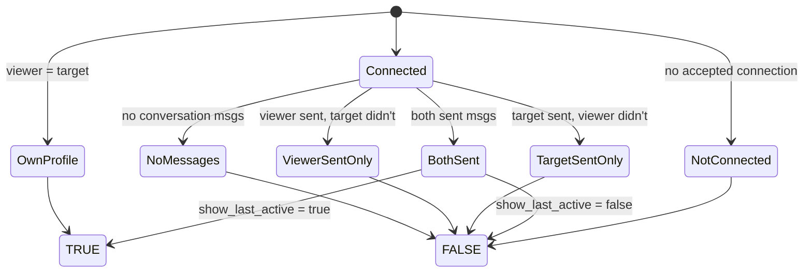

# F45a: Gate Test Harness

> First integration-test pattern for the codebase. Tests the `can_see_last_seen()` SQL gate and establishes reusable fixture/cleanup patterns for future SQL integration tests.

## Architecture



## Test Infrastructure

### Separate Vitest Config

`vitest.integration.config.ts` — isolated from unit tests:
- `environment: "node"` (not jsdom)
- `include: ["src/**/*.integration.test.ts"]`
- Unit config (`vitest.config.ts`) excludes `*.integration.test.ts`

### Reusable Helpers (`src/test/integration-helpers.ts`)

| Helper | Purpose |
|--------|---------|
| `createTestUser(suffix)` | Creates auth user via `signUp` + returns authenticated client |
| `seedProfile(userId, industryId, overrides?)` | Inserts profile via service-role client |
| `seedConnection(userA, userB)` | Inserts accepted connection |
| `seedConversation(userA, userB, senders)` | Creates conversation + participants + optional messages |
| `getAnyIndustryId()` | Fetches a real industry ID from seeded taxonomy |
| `cleanupTestUsers(userIds)` | Deletes via direct Postgres (connections first, then auth.users CASCADE) |
| `getServiceClient()` | Returns service-role Supabase client (bypasses RLS) |

### Key Design Decisions

1. **signUp instead of admin.createUser** — GoTrue v2.187+ rejects HS256 JWTs on the admin API. `signUp` works because local dev has `enable_confirmations = false` (auto-confirm).

2. **Service-role client for seeding** — Bypasses RLS so we can INSERT directly into any table without needing per-table INSERT policies for test users.

3. **Direct Postgres for cleanup** — `auth.admin.deleteUser()` also fails with the HS256 issue. Direct `DELETE FROM auth.users` with FK cascade handles cleanup. Connections table requires explicit deletion first (FK without CASCADE).

4. **One client per user** — Each `TestUser` holds its own `SupabaseClient` with an active session, so `auth.uid()` resolves correctly in RPC calls.

## Test Scenarios

### `can_see_last_seen()` Gate (7 core scenarios)



### Additional Tests

| Test | Validates |
|------|-----------|
| `get_last_seen()` returns timestamp when gate passes | RPC integration |
| `get_last_seen()` returns null when gate fails | Privacy guarantee |
| Unauthenticated caller | `REVOKE ALL FROM public` enforcement |
| Soft-deleted messages ignored | `is_deleted = false` filter in gate |

## Running Tests

```bash
# Requires local Supabase running
supabase start

# Run integration tests (loads .env.local for Supabase keys)
npx dotenv-cli -e .env.local -- npm run test:integration

# Run unit tests only (default, excludes integration)
npm test
```

## Future Integration Tests

To add new integration tests:

1. Create `src/<path>/<name>.integration.test.ts`
2. Import helpers from `@/test/integration-helpers`
3. Use `createTestUser` + seed helpers in `beforeAll`
4. Call Supabase RPCs via `testUser.client.rpc()`
5. Clean up with `cleanupTestUsers` in `afterAll`
