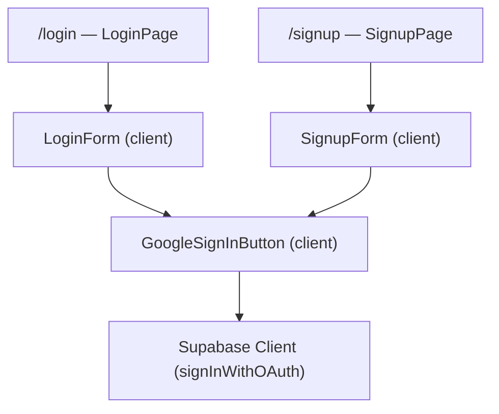
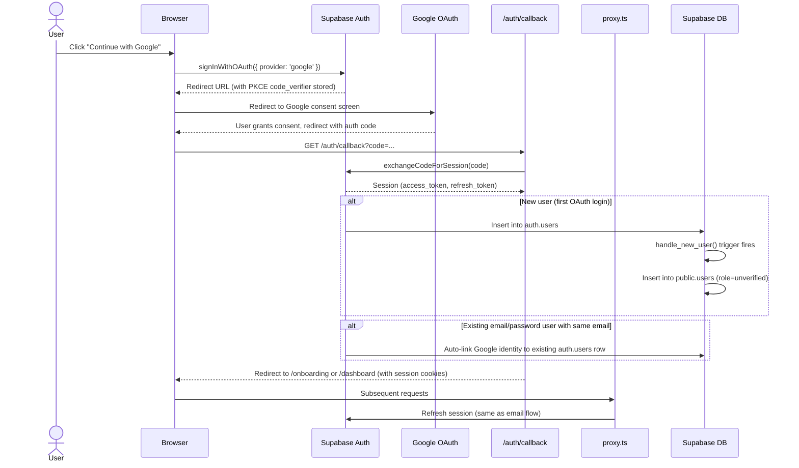
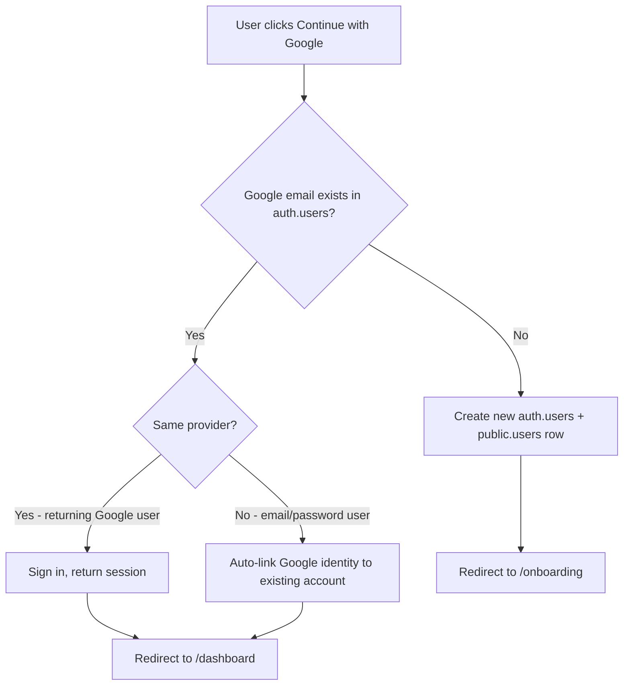

# Feature: Google OAuth (Sign in with Google)

**Date Implemented**: 2026-03-13
**Status**: Complete
**Related ADRs**: ADR-021

## Overview

Social login via Google OAuth, allowing alumni to sign in or sign up with their Google account. Uses Supabase's built-in OAuth support with PKCE flow. Available to all user roles on both `/login` and `/signup` pages. New OAuth users enter the same onboarding and verification pipeline as email/password users.

## Architecture

### Component Hierarchy



### Data Flow — OAuth Sign-In Sequence



### Account Linking Flow



## Key Files

| File | Purpose |
|------|---------|
| `src/app/(auth)/google-sign-in-button.tsx` | Client component — renders Google button, calls `signInWithOAuth` |
| `src/app/(auth)/login/login-form.tsx` | Login form — includes Google button above email form |
| `src/app/(auth)/signup/signup-form.tsx` | Signup form — includes Google button above email form |
| `src/app/(auth)/auth/callback/route.ts` | Code exchange handler — unchanged, works for both email and OAuth |
| `src/proxy.ts` | Session refresh — unchanged, works for both email and OAuth |
| `supabase/config.toml` | Local dev config — `[auth.external.google]` section |
| `src/i18n/messages/en.json` | English translations — `auth.oauth` namespace |
| `src/i18n/messages/vi.json` | Vietnamese translations — `auth.oauth` namespace |
| `.env.example` | Documents `GOOGLE_CLIENT_ID` and `GOOGLE_CLIENT_SECRET` env vars |

## Configuration

### Local Development

In `supabase/config.toml`:

```toml
[auth.external.google]
enabled = true
client_id = "env(GOOGLE_CLIENT_ID)"
secret = "env(GOOGLE_CLIENT_SECRET)"
```

Environment variables in `.env.local`:
- `GOOGLE_CLIENT_ID` — from Google Cloud Console
- `GOOGLE_CLIENT_SECRET` — from Google Cloud Console

### Production

1. **Google Cloud Console**: Create OAuth 2.0 client credentials. Set authorized redirect URI to `https://<supabase-project-ref>.supabase.co/auth/v1/callback`.
2. **Supabase Dashboard**: Authentication > Providers > Google — enter client ID and secret.
3. No Vercel/Next.js env vars needed for OAuth itself (Supabase handles the provider config).

## RLS Policies

No new RLS policies. OAuth users go through the same `public.users` table with the same policies as email/password users. The `handle_new_user()` trigger creates the `public.users` row with `role = 'unverified'` and `verification_status = 'unverified'`.

## Edge Cases and Error Handling

- **User cancels Google consent screen**: Google redirects back without an auth code. The callback route handles missing/invalid codes gracefully and redirects to `/login` with an error parameter.
- **Google account email matches existing email/password account**: Supabase auto-links the Google identity to the existing account. The user can then sign in with either method. No duplicate `public.users` rows are created.
- **OAuth error from Supabase**: If `signInWithOAuth` returns an error (e.g., provider disabled, network issue), the error is logged and the button re-enables. No redirect occurs.
- **Loading state**: Button shows "Signing in..." text and is disabled while the OAuth redirect is in progress, preventing double-clicks.
- **Pop-up blockers**: Uses full-page redirect (not popup), so pop-up blockers do not interfere.

## Design Decisions

- **Client-side initiation**: OAuth requires a browser redirect to the Google consent screen, which cannot be done from a Server Action. See ADR-021 for full rationale.
- **Shared callback route**: The existing `/auth/callback` route handles both email verification codes and OAuth codes via `exchangeCodeForSession()`. No separate OAuth callback was needed.
- **Button placement**: Google button appears above the email form with an "or continue with email" divider, following the convention used by most modern web apps (social login first, email fallback second).
- **No new migrations**: OAuth is handled entirely by Supabase Auth (`auth.users` + `auth.identities`). The existing `handle_new_user()` trigger and `public.users` table work without changes.
- **i18n**: Four translation keys in `auth.oauth` namespace (`continueWithGoogle`, `signingIn`, `or`, `continueWithEmail`) keep the UI bilingual.

## Future Considerations

- **Additional providers**: LinkedIn, GitHub, or Microsoft could be added following the same pattern — new button component, provider config in Supabase, no backend changes needed.
- **Provider-specific profile data**: Google provides profile photo and display name. A future enhancement could pre-fill onboarding fields from the OAuth profile metadata.
- **Unlinking providers**: Users may want to disconnect their Google account. This requires a settings UI and calls to `supabase.auth.unlinkIdentity()`.
