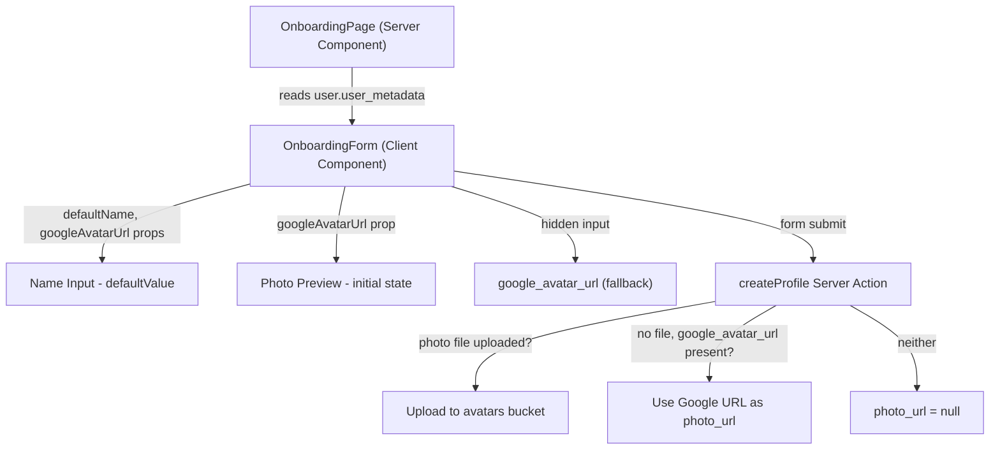
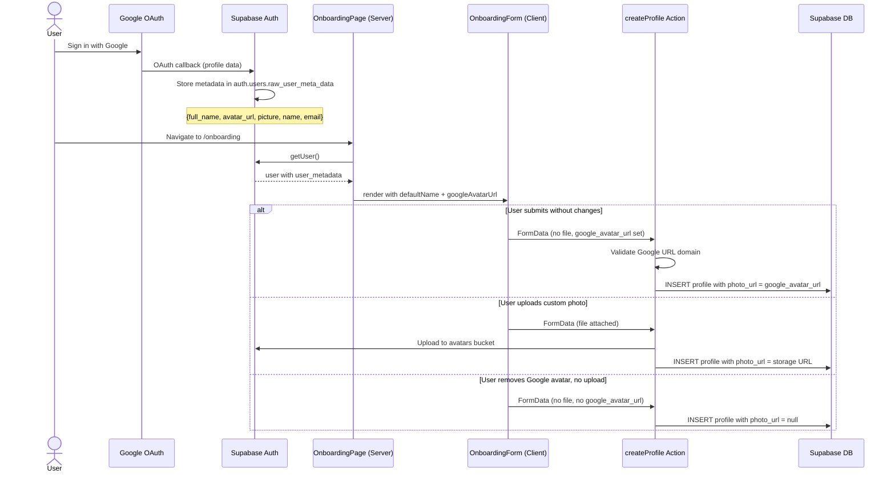

# Feature: Google Profile Import (Onboarding)

**Date Implemented**: TODO
**Status**: In Progress
**Related ADRs**: None (no schema or architectural changes)

## Overview

When users sign up via Google OAuth, their Google display name and profile picture are automatically pre-populated on the onboarding form. Users can still edit the name or upload a different photo. This reduces friction for Google OAuth signups by eliminating the need to manually re-enter information that Google already provides.

## Architecture

### Component Hierarchy

### Data Flow

## Key Files

| File | Purpose |
|------|---------|
| `src/app/(main)/onboarding/page.tsx` | Server Component — reads `user_metadata`, passes Google data as props |
| `src/app/(main)/onboarding/onboarding-form.tsx` | Client Component — pre-fills name, shows Google avatar preview |
| `src/app/(main)/onboarding/actions.ts` | Server Action — handles Google avatar URL fallback when no file uploaded |

## Changes Required

### `onboarding/page.tsx`
- Extract `user.user_metadata.full_name` (or `user.user_metadata.name`) and `user.user_metadata.avatar_url` (or `user.user_metadata.picture`)
- Pass as `defaultName?: string` and `googleAvatarUrl?: string` props to `OnboardingForm`

### `onboarding-form.tsx`
- Accept new optional props: `defaultName`, `googleAvatarUrl`
- Set `defaultValue={defaultName}` on the `full_name` input
- Initialize `photoPreview` state with `googleAvatarUrl` if present
- Add hidden input `<input type="hidden" name="google_avatar_url" value={...} />` (cleared when user uploads a custom photo or removes the preview)
- Add "remove" button on the Google avatar preview to clear it

### `onboarding/actions.ts`
- After existing photo upload logic: if no file uploaded, check for `google_avatar_url` in form data
- Validate URL is from a Google domain (e.g., `lh3.googleusercontent.com`, `googleusercontent.com`)
- If valid, use as `photo_url` directly (no storage upload needed)

## Edge Cases and Error Handling

- **Email-password signup**: `user_metadata` has no `full_name` or `avatar_url` → no pre-fill, existing behavior unchanged
- **Google account without profile picture**: `avatar_url` is absent or empty → no avatar preview, form behaves normally
- **Google display name is empty/whitespace**: No name pre-fill, field is blank
- **Google avatar URL expired/invalid**: Profile created with the URL; if it 404s later, the `AvatarFallback` (initials) renders automatically across the app
- **User changes Google avatar after signup**: `photo_url` still points to old URL — acceptable for Phase 1. User can update via profile edit page.
- **URL validation rejects non-Google URL**: If someone tampers with the hidden input, the URL is rejected and `photo_url` is set to `null`

## Design Decisions

- **No storage re-upload of Google avatar**: Google avatar URLs are stable, publicly accessible CDN links (`lh3.googleusercontent.com`). Re-uploading to our own bucket would add complexity and storage cost with no clear benefit. If Google changes their CDN or URLs expire (extremely rare), the `AvatarFallback` component handles it gracefully.
- **Hidden input for Google avatar URL**: The server action needs to know about the Google avatar as a fallback. A hidden input is the simplest approach that works with the existing `useActionState` + `FormData` pattern.
- **No schema changes**: `profiles.photo_url` already stores any URL string. No migration needed.

## Future Considerations

- **Profile edit page**: Could also show the Google avatar as a "restore original" option when editing profile photo
- **Other OAuth providers**: If LinkedIn OAuth is added, the same pattern applies — extract metadata and pre-fill
- **Avatar re-upload**: If Google avatar URLs prove unreliable over time, add a background job to download and re-upload to the avatars bucket
