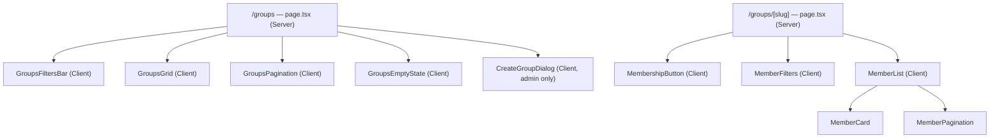
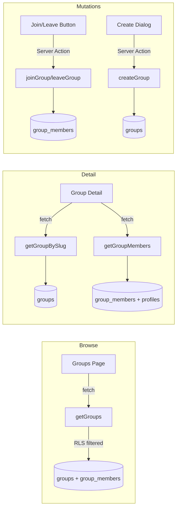
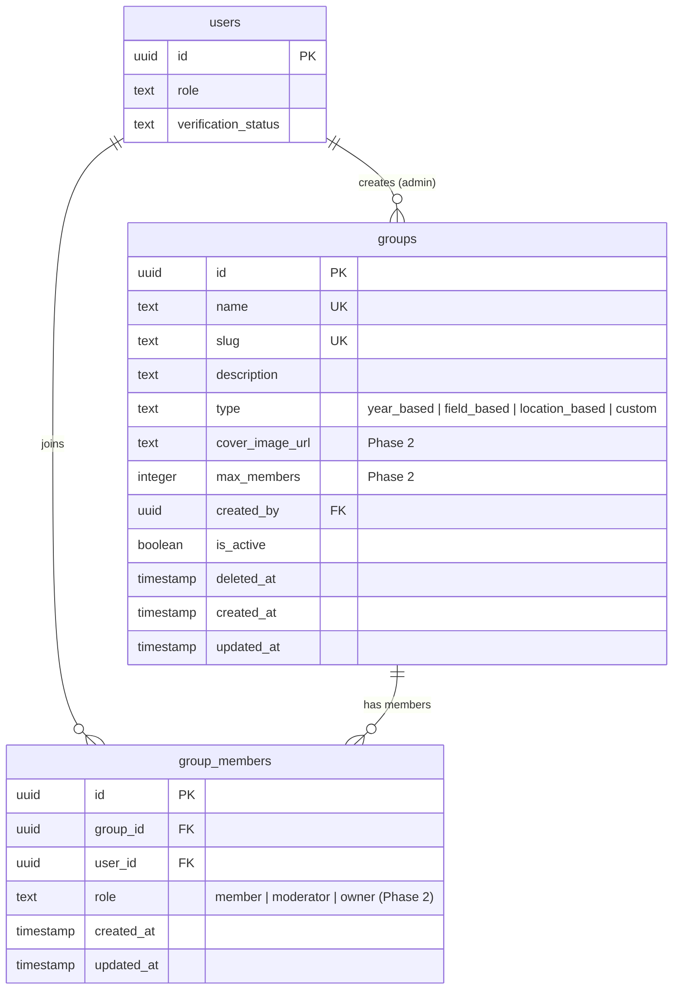
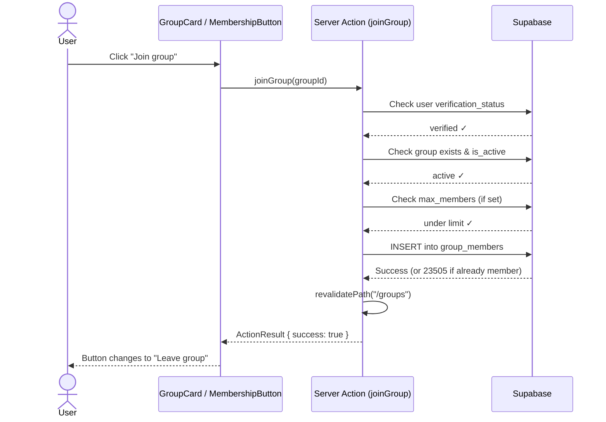
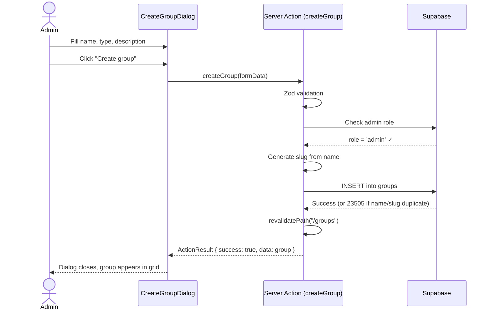

# Feature: Groups (Basic, Admin-Created)

**Date Implemented**: 2026-03-10
**Status**: Complete
**Related ADRs**: ADR-012

## Overview

Admin-created alumni groups that verified users can browse and join. Groups are organized by type: year-based, field-based, location-based, or custom. Phase 1 provides a member directory within each group — no group chat or discussions.

**User roles**:
- **Admin**: Create, update, soft-delete groups; remove members
- **Verified user**: Browse groups, join/leave, view member lists
- **Unverified user**: Can see groups but cannot join; shown verification banner

## Architecture

### Component Hierarchy

### Data Flow

### Database Schema

### Sequence Diagram: Join Group

### Sequence Diagram: Create Group (Admin)

## Key Files

| File | Purpose |
|------|---------|
| `supabase/migrations/00020_create_groups_tables.sql` | Schema: groups + group_members tables, RLS |
| `src/lib/types.ts` | Group, GroupMember, GroupWithMemberCount, GroupWithDetails, GroupFilters, GroupsResult |
| `src/lib/queries/groups.ts` | getGroups, getGroupBySlug, getGroupMembers |
| `src/app/(main)/groups/page.tsx` | Browse page (Server Component) |
| `src/app/(main)/groups/actions.ts` | createGroup, updateGroup, deleteGroup, joinGroup, leaveGroup, removeMember |
| `src/app/(main)/groups/groups-grid.tsx` | Group cards grid with join/leave buttons |
| `src/app/(main)/groups/groups-filters.tsx` | Search + type filter (nuqs URL state) |
| `src/app/(main)/groups/groups-pagination.tsx` | Pagination (nuqs) |
| `src/app/(main)/groups/groups-empty-state.tsx` | Empty state component |
| `src/app/(main)/groups/create-group-dialog.tsx` | Admin create group dialog |
| `src/app/(main)/groups/loading.tsx` | Skeleton loading state |
| `src/app/(main)/groups/[slug]/page.tsx` | Group detail page with member directory |
| `src/app/(main)/groups/[slug]/membership-button.tsx` | Join/leave button (Client) |
| `src/app/(main)/groups/[slug]/member-list.tsx` | Member cards + pagination |
| `src/app/(main)/groups/[slug]/member-filters.tsx` | Member search input |
| `src/app/(main)/groups/[slug]/loading.tsx` | Detail page skeleton |
| `src/components/navbar/main-navbar-client.tsx` | Added "Groups" nav link |

## RLS Policies

| Table | Operation | Roles | Description |
|-------|-----------|-------|-------------|
| `groups` | SELECT | authenticated | All authenticated users can browse active groups |
| `groups` | INSERT | admin | Only admins can create groups |
| `groups` | UPDATE | admin | Only admins can update groups |
| `groups` | DELETE | admin | Only admins can delete groups (soft delete preferred) |
| `group_members` | SELECT | authenticated | All authenticated users can see membership |
| `group_members` | INSERT | verified | Verified users can join (self only, active group) |
| `group_members` | DELETE | self / admin | Users can leave; admins can remove anyone |

## Edge Cases and Error Handling

- **Duplicate join**: Unique constraint (group_id, user_id) catches; returns "You are already a member" error
- **Duplicate group name**: Unique constraint on name; returns "A group with this name already exists"
- **Unverified user tries to join**: RLS blocks INSERT + app-layer check returns friendly error
- **Group at max capacity**: Checked before INSERT when `max_members` is set
- **Soft-deleted group**: `is_active = false` groups hidden from all queries; members remain in DB
- **Empty slug generation**: Validated — names must produce at least one alphanumeric slug character
- **Empty group**: Shows "No members yet. Be the first to join!" state

## Design Decisions

- **Slug-based URLs** (`/groups/class-of-2020`) instead of UUID-based for SEO and shareability
- **Reused DirectoryProfile type** for member cards — avoids duplicating the profile card pattern
- **Admin-only creation** keeps Phase 1 simple; `created_by` column already tracks creator for future user-created groups
- **Future-ready columns** added at zero cost: `role` on members, `cover_image_url`, `max_members` on groups
- See ADR-012 for full architecture decision rationale

## Future Considerations

### Phase 2: Enhanced Groups
| Feature | Schema Ready? | Implementation Notes |
|---------|--------------|---------------------|
| Group roles (moderator/owner) | Yes — `role` column exists | Update RLS to allow moderators to manage members; add role management UI |
| User-created groups | Yes — `created_by` tracks creator | Change RLS INSERT policy on `groups` to allow verified users; add approval workflow |
| Group cover images | Yes — `cover_image_url` column exists | Add Supabase Storage bucket `group-covers`; upload UI in create/edit dialog |
| Member limits | Yes — `max_members` column exists | Already enforced in `joinGroup` action; add display in UI |
| Auto-groups | No schema change needed | Seed script to auto-create groups per graduation year and per industry |

### Phase 3: Community Features
| Feature | Schema Needed | Notes |
|---------|--------------|-------|
| Group chat / discussions | `group_messages` table | FK to groups, similar pattern to existing messaging |
| Group events | `group_events` table | Date/location/RSVP, FK to groups |
| Group announcements | `group_announcements` table | Admin/moderator posts within group |
| Group moderation | Role-based actions | Leverage `role` column on `group_members` |

### Phase 4: Multi-School
- Groups will need `school_id` FK when multi-school support ships
- RLS policies will add school-scoping filter
