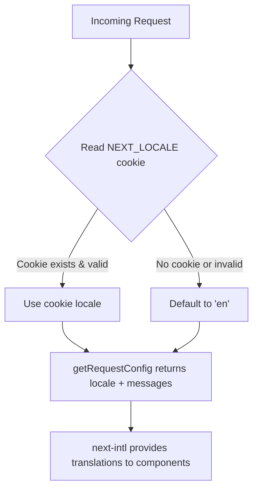
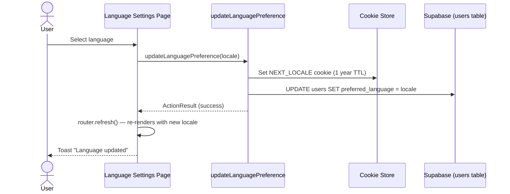
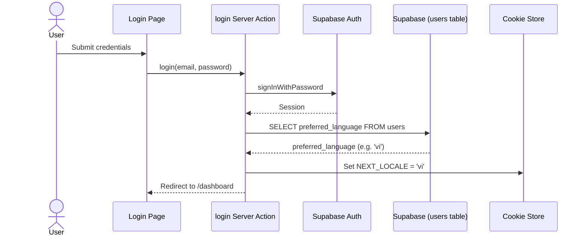
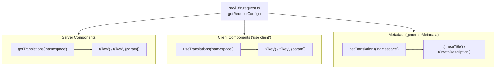
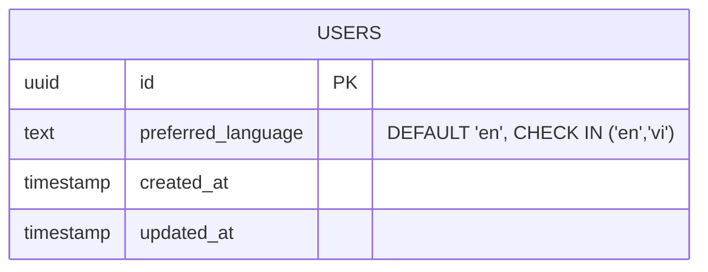

# Feature: i18n / Display Language

**Date Implemented**: 2026-03-13
**Status**: Complete
**Related ADRs**: ADR-020

## Overview

Bilingual (English / Vietnamese) interface support for all authenticated and unauthenticated UI. Uses `next-intl` in non-routing mode — locale is stored in a `NEXT_LOCALE` cookie (no URL prefixes). Authenticated users have their preference persisted in the `users.preferred_language` database column and synced to the cookie on login.

## Architecture

### Locale Resolution Flow

### Language Update Flow

### Login Sync Flow

### Component Integration Pattern

### Database Schema

## Key Files

| File | Purpose |
|------|---------|
| `src/i18n/config.ts` | Locale definitions, type exports, display names |
| `src/i18n/request.ts` | `getRequestConfig` — reads cookie, loads messages |
| `src/i18n/messages/en.json` | English translation strings |
| `src/i18n/messages/vi.json` | Vietnamese translation strings |
| `src/app/(main)/settings/language/page.tsx` | Language toggle UI (client component) |
| `src/app/(main)/settings/language/actions.ts` | `updateLanguagePreference` server action |
| `src/app/(auth)/actions.ts` | Login action — syncs `preferred_language` from DB to cookie |
| `supabase/migrations/00032_add_preferred_language.sql` | Adds `preferred_language` column to `users` |

## Translation Key Conventions

Translation keys are organized by namespace matching the route/feature structure:

| Namespace | Scope | Example Keys |
|-----------|-------|-------------|
| `common` | Shared buttons, labels, statuses | `common.save`, `common.loading`, `common.classOf` |
| `auth` | Login, signup, password flows | `auth.login.heading`, `auth.errors.invalidEmail` |
| `nav` | Navigation sidebar and menus | `nav.dashboard`, `nav.signOut` |
| `dashboard` | Dashboard page | `dashboard.welcomeBack`, `dashboard.suggestedAlumni` |
| `directory` | Alumni directory | `directory.title`, `directory.searchPlaceholder` |
| `messages` | Messaging UI | `messages.typeMessage`, `messages.sendMessage` |
| `connections` | Connection management | `connections.accept`, `connections.disconnect` |
| `profile` | Profile view/edit | `profile.editProfile`, `profile.about` |
| `groups` | Groups feature | `groups.joinGroup`, `groups.leaveGroup` |
| `settings` | Settings pages | `settings.language`, `settings.languageDesc` |
| `admin` | Admin panel (nested) | `admin.dashboard.title`, `admin.users.manage` |
| `moderation` | Moderation panel | `moderation.dismiss`, `moderation.warnUser` |

ICU message format is used for interpolation and plurals:
- Interpolation: `"welcomeBack": "Welcome back, {name}"`
- Plurals: `"users": "{count, plural, one {# user} other {# users}}"`

## RLS Policies

No new RLS policies were needed. The `preferred_language` column is covered by the existing `users` table policies — users can read and update their own row.

## Edge Cases and Error Handling

- **Invalid cookie value**: If `NEXT_LOCALE` contains an unsupported value, `getRequestConfig` falls back to `'en'` (the default locale).
- **DB sync failure on language change**: The cookie is set first. If the DB update fails, the UI still reflects the new language. A server-side error is logged but no error is shown to the user — the preference will be out of sync until the next successful save.
- **Login without a `users` row**: If `preferred_language` is not found (e.g., the public.users row hasn't been created yet by the trigger), the cookie is not set and the existing cookie value (or default) is used.
- **Missing translation key**: next-intl falls back to displaying the raw key name (e.g., `settings.missingKey`). Both JSON files must be kept in sync.

## What Is NOT Translated

| Category | Reason |
|----------|--------|
| Industry names (taxonomy) | Admin-entered DB data, not in JSON files |
| Specialization names (taxonomy) | Admin-entered DB data, not in JSON files |
| Availability tags | DB-stored enum display values |
| Email templates (Resend) | Hardcoded in email sending functions; deferred to future phase |
| Audit log action labels | Internal/admin-facing, English-only |
| User-generated content (bios, messages) | Written by users in their own language |

## Design Decisions

- **Non-routing mode** was chosen because the app is fully authenticated — there is no SEO benefit to locale-prefixed URLs, and clean URLs are preferred. See ADR-020.
- **Cookie + DB dual persistence** ensures the preference survives across devices (DB) while working for unauthenticated pages like login (cookie).
- **Login-time sync** (DB to cookie) ensures a user who set Vietnamese on one device sees Vietnamese when logging in on a new device.
- **1-year cookie TTL** balances persistence with eventual expiry.

## Future Considerations

- **Translate DB taxonomy data**: Industry and specialization names could have a `name_vi` column or a separate `translations` table. This was deferred because admin-managed taxonomy is small and rarely displayed without context.
- **Email template translations**: Transactional emails could use the user's `preferred_language` to select a template variant.
- **Additional locales**: The `locales` array in `config.ts` and the DB constraint can be extended. Adding a locale requires creating a new message JSON file and updating the constraint.
- **Translation management tooling**: As the JSON files grow, a tool like Crowdin or Tolgee could streamline translator workflows.
