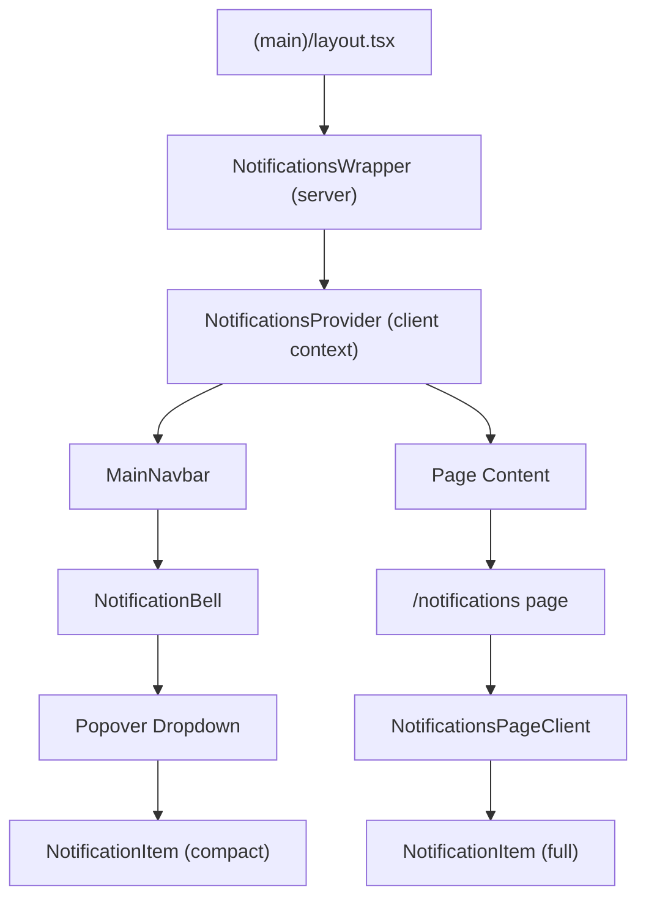
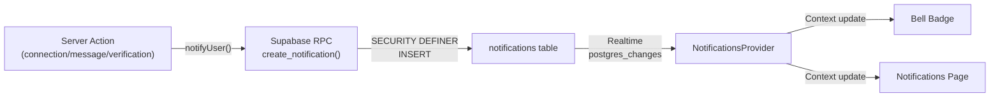
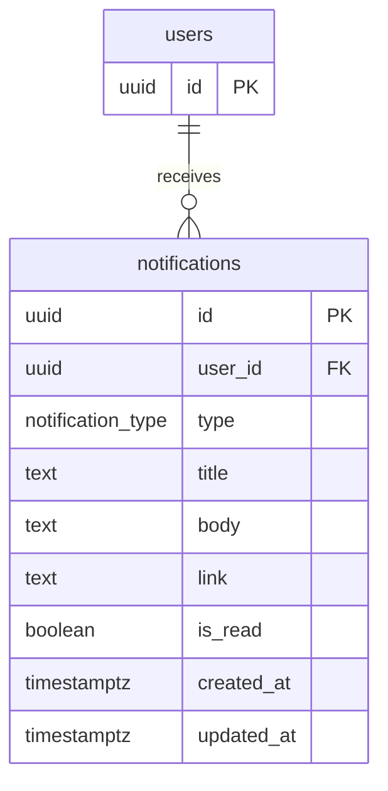
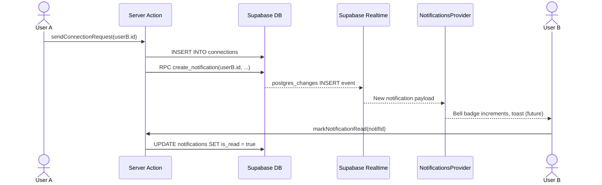

# Feature: In-App Notifications

**Date Implemented**: 2026-03-10
**Status**: Complete
**Related ADRs**: ADR-009

## Overview

Real-time in-app notification system that alerts users about important events — connection requests, connection acceptances, new messages, and verification status updates. Notifications are delivered instantly via Supabase Realtime and displayed through a bell icon in the navbar with an unread count badge.

Serves all authenticated user roles (unverified, verified, moderator, admin).

## Architecture

### Component Hierarchy

### Data Flow

### Database Schema

### Sequence Diagram — Notification Lifecycle

## Key Files

| File | Purpose |
|------|---------|
| `supabase/migrations/00016_create_notifications_table.sql` | Schema, RLS, SECURITY DEFINER function, Realtime |
| `src/lib/types.ts` | `NotificationType`, `Notification` types |
| `src/lib/notifications.ts` | `notifyUser()` fire-and-forget helper |
| `src/lib/queries/notifications.ts` | Query helpers (unread count, recent, paginated) |
| `src/app/(main)/notifications/actions.ts` | Server actions (mark read, mark all, delete, fetch page) |
| `src/app/(main)/notifications/page.tsx` | Full notifications page (server component) |
| `src/app/(main)/notifications/components/notifications-provider.tsx` | Real-time context + provider |
| `src/app/(main)/notifications/components/notification-item.tsx` | Shared notification row component |
| `src/app/(main)/notifications/components/notifications-page-client.tsx` | Paginated list with filters |
| `src/app/(main)/notifications-wrapper.tsx` | Server component that initializes provider in layout |
| `src/components/navbar/notification-bell.tsx` | Bell icon + popover dropdown |
| `src/components/navbar/main-navbar-client.tsx` | Updated with bell (desktop) + mobile notifications link |

## RLS Policies

| Table | Policy | Operation | Description |
|-------|--------|-----------|-------------|
| `notifications` | Users can view own notifications | SELECT | `auth.uid() = user_id` |
| `notifications` | Users can update own notifications | UPDATE | `auth.uid() = user_id` (mark read) |
| `notifications` | Users can delete own notifications | DELETE | `auth.uid() = user_id` |
| `notifications` | *(no INSERT policy)* | INSERT | Only via `create_notification()` SECURITY DEFINER function |

## Notification Triggers

| Event | Source Action | Recipient | Title | Link |
|-------|-------------|-----------|-------|------|
| Connection request sent | `connections/actions.ts` → `sendConnectionRequest` | Receiver | "New connection request" | `/connections` |
| Connection accepted | `connections/actions.ts` → `acceptConnectionRequest` | Requester | "Connection accepted" | `/profile/{id}` |
| New message | `messages/actions.ts` → `sendMessage` | Other participant | "New message from {name}" | `/messages?conversation={id}` |
| Verification approved | `admin/verification/actions.ts` → `approveRequest` | User | "Verification approved!" | `/dashboard` |
| Verification rejected | `admin/verification/actions.ts` → `rejectRequest` | User | "Verification update" | `/verification` |

## Edge Cases and Error Handling

- **Notification creation failure**: `notifyUser()` is fire-and-forget — errors are logged but never block the primary action (e.g., a connection request still succeeds even if notification insertion fails).
- **Self-notification**: Not possible by design — each trigger sends to the *other* user, never the actor.
- **Provider not available**: The `NotificationsWrapper` renders children without the provider if no user is authenticated, so unauthenticated pages work fine.
- **Stale real-time connection**: Supabase Realtime auto-reconnects. Provider cleanup runs on unmount.

## Design Decisions

- **SECURITY DEFINER for inserts** — prevents users from creating fake notifications via the client SDK (ADR-009).
- **Provider at layout level** — initially placed in the navbar, but moved to `(main)/layout.tsx` so the `/notifications` page (which uses `useNotifications()`) is also within the provider tree.
- **Fire-and-forget notifications** — notification failures should never break primary user actions. Logged for debugging, but errors are swallowed.
- **No deduplication for messages** — each `sendMessage` call creates a notification. Batching/digesting ("3 new messages") is a Phase 2 enhancement.

## Future Considerations

| Enhancement | Phase | Description |
|------------|-------|-------------|
| Email notifications | Phase 1 (F22) | Resend integration, 15-min delay for unread messages, per-type preferences |
| Push notifications (browser) | Phase 2 | Service Worker + Web Push API |
| Notification batching/digesting | Phase 2 | "3 new messages from {name}" instead of 3 separate |
| Notification preferences UI | Phase 2 | Per-type toggle (in-app on/off, email on/off) in settings page |
| Fan-out queue | Phase 3 | Redis/BullMQ for high-volume (announcements to 10k+ users) |
| Push notifications (mobile) | Phase 3 | FCM/APNs when React Native app exists |
| Read receipts sync | Phase 3 | Mark message notification read when message is read |
| Notification TTL + cleanup | Phase 3 | Auto-delete notifications older than 90 days via pg_cron |
| Multi-school scoping | Phase 4 | `school_id` on notifications, school-scoped announcements |
