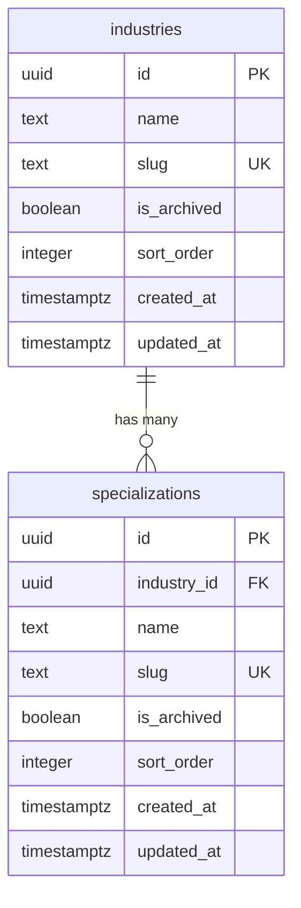
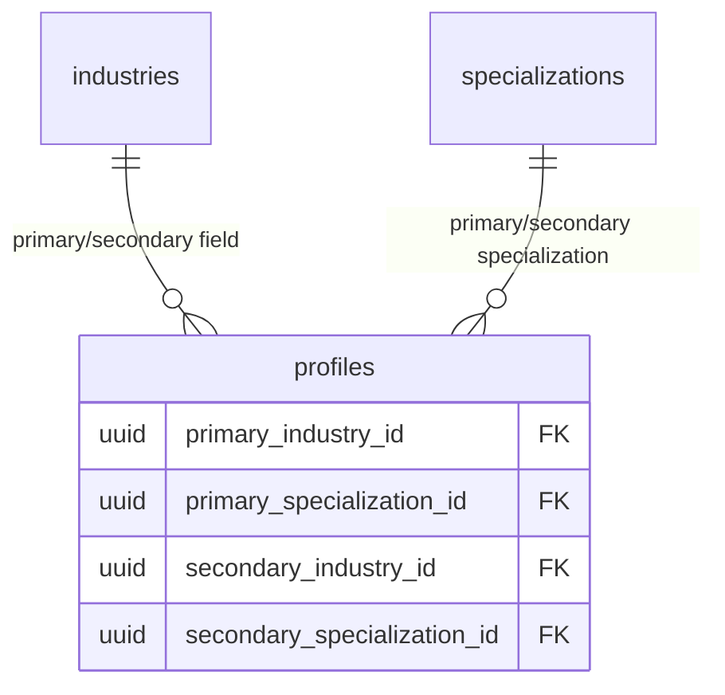

# Feature: Industry Taxonomy (Two-Level)

**Date Implemented**: 2026-03-09
**Status**: Complete
**Related ADRs**: ADR-002

## Overview

Two-level industry taxonomy used for profile career fields, directory filters, and the recommendation engine. Industries (level 1) contain specializations (level 2). Admin-managed with soft-delete archival. No UI in this phase — just schema, seed data, and query helpers.

## Architecture

### Data Flow

```mermaid
flowchart LR
    SC[Server Component] -->|getIndustries\ngetIndustriesWithSpecializations| Query[Query Helper]
    Query -->|SELECT with RLS| Supabase[(Supabase DB)]
    Supabase -->|Filtered rows| Query
    Query -->|Industry[] or\nIndustryWithSpecializations[]| SC
```

### Database Schema



### Relationship to Profiles (future)



## Key Files

| File | Purpose |
|------|---------|
| `supabase/migrations/00002_create_taxonomy_tables.sql` | Schema: industries + specializations tables, indexes, RLS |
| `supabase/migrations/00003_seed_taxonomy_data.sql` | Seed data: 20 industries, 132 specializations |
| `supabase/migrations/00004_fix_admin_rls_recursion.sql` | Fix: `is_admin()` security definer function |
| `src/lib/types.ts` | TypeScript types: `Industry`, `Specialization`, `IndustryWithSpecializations` |
| `src/lib/queries/taxonomy.ts` | Server-side query helpers |
| `src/lib/queries/taxonomy.test.ts` | Unit tests (4 tests) |

## RLS Policies

| Table | Policy | Roles | Description |
|-------|--------|-------|-------------|
| `industries` | `industries_select_active` | authenticated | Read active (non-archived) industries |
| `industries` | `industries_admins_select_all` | admin | Read all industries including archived |
| `industries` | `industries_admins_insert` | admin | Create new industries |
| `industries` | `industries_admins_update` | admin | Update existing industries |
| `specializations` | `specializations_select_active` | authenticated | Read active specializations |
| `specializations` | `specializations_admins_select_all` | admin | Read all including archived |
| `specializations` | `specializations_admins_insert` | admin | Create new specializations |
| `specializations` | `specializations_admins_update` | admin | Update existing specializations |

## Seed Data

20 industries with 5-10 specializations each (132 total). Source: FEATURES.md F4 taxonomy list.

Seed uses `ON CONFLICT (slug) DO NOTHING` for idempotency.

## Edge Cases and Error Handling

- **Archived items**: Not returned by default queries. Only visible to admins (for taxonomy management UI later).
- **Query failures**: Helpers return empty arrays and log errors server-side. UI should handle empty states gracefully.
- **Slug uniqueness**: Specialization slugs are globally unique (not per-industry) to support URL-friendly filtering.

## Design Decisions

- **Separate seed migration**: Schema (00002) and data (00003) in separate migrations for clean separation. Schema is structural; seed data could be re-run or modified independently.
- **`is_admin()` security definer**: Admin RLS policies originally used subqueries on `public.users`, causing infinite recursion. Fixed with a `security definer` function that bypasses RLS for the admin check. See ADR-002.
- **No UI yet**: Per PLAN.md, taxonomy management UI (Feature #27) comes in Phase E. The data layer is needed now for profiles (Feature #4, next).

## Future Considerations

- **Taxonomy management UI** (Feature #27): Admin CRUD for industries and specializations.
- **User counts per category**: Admin will see how many users are tagged with each category.
- **Archival cascade**: Archiving an industry should archive its specializations (to be implemented in admin UI).
