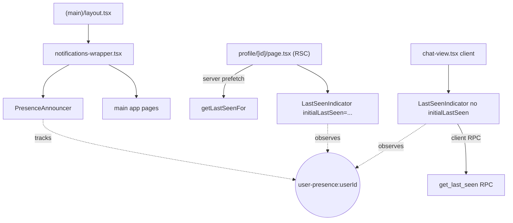
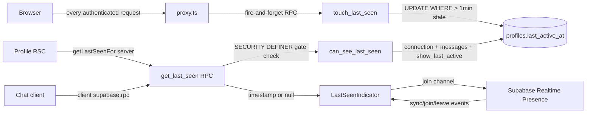
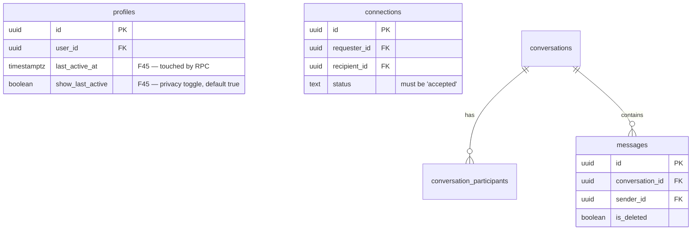
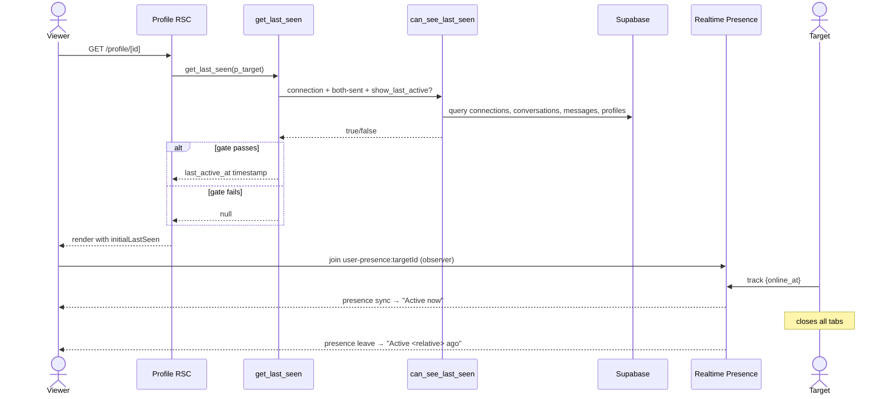

# Feature: Last Seen Online (privacy-gated)

**Date Implemented**: 2026-04-07
**Status**: Complete
**Related ADRs**: ADR-025

## Overview

Shows "Active now" with a green dot or a locale-aware relative timestamp ("Active 5 minutes ago") next to other alumni's names on **profile pages** and in **chat headers**. The signal is gated:

- Viewer must have an accepted **connection** with the target.
- Viewer and target must each have sent **≥1 non-deleted message** in a shared conversation (i.e. a real two-way exchange, not a one-sided cold open).
- Target must have `show_last_active = true` (default; togglable in `/settings/privacy`).

When the gate fails, the indicator renders nothing — the green dot cannot leak past the gate. Viewers cannot distinguish "hidden" from "never online" — both collapse to `null`, matching WhatsApp/Signal behavior.

## Architecture

### Component Hierarchy

### Data Flow

### Database Schema

### Sequence — viewing a gated profile

## Key Files

| File | Purpose |
|------|---------|
| `supabase/migrations/00038_last_seen_online.sql` | Adds `profiles.show_last_active` + the three RPCs |
| `src/proxy.ts` | Fires `touch_last_seen` on every authenticated request |
| `src/lib/queries/presence.ts` | Server-side `getLastSeenFor()` wrapper around the RPC |
| `src/app/(main)/presence-announcer.tsx` | Client component — joins `user-presence:${userId}` and tracks |
| `src/app/(main)/notifications-wrapper.tsx` | Mounts `<PresenceAnnouncer>` once per authenticated session |
| `src/app/(main)/profile/[id]/last-seen-indicator.tsx` | Client component — observer, supports server-prefetch and client-fetch modes |
| `src/app/(main)/profile/[id]/page.tsx` | Server-prefetches last seen and renders the indicator in the header |
| `src/app/(main)/messages/components/chat-view.tsx` | Renders the indicator under the conversation partner's name (client-fetch mode) |
| `src/app/(main)/settings/privacy/page.tsx` | Settings page exposing the `show_last_active` toggle |
| `src/app/(main)/settings/privacy/privacy-toggle.tsx` | Optimistic toggle UI |
| `src/app/(main)/settings/privacy/actions.ts` | Server action — `updateShowLastActive` |
| `src/app/(main)/settings/settings-nav.tsx` | Adds the Privacy tab to the settings nav |
| `src/i18n/messages/en.json`, `vi.json` | `presence.activeNow`, `settings.privacy*` strings |

## RLS / Function Security

| Object | Type | Notes |
|--------|------|-------|
| `profiles.show_last_active` | column | Subject to existing `profiles_select_active` and update policies |
| `touch_last_seen()` | function | `SECURITY DEFINER`, `search_path = public`. EXECUTE granted to `authenticated` only |
| `can_see_last_seen(uuid)` | function | `SECURITY DEFINER STABLE`, encapsulates the gate. EXECUTE granted to `authenticated` |
| `get_last_seen(uuid)` | function | `SECURITY DEFINER STABLE`, the only display readout. EXECUTE granted to `authenticated` |

The `last_active_at` column itself is **not** RLS-gated for reads — the directory's "recently active" sort needs it for ordering. Display reads must go through `get_last_seen()`.

## Edge Cases and Error Handling

- **Viewer = target (own profile)**: gate returns `true` immediately. We skip rendering anyway in the profile page (`isOwnProfile` check) — the chat header never loads with self as the other participant.
- **Target hides activity mid-session**: presence channel keeps showing "Active now" until either page navigation or the next time the observer rejoins the channel. The persistent gate flips to `null` immediately. This is acceptable — toggling is not a panic-button feature.
- **Viewer is not authenticated**: `get_last_seen` returns `null` (gate's first branch). UI renders nothing.
- **`get_last_seen` RPC errors**: query helper logs and returns `null`. UI renders nothing — fail-closed.
- **Banned/suspended user**: still hits the proxy `touch_last_seen` RPC (harmless side effect — the row update is invisible since they cannot use the app), but they're redirected before reaching any UI that displays presence.
- **Initial fetch race in chat header**: while the client RPC is in flight, `lastSeen === undefined` and the indicator renders nothing. After fetch resolves, it renders the appropriate state. No flash of "Active now" without proof of gate.

## Design Decisions

- **Throttled write at the database, not the client** — prevents write amplification under burst traffic. See ADR-025 for why a client-side heartbeat was rejected.
- **Per-user presence channels, not a global "who's online"** — scales with profile views, not users squared.
- **Two render modes for `<LastSeenIndicator>`** — server-prefetch on the profile page (where we can `await` in an RSC) and client-fetch in the chat header (where the parent is a client component). The component handles both cleanly without duplication.
- **`Intl.RelativeTimeFormat` instead of an i18n wrapper string** — locale-aware (handles plurals + word order for English and Vietnamese for free), no external dependency, no need for date-fns.
- **Gate failure indistinguishable from "never online"** — both return `null`. Matches WhatsApp behavior. Prevents inferring a hidden toggle.

## Future Considerations

- **Presence-aware directory**: could add a green dot to directory listings using the same per-user channels, joining only for visible viewport rows (intersection observer). Out of scope for F45.
- **Multi-tab sync**: presence currently treats every tab as a separate "online" entry. Closing one tab doesn't drop presence if another is open — that's the desired behavior, but we may want explicit deduplication if we ever add presence analytics.
- **Connection-only mode**: a future privacy refinement could expose a third state — "connected viewers only, even without messages exchanged". Would be a new branch in `can_see_last_seen()` rather than a new RPC.
