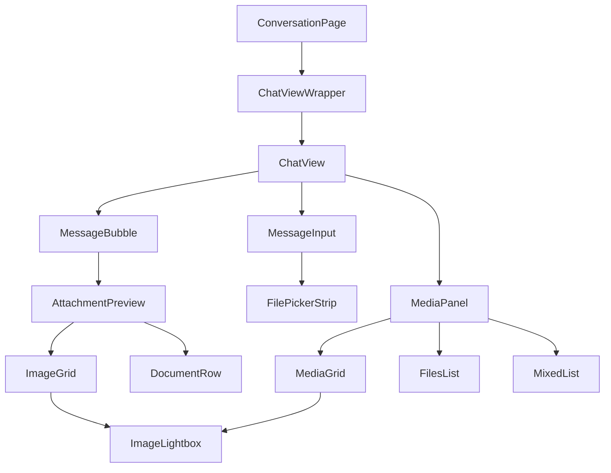
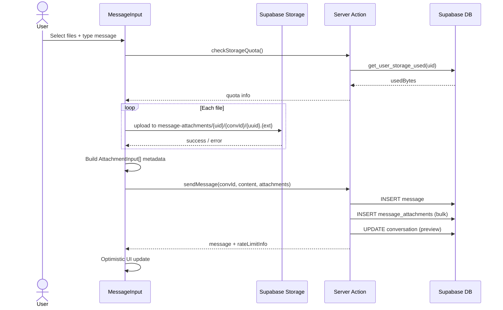
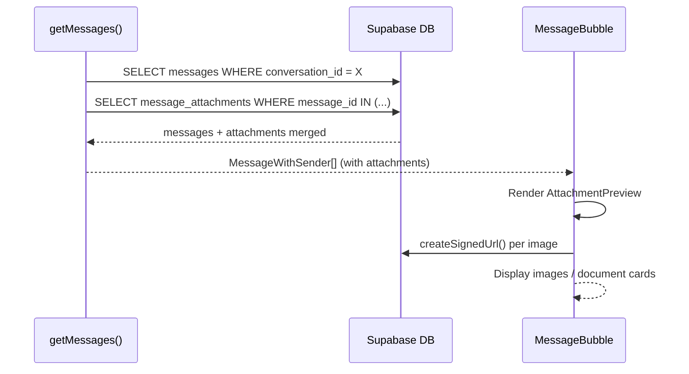
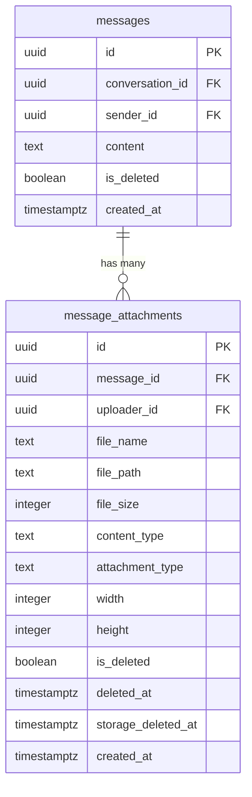

# Feature: Message Attachments (Media & File Sharing)

**Date Implemented**: 2026-03-10
**Status**: Complete
**Related ADRs**: ADR-014

## Overview

Enables users to share images and documents within 1-on-1 conversations. Includes inline previews in message bubbles, a full-screen image lightbox, document downloads, and a Messenger-style side panel for browsing all shared media/files in a conversation. Available to all verified users.

## Architecture

### Component Hierarchy

### Data Flow — Upload & Send

### Data Flow — Display

### Database Schema

## Key Files

| File | Purpose |
|------|---------|
| `supabase/migrations/00026_create_message_attachments.sql` | Table, indexes, RLS, storage bucket, helper functions |
| `src/lib/types.ts` | `MessageAttachment`, `AttachmentInput`, `AttachmentWithSender` types |
| `src/lib/attachments.ts` | Shared constants (allowed types, size limits, quota) and helpers |
| `src/app/(main)/messages/actions.ts` | `checkStorageQuota`, `getConversationAttachments`, modified `sendMessage`/`deleteMessage` |
| `src/lib/queries/messages.ts` | Modified `getMessages` to batch-fetch attachments |
| `src/app/(main)/messages/components/file-picker-strip.tsx` | File selection preview strip above textarea |
| `src/app/(main)/messages/components/attachment-preview.tsx` | Renders attachments in message bubbles |
| `src/app/(main)/messages/components/image-lightbox.tsx` | Full-screen image viewer |
| `src/app/(main)/messages/components/media-panel.tsx` | Side panel with All/Media/Files tabs |
| `src/app/(main)/messages/components/message-input.tsx` | Modified: attach button, drag-drop, upload flow |
| `src/app/(main)/messages/components/message-bubble.tsx` | Modified: renders AttachmentPreview |
| `src/app/(main)/messages/components/chat-view.tsx` | Modified: media panel toggle + layout |
| `src/app/(main)/messages/components/messages-provider.tsx` | Modified: fetches attachments on Realtime INSERT |

## RLS Policies

| Table | Policy | Roles | Description |
|-------|--------|-------|-------------|
| `message_attachments` | `SELECT` | authenticated | Conversation participants only (joins through messages) |
| `message_attachments` | `INSERT` | authenticated | `uploader_id = auth.uid()` |
| `message_attachments` | `UPDATE` | authenticated | `uploader_id = auth.uid()` (for soft delete) |
| `storage.objects` | `INSERT` | authenticated | Users upload to own folder (`{uid}/...`) |
| `storage.objects` | `SELECT` | authenticated | Own files or conversation participant |
| `storage.objects` | `DELETE` | authenticated | Own files only |

## Edge Cases and Error Handling

- **Mobile document download**: `DocumentRow` uses a native `<a>` tag with a pre-fetched signed URL instead of programmatic `window.open()` or `link.click()`. iOS Safari blocks `window.open()` / programmatic clicks when called after an `await` (cross-origin Supabase storage URLs). Pre-fetching the signed URL on mount and using a native `<a target="_blank">` avoids this restriction.
- **Expired signed URLs**: `onError` handler on `` elements re-fetches a fresh signed URL (1-hour expiry).
- **Partial upload failure**: Per-file error states in the file picker strip with retry button. Send is blocked until all files succeed or are removed.
- **Storage quota exceeded**: Checked before upload begins and again server-side before insert. Clear error message with remaining space shown.
- **MIME type enforcement**: Validated client-side (file input `accept`), at bucket level (allowed_mime_types), and server-side (whitelist check in server action).
- **Path traversal prevention**: Server action validates all file paths start with `{userId}/`.
- **Message deletion**: Soft-deleting a message also soft-deletes its attachments. Storage files are retained for 30-day grace period.
- **Real-time incoming messages**: When a message arrives via Realtime, attachments are fetched in a separate query and merged before adding to state.
- **Text-only messages**: Fully backward-compatible. `attachments` field is optional on `MessageWithSender`.

## Design Decisions

- **Attachments rendered outside the bubble**: To avoid nested `<button>` HTML validation errors (the bubble has a clickable timestamp toggle, and document rows are also clickable), attachments render below the colored bubble as separate cards.
- **CSS-only image resizing**: No server-side thumbnail generation in Phase 1. Images use `max-w-[300px]` with preserved aspect ratio. Simplifies implementation and avoids edge function costs.
- **Batch attachment fetch**: `getMessages()` fetches attachments with `WHERE message_id IN (...)` rather than per-message queries, avoiding N+1.
- **Optimistic UI**: Messages with attachments appear immediately using local `URL.createObjectURL` previews before the server confirms.

## Future Considerations

- **Video support**: Document in schema (`attachment_type` can be extended), but not implemented in Phase 1.
- **Server-side thumbnails**: Generate via Supabase Edge Function or image transformation for faster loading.
- **Orphaned file cleanup**: Files uploaded but never attached to a message (e.g., user abandons send). Needs a periodic scan of storage vs. `message_attachments` table.
- **Storage cleanup cron**: Automated purge of soft-deleted files after 30-day grace period. Requires `pg_cron` (Supabase Pro) or external cron service.
- **Storage tier upgrade**: At ~40 active uploading users, consider Supabase Pro (100GB) or migrate to Cloudflare R2.
