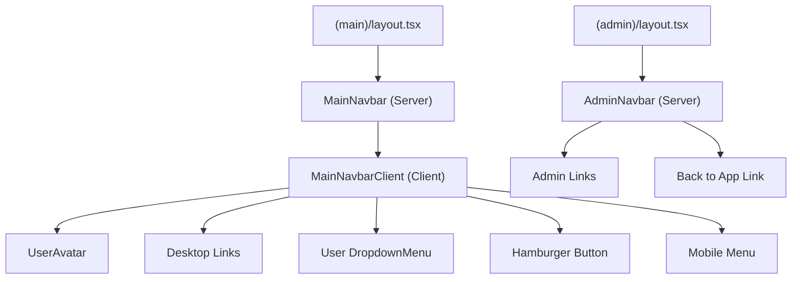
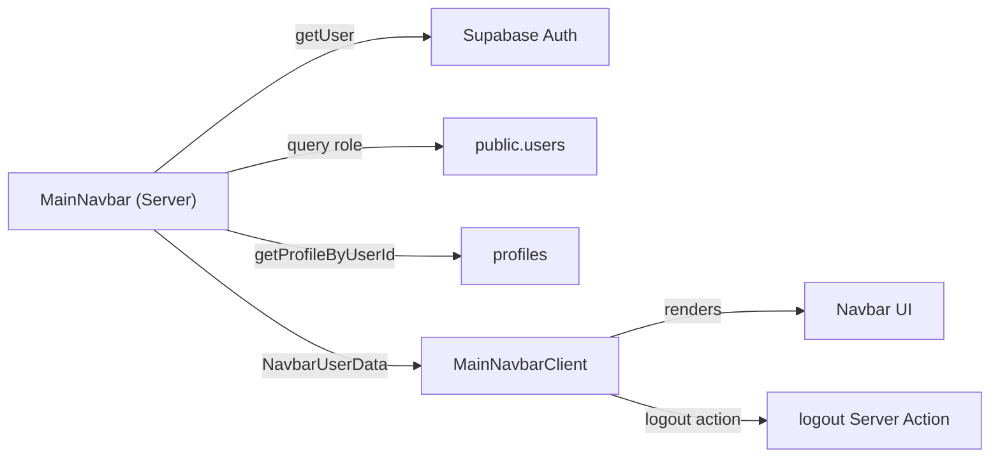

# Feature: Navigation (Navbar)

**Date Implemented**: 2026-03-09
**Status**: Complete
**Related ADRs**: None (follows standard SaaS pattern)

## Overview

Top navigation bar for the main app and admin area. Provides users with discoverable links to all implemented features and a user menu with profile/logout actions. Separate navbars for main app vs admin to maintain clear visual context separation.

## Architecture

### Component Hierarchy



### Data Flow



## Key Files

| File | Purpose |
|------|---------|
| `src/components/navbar/main-navbar.tsx` | Server component — fetches user data (auth, role, profile) |
| `src/components/navbar/main-navbar-client.tsx` | Client component — renders navbar, mobile menu, user dropdown |
| `src/components/navbar/admin-navbar.tsx` | Server component — simple admin nav bar |
| `src/app/(main)/layout.tsx` | Integrates MainNavbar |
| `src/app/(admin)/layout.tsx` | Integrates AdminNavbar |

## Props Interface

```typescript
interface NavbarUserData {
  email: string;
  role: "user" | "moderator" | "admin";
  fullName: string | null;    // null if no profile yet
  photoUrl: string | null;
  profileId: string | null;   // null → links to /onboarding instead of /profile/[id]
}
```

## Edge Cases and Error Handling

- **No profile yet (pre-onboarding)**: "My Profile" link points to `/onboarding`. Avatar shows email initial.
- **Unauthenticated user**: MainNavbar returns `null` — auth pages use their own layout with no navbar.
- **Admin role**: Extra "Admin" link appears in both desktop and mobile nav.
- **Mobile menu**: Closes on link click to prevent stale open state after navigation.

## Design Decisions

- **Separate navbars for main/admin**: Industry standard (Vercel, Stripe, Supabase pattern). Provides clear visual context and prevents accidental admin actions from the main app.
- **Server Component for data fetching, Client Component for interactivity**: MainNavbar (server) fetches user data once, passes it to MainNavbarClient (client) which handles hamburger toggle and dropdown. Avoids client-side data fetching for nav.
- **base-ui DropdownMenu**: shadcn v4 uses `@base-ui/react` — no `asChild` prop. Used `render` prop for Link items. Logout uses hidden form + `requestSubmit()`.
- **Inline SVGs for hamburger/close icons**: Avoids adding lucide-react dependency just for two icons.

## Future Considerations

When adding new features, update navigation in these locations:

| Feature | Where to add |
|---------|-------------|
| **Directory/Search** | Add to `navLinks` array in `main-navbar-client.tsx`. Add search input to desktop navbar when directory is implemented. |
| **Notifications** | Add bell icon with unread count badge between desktop links and user avatar in `main-navbar-client.tsx`. |
| **Connections** | Add "Connections" to `navLinks` array. |
| **Messages** | Add "Messages" to `navLinks` array with unread badge. |
| **Admin sub-pages** (user mgmt, analytics, taxonomy) | Add links to `AdminNavbar`. Consider converting to sidebar layout when > 3 admin pages. |
| **Moderator role** | Add moderator-specific links (report queue) visible when `role === "moderator"`. |
| **Active link highlighting** | Use `usePathname()` to highlight the current route in the navbar. |
| **Desktop sidebar** | FEATURES.md specifies a desktop sidebar for filters/groups/connections. Add when those features exist. |
