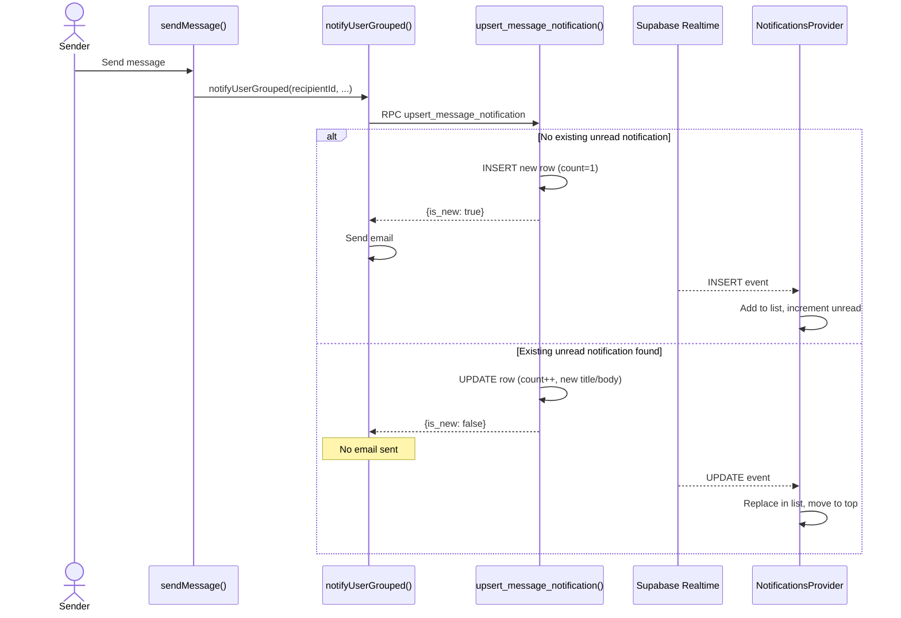
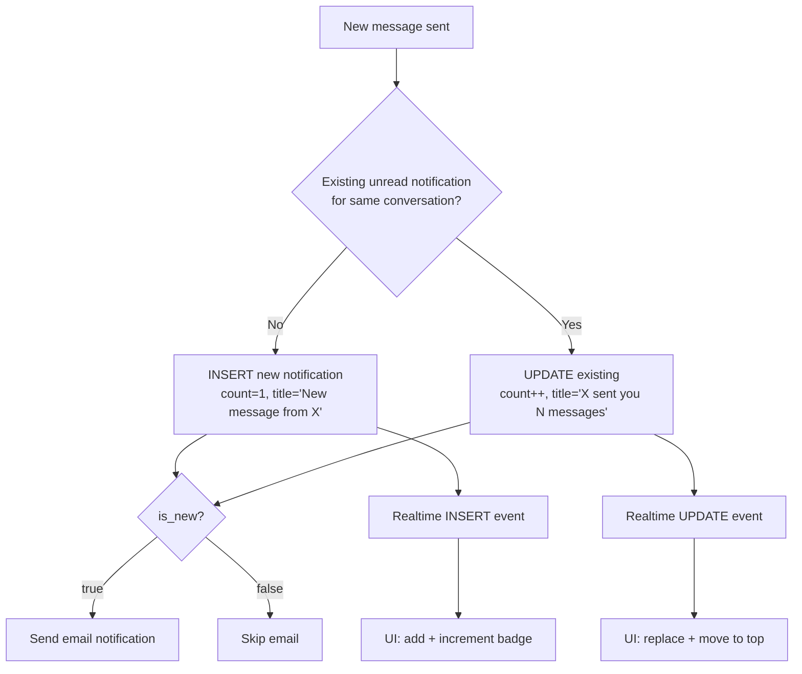
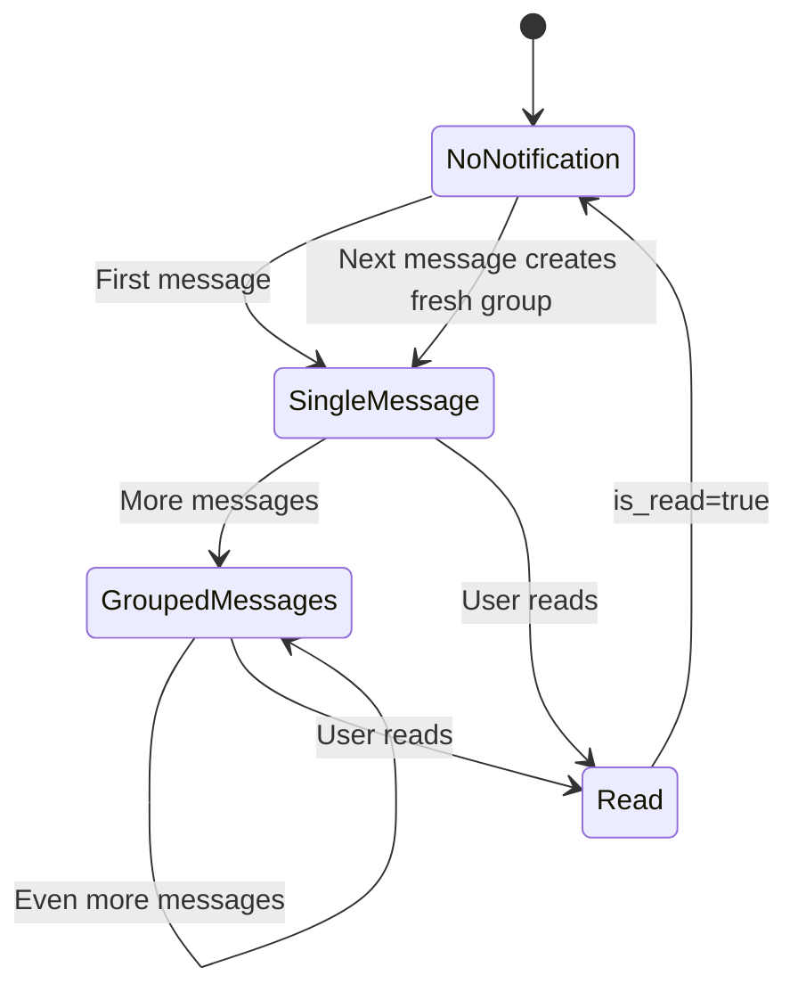

# Feature: Notification Grouping

**Date Implemented**: 2026-03-14
**Status**: Complete
**Related ADRs**: ADR-023

## Overview

Groups repeated `new_message` notifications per conversation into a single notification row. Instead of "New message from X" appearing N times, users see "X sent you N messages". Also debounces email notifications — only the first message in a group triggers an email.

## Architecture

### Data Flow

### Grouping Logic

### Reset Cycle

## Key Files

| File | Purpose |
|------|---------|
| `supabase/migrations/00037_notification_grouping.sql` | Adds `grouped_count` column, `upsert_message_notification()` function |
| `src/lib/notifications.ts` | `notifyUserGrouped()` — calls upsert RPC, controls email send |
| `src/app/(main)/messages/actions.ts` | `sendMessage()` — calls `notifyUserGrouped` instead of `notifyUser` |
| `src/app/(main)/notifications/components/notifications-provider.tsx` | Realtime: handles UPDATE events for grouped refresh |
| `src/app/(main)/notifications/components/notification-item.tsx` | Shows `updated_at` timestamp for freshness |
| `src/lib/types.ts` | `Notification` interface — added `grouped_count` field |

## Edge Cases and Error Handling

- **User reads notification**: `is_read` becomes true. Next message creates a fresh notification (new group), triggering a new email.
- **Multiple senders**: Grouping is keyed by `link` (conversation URL), so different senders to different conversations get separate notifications.
- **Race condition**: The upsert runs inside a single SECURITY DEFINER function, making it atomic.
- **Backward compatibility**: `grouped_count` defaults to 1 for all existing rows.

## Design Decisions

- Title constructed in SQL (`p_actor_name || ' sent you ' || count || ' messages'`) to keep it atomic and avoid a read-then-write race.
- Email debounce via `is_new` return value rather than a separate timestamp column — simpler, zero extra storage.
- Only `new_message` type uses grouping currently. Other types (connection requests, announcements) remain ungrouped since they're infrequent.

## Future Considerations

- Extend grouping to other notification types if they become noisy.
- ADR-023 Option B (pg_cron digests) for daily/weekly email summaries.
- Show grouped message count as a badge in the notification item UI.
