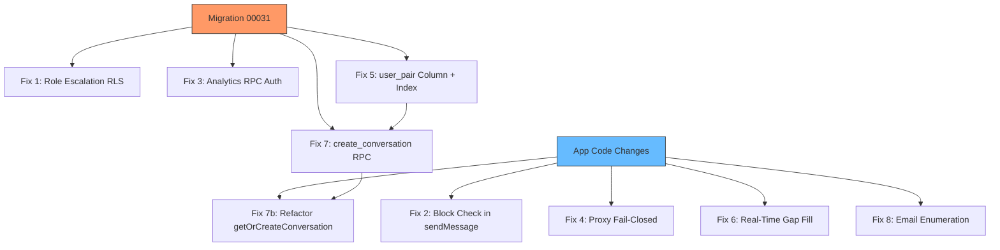
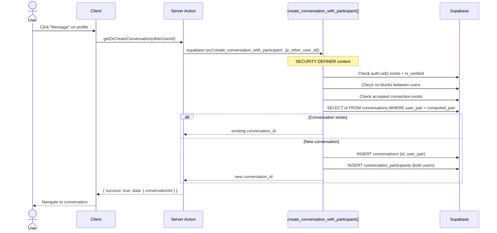
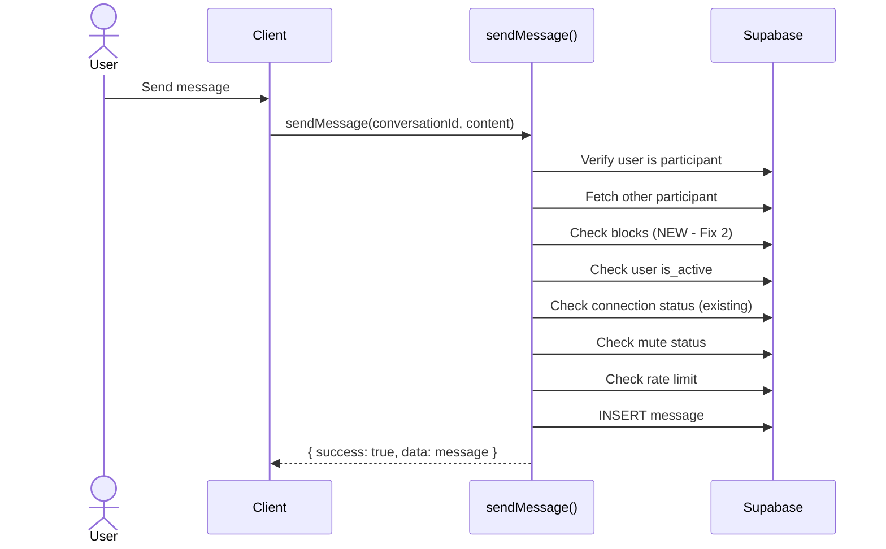
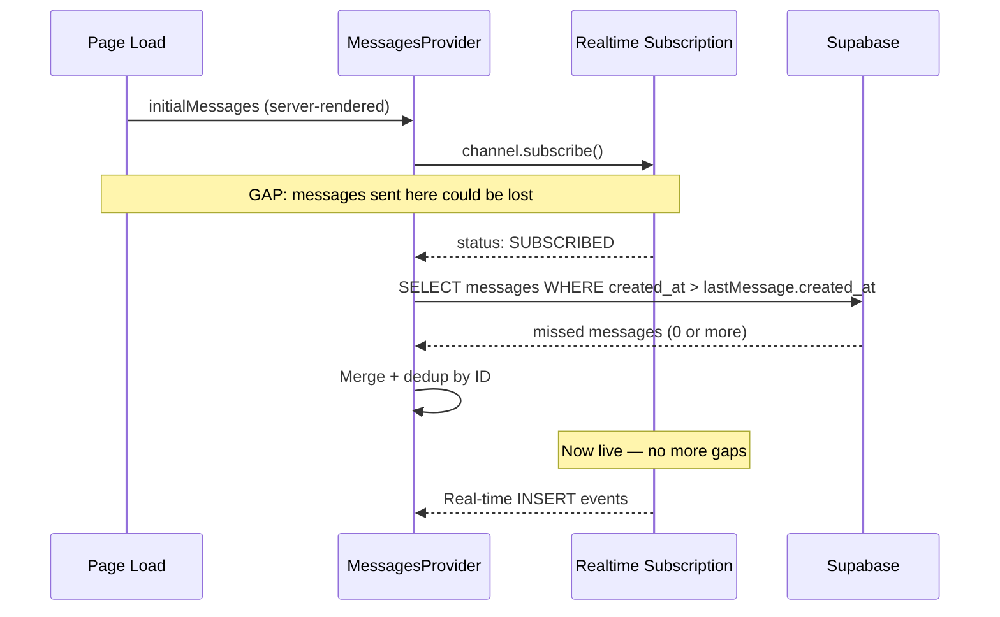
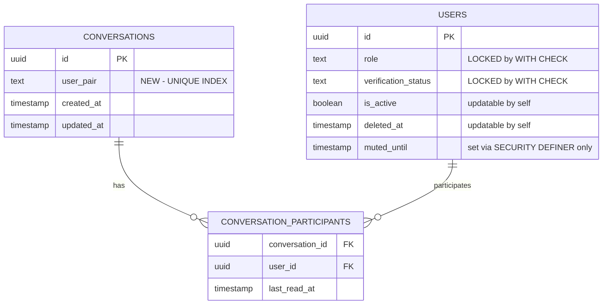

# Feature: Pre-Deployment Security Hardening

**Date Implemented**: 2026-03-11
**Status**: Complete
**Related ADRs**: ADR-019

## Overview

Targeted security and reliability fixes identified during a full architecture review before soft launch. 8 fixes across auth/permissions (6) and messaging/reliability (2). No refactoring — surgical changes to existing code.

## Architecture

### Fix Dependency Graph

### Data Flow — Conversation Creation (After Fix 5 + 7)

### Data Flow — sendMessage (After Fix 2)

### Real-Time Gap Fill (Fix 6)

### RLS Policy Changes (Fix 1)

## Key Files

| File | Purpose |
|------|---------|
| `supabase/migrations/00031_security_fixes.sql` | All DB changes: RLS, functions, column, index |
| `src/app/(main)/messages/actions.ts` | Fix 2 (block check) + Fix 7b (RPC refactor) |
| `src/app/(main)/messages/components/messages-provider.tsx` | Fix 6 (gap fill) |
| `src/proxy.ts` | Fix 4 (fail-closed) |
| `src/app/(auth)/actions.ts` | Fix 8 (email enumeration) |

## RLS Policies

| Table | Policy | Change | Description |
|-------|--------|--------|-------------|
| `users` | `users_update_own` | **Modified** | Added WITH CHECK preventing `role` and `verification_status` self-modification |
| `conversation_participants` | `conversation_participants_insert_verified` | **Dropped** | Direct INSERT no longer allowed; creation goes through SECURITY DEFINER RPC |

## RPC Functions

| Function | Change | Description |
|----------|--------|-------------|
| `get_user_status_counts` | **Modified** | Added `is_admin()` guard |
| `get_signups_over_time` | **Modified** | Added `is_admin()` guard |
| `get_connections_over_time` | **Modified** | Added `is_admin()` guard |
| `get_messages_over_time` | **Modified** | Added `is_admin()` guard |
| `get_top_industries` | **Modified** | Added `is_admin()` guard |
| `get_top_locations` | **Modified** | Added `is_admin()` guard |
| `create_conversation_with_participant` | **New** | Atomic conversation creation with all validation |

## Edge Cases and Error Handling

- **Fix 1 — Admin updating user role**: Admin policies (`users_admin_update`) are separate from `users_update_own` and unaffected. Admins can still change roles.
- **Fix 2 — Block check with deleted other user**: If other participant is deleted, the `is_active` check (existing) catches it before the block check runs.
- **Fix 4 — Supabase outage**: All authenticated users redirected to login. Recovery is automatic once Supabase is back. Trade-off: brief false-positive lockouts during outages.
- **Fix 5 — Existing duplicate conversations**: Backfill script in migration handles existing data. If duplicates exist, the first one (by created_at) gets the `user_pair` value; others are left with NULL.
- **Fix 6 — Gap fill returns stale data**: Dedup by message ID prevents duplicates. Messages already in state are filtered out.
- **Fix 7 — RPC constraint violation**: If two concurrent calls hit the unique index, one gets a Postgres unique violation. The RPC should handle this by retrying with a SELECT.
- **Fix 8 — Existing users re-signing up**: They see "Check your email" but receive no email. They can use "Forgot password" to recover access.

## Design Decisions

- **RLS WITH CHECK over triggers (Fix 1)**: Simpler, single migration, no trigger overhead. The subquery pattern is standard for preventing column modification.
- **SECURITY DEFINER function over tighter RLS (Fix 7)**: RLS can't handle the case where one user inserts a row for another user. The function centralizes validation and eliminates the conversation creation race condition.
- **Fail-closed proxy (Fix 4)**: Standard security practice. The UX impact (logout during outages) is acceptable for a soft launch.
- **Generic signup response (Fix 8)**: OWASP-recommended. Slightly worse UX traded for preventing email harvesting.

## Future Considerations

- **Phase 2**: Redis-based rate limiting (replaces DB query approach), security headers (CSP), storage cleanup job for soft-deleted attachments
- **Phase 2**: Enforce message soft-delete at RLS level (currently app-layer only)
- **Phase 2**: Add missing indexes (notifications, message_reports, dismissed_announcements)
- **Phase 2**: Fix 10 failing unit tests (profile-completeness scoring, onboarding mocks)
- **Phase 3**: Mute enforcement at RLS level via trigger (currently server action only)
