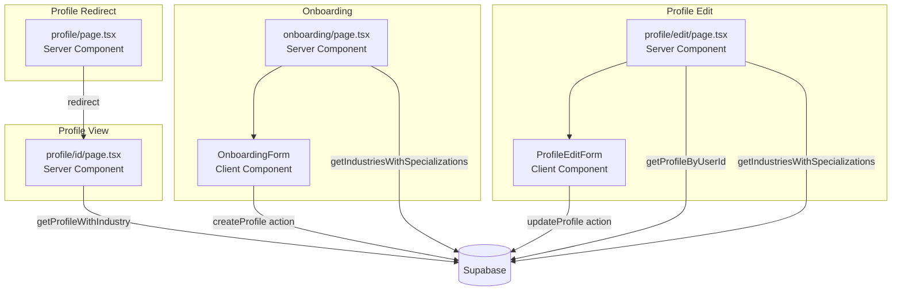
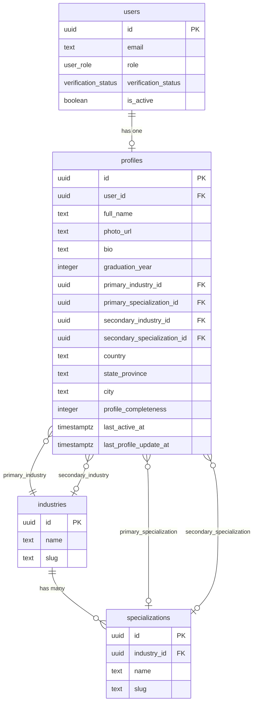
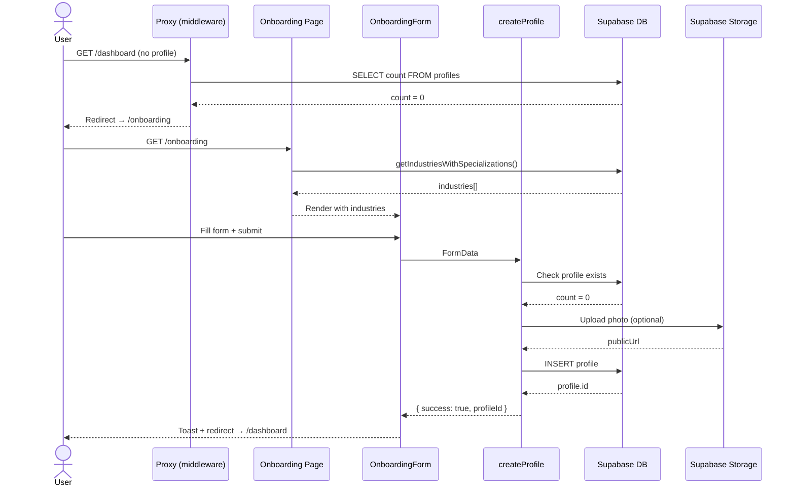

# Feature: Profile — Create & Edit (Progressive)

**Date Implemented**: 2026-03-09
**Status**: Complete
**Related ADRs**: ADR-003

## Overview

Core profile system allowing alumni to create and edit their profiles. After signup, users are redirected to an onboarding flow that captures required fields (name, graduation year, primary industry). A full edit page is available for updating all profile fields including bio, location, secondary industry, and photo.

Serves: all authenticated users (create/edit own), verified alumni (view others), admins (view all).

## Architecture

### Component Hierarchy



### Data Flow

```mermaid
flowchart LR
    subgraph Onboarding Flow
        Signup[Signup Success] -->|redirect| Onboarding[/onboarding]
        Onboarding -->|createProfile| SA1[Server Action]
        SA1 -->|INSERT| DB[(profiles table)]
        SA1 -->|Upload| Storage[(avatars bucket)]
        DB -->|Success| Dashboard[/dashboard]
    end

    subgraph Edit Flow
        Edit[/profile/edit] -->|updateProfile| SA2[Server Action]
        SA2 -->|UPDATE| DB
        SA2 -->|Upload/Delete| Storage
        SA2 -->|ActionResult| Edit
    end
```

### Database Schema



### Sequence Diagram — Onboarding



## Key Files

| File | Purpose |
|------|---------|
| `supabase/migrations/00005_create_profiles_table.sql` | Profiles table, RLS, indexes, triggers |
| `supabase/migrations/00006_create_avatars_bucket.sql` | Public storage bucket + policies |
| `src/lib/types.ts` | `Profile`, `ProfileWithIndustry` interfaces |
| `src/lib/profile-completeness.ts` | Weighted completeness calculator |
| `src/lib/queries/profiles.ts` | Query helpers (get, check existence) |
| `src/app/(main)/onboarding/page.tsx` | Onboarding page (Server Component) |
| `src/app/(main)/onboarding/actions.ts` | `createProfile` Server Action |
| `src/app/(main)/onboarding/onboarding-form.tsx` | Onboarding form (Client Component) |
| `src/app/(main)/profile/page.tsx` | Redirect to own profile |
| `src/app/(main)/profile/[id]/page.tsx` | Profile view page |
| `src/app/(main)/profile/edit/page.tsx` | Profile edit page |
| `src/app/(main)/profile/edit/actions.ts` | `updateProfile` Server Action |
| `src/app/(main)/profile/edit/profile-edit-form.tsx` | Edit form (Client Component) |
| `src/proxy.ts` | Updated with onboarding redirect logic |

## RLS Policies

| Table | Policy | Operation | Description |
|-------|--------|-----------|-------------|
| `profiles` | `profiles_select_own` | SELECT | Users can read their own profile |
| `profiles` | `profiles_select_active` | SELECT | Authenticated users can read profiles of active users |
| `profiles` | `profiles_insert_own` | INSERT | Users can insert their own profile (UNIQUE constraint) |
| `profiles` | `profiles_update_own` | UPDATE | Users can update their own profile |
| `profiles` | `profiles_admin_select` | SELECT | Admins can read all profiles |
| `profiles` | `profiles_admin_update` | UPDATE | Admins can update any profile |
| `storage.objects` | `avatars_insert` | INSERT | Users upload to `avatars/{user_id}/` |
| `storage.objects` | `avatars_update` | UPDATE | Users update own avatar files |
| `storage.objects` | `avatars_select` | SELECT | Anyone can read (public bucket) |
| `storage.objects` | `avatars_delete` | DELETE | Users delete own avatars |

## Edge Cases and Error Handling

- **Duplicate profile**: `user_id UNIQUE` constraint + Server Action checks existence → redirects to dashboard.
- **Invalid specialization pairing**: Server Action validates that specialization belongs to selected industry via DB query.
- **Photo upload failure**: Profile still creates/updates without photo. Error logged server-side, no user-blocking.
- **Graduation year bounds**: Enforced at Zod (1950–2100) and DB constraint level.
- **Profile not found**: `notFound()` renders 404 for invalid profile IDs.
- **No profile on protected routes**: Proxy queries `profiles` table and redirects to `/onboarding`.
- **User signs up and immediately hits dashboard**: Proxy intercepts and redirects to onboarding.

## Design Decisions

- **Two-phase approach** (onboarding + edit page) chosen over multi-step wizard for simplicity. See ADR-003.
- **Public storage bucket** for avatars — profile photos are inherently public to verified alumni.
- **Profile completeness** calculated server-side on every write to avoid client/server drift.
- **Proxy-level redirect** ensures no protected page can be accessed without a profile, regardless of entry point.
- **Cascading select** for industry → specialization implemented client-side with hidden inputs for form submission.

## Future Considerations

- Features #5-8 will add career history, education history, location hierarchy, and availability tags.
- Feature #9 will add per-field visibility controls (connected-only details).
- Profile photo optimization (resize, WebP conversion) can be added via Supabase Edge Functions or image CDN.
- Profile completeness scoring may need adjustment as new fields are added in Features #5-8.
