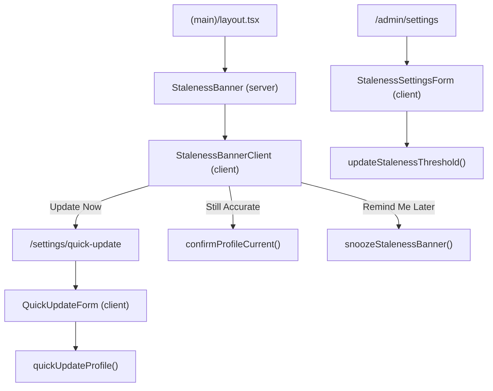
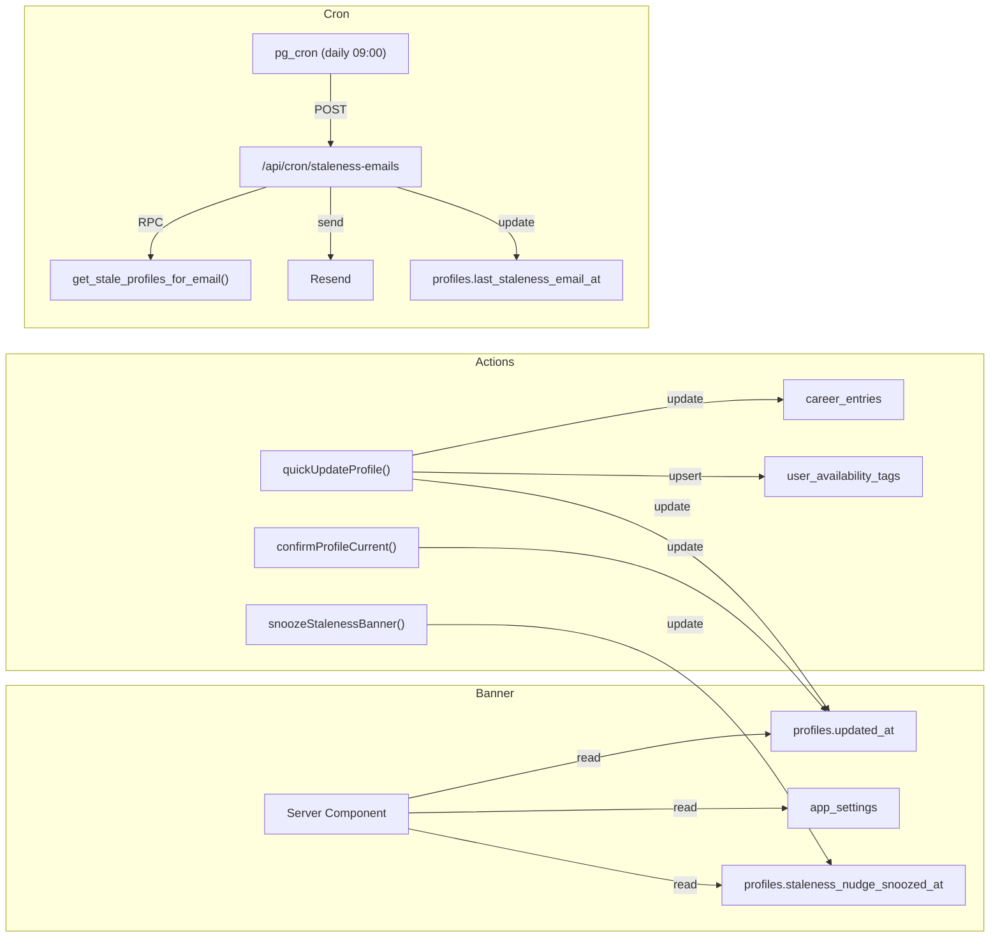
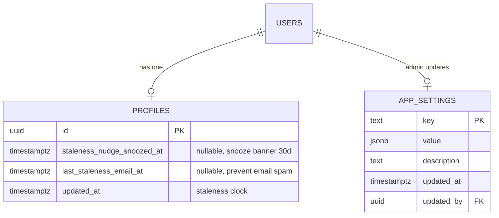
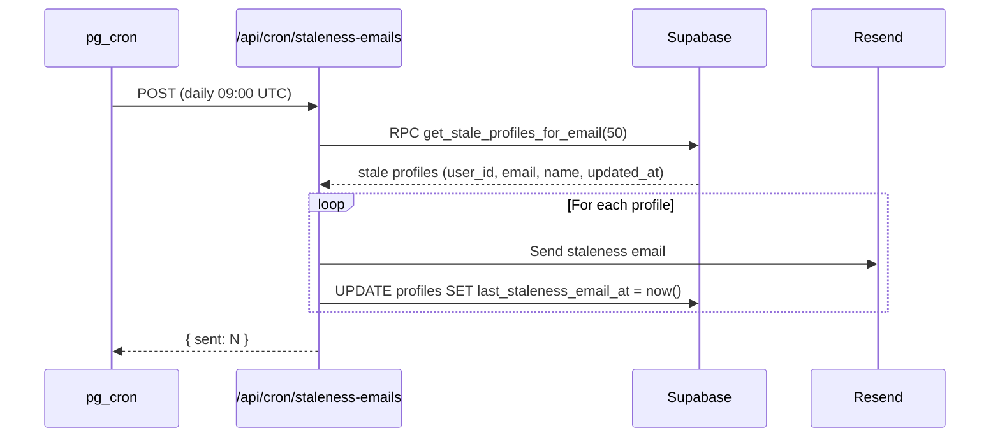

# Feature: Profile Staleness — Periodic Update Prompts

**Date Implemented**: 2026-03-11
**Status**: Complete
**Related ADRs**: ADR-018

## Overview

Nudges users to keep their profiles current through two channels:
1. **In-app banner** on the main layout when a profile hasn't been updated beyond an admin-configurable threshold (default 6 months)
2. **Email nudge** via a daily pg_cron job that sends reminders to stale profiles

Includes a **quick-update flow** at `/settings/quick-update` where users can confirm or update key fields (job, location, availability) without navigating to the full profile editor.

Admins can configure the staleness threshold (or disable it entirely) at `/admin/settings`.

## Architecture

### Component Hierarchy

### Data Flow

### Database Schema

### Sequence Diagram — Email Nudge Flow

## Key Files

| File | Purpose |
|------|---------|
| `supabase/migrations/00030_profile_staleness.sql` | Schema: app_settings table, profile columns, pg_cron job |
| `src/app/(main)/staleness-banner.tsx` | Server component: staleness detection logic |
| `src/app/(main)/staleness-banner-client.tsx` | Client component: banner UI with snooze/confirm/update |
| `src/app/(main)/staleness-actions.ts` | Server actions: snooze, confirm current |
| `src/app/(main)/settings/quick-update/page.tsx` | Quick-update page (server) |
| `src/app/(main)/settings/quick-update/quick-update-form.tsx` | Quick-update form (client) |
| `src/app/(main)/settings/quick-update/actions.ts` | Quick-update server action |
| `src/app/api/cron/staleness-emails/route.ts` | Cron API route for batch email sending |
| `src/app/(admin)/admin/settings/page.tsx` | Admin settings page |
| `src/app/(admin)/admin/settings/staleness-settings-form.tsx` | Admin threshold config form |
| `src/app/(admin)/admin/settings/actions.ts` | Admin settings server action |
| `src/lib/queries/app-settings.ts` | Query helpers for app_settings table |
| `src/lib/email-templates.ts` | Added `profileStalenessEmail()` template |

## RLS Policies

| Table | Policy | Roles | Description |
|-------|--------|-------|-------------|
| `app_settings` | `SELECT` | authenticated | All users can read settings (banner needs threshold) |
| `app_settings` | `INSERT/UPDATE/DELETE` | admin | Only admins can modify settings |

## Edge Cases and Error Handling

- **New users**: `updated_at` is recent, no banner shown
- **No profile**: Banner returns `null` (user will see onboarding flow)
- **Admin sets threshold to 0**: Feature disabled — no banner, no emails
- **Snooze**: 30-day cooldown, then banner reappears
- **"Still Accurate"**: Resets `updated_at` without changing fields
- **Email delivery failure**: Logged, `last_staleness_email_at` not updated → retried next day
- **Unverified users**: Excluded from both banner and email nudge
- **Email opt-out**: Users can disable via `/settings/notifications` → `profile_staleness` preference

## Design Decisions

- **`app_settings` as key-value table**: Simple, extensible for future admin config needs. See ADR-018.
- **Banner in layout, not per-page**: Ensures visibility on any page the user visits
- **Snooze vs permanent dismiss**: Snooze (30 days) ensures users are reminded again, not indefinitely silenced
- **Quick-update as page, not modal**: Bookmarkable, linkable from email, simpler routing
- **pg_cron + API route**: Reuses existing pattern from account hard-delete job

## Future Considerations

- **Phase 2**: In-app notification (not just banner) for staleness
- **Phase 2**: Admin-configurable snooze duration
- **Phase 2**: 7-day reminder email before the full staleness email
- **Phase 3**: Smart nudging based on profile completeness score
