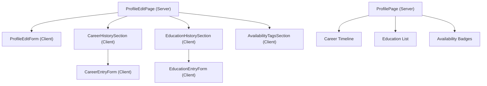
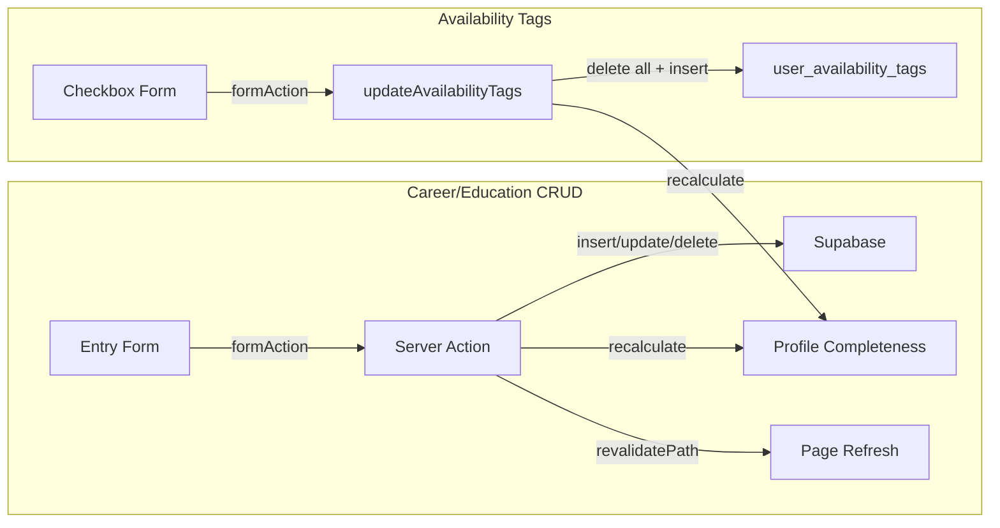
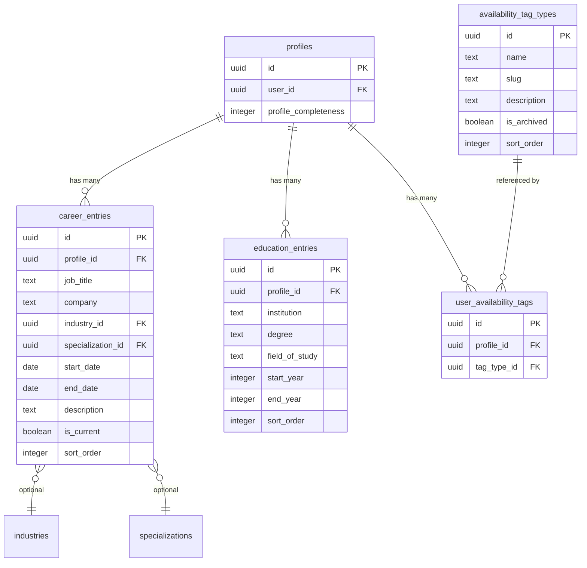
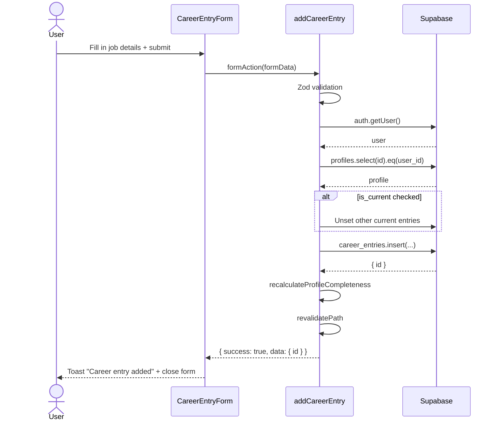

# Feature: Profile Sub-features (Career History, Education History, Availability Tags)

**Date Implemented**: 2026-03-09
**Status**: Complete
**Related ADRs**: ADR-004 (availability tags junction table)

## Overview

Three profile enrichment features that allow alumni to showcase their professional background and availability. Serves all authenticated users (create/edit own) and all verified users (view on profiles).

- **Career History** (#5): LinkedIn-style multiple position entries with timeline display
- **Education History** (#6): Multiple education entries with degree/field/year details
- **Availability Tags** (#8): Checkbox-based tags indicating what a user is open to

## Architecture

### Component Hierarchy

### Data Flow

### Database Schema

### Sequence Diagram — Add Career Entry

## Key Files

| File | Purpose |
|------|---------|
| `supabase/migrations/00008_create_career_education_availability_tables.sql` | Schema for all 4 tables + RLS + seed data |
| `src/lib/types.ts` | CareerEntry, EducationEntry, AvailabilityTagType types |
| `src/lib/queries/career-entries.ts` | Career entry query helpers |
| `src/lib/queries/education-entries.ts` | Education entry query helpers |
| `src/lib/queries/availability-tags.ts` | Availability tag query helpers |
| `src/lib/profile-completeness.ts` | Updated completeness calculation with new weights |
| `src/lib/profile-completeness-updater.ts` | Server-side completeness recalculator (checks related tables) |
| `src/app/(main)/profile/edit/career-actions.ts` | add/update/delete career entry Server Actions |
| `src/app/(main)/profile/edit/education-actions.ts` | add/update/delete education entry Server Actions |
| `src/app/(main)/profile/edit/availability-actions.ts` | updateAvailabilityTags Server Action |
| `src/app/(main)/profile/edit/career-entry-form.tsx` | Career entry add/edit form (Client) |
| `src/app/(main)/profile/edit/career-history-section.tsx` | Career entries list with CRUD (Client) |
| `src/app/(main)/profile/edit/education-entry-form.tsx` | Education entry add/edit form (Client) |
| `src/app/(main)/profile/edit/education-history-section.tsx` | Education entries list with CRUD (Client) |
| `src/app/(main)/profile/edit/availability-tags-section.tsx` | Availability checkboxes form (Client) |
| `src/app/(main)/profile/edit/page.tsx` | Updated to fetch and pass all new data |
| `src/app/(main)/profile/[id]/page.tsx` | Updated with career timeline, education list, availability badges |

## RLS Policies

| Table | Policy | Roles | Description |
|-------|--------|-------|-------------|
| `career_entries` | `SELECT` | authenticated | Read entries of active users |
| `career_entries` | `INSERT/UPDATE/DELETE` | owner | Via profile_id → profiles.user_id = auth.uid() |
| `career_entries` | `ALL` | admin | Full access |
| `education_entries` | `SELECT` | authenticated | Read entries of active users |
| `education_entries` | `INSERT/UPDATE/DELETE` | owner | Via profile_id → profiles.user_id = auth.uid() |
| `education_entries` | `ALL` | admin | Full access |
| `availability_tag_types` | `SELECT` | authenticated | Non-archived tag types |
| `availability_tag_types` | `ALL` | admin | Full access including archived |
| `user_availability_tags` | `SELECT` | authenticated | Read tags of active users |
| `user_availability_tags` | `INSERT/DELETE` | owner | Via profile_id → profiles.user_id = auth.uid() |
| `user_availability_tags` | `ALL` | admin | Full access |

## Edge Cases and Error Handling

- **Career date validation**: `end_date >= start_date` enforced in both Zod schema and DB constraint
- **Education year validation**: `end_year >= start_year` when both provided, enforced at both layers
- **Single current position**: When marking a career entry as "current", all other entries for the same profile are unset first
- **Availability replace-all**: Tags update uses delete-all + insert pattern to avoid stale state
- **Profile completeness after delete**: Recalculated after every add/delete to ensure accuracy when last entry is removed
- **Specialization-industry pairing**: Career entry form resets specialization when industry changes

## Design Decisions

- **Separate cards on edit page**: Career, education, and availability are independent sections in separate Card components, not nested inside the main profile form. This keeps each section's form state isolated.
- **Inline add/edit**: Entry forms expand inline rather than navigating to separate pages, reducing navigation friction.
- **`recalculateProfileCompleteness` helper**: Centralized function that queries all related tables to compute completeness. Called after any add/delete operation on career, education, or availability data.
- **Profile completeness weights redistributed**: Reduced existing field weights to make room for new sections (career 10%, education 6%, availability 4%).

## Future Considerations

- **Location hierarchical selection** (#7): Currently free-text. Could upgrade to dropdown-based country/state/city picker in Phase 2.
- **Career entry company autocomplete**: Could add typeahead from existing company names in the database.
- **Education auto-populate**: Could pre-fill an entry from signup graduation year + school name.
- **Admin tag type management**: Tag types can already be added/archived via direct DB access; UI for this is planned in Feature #27.
