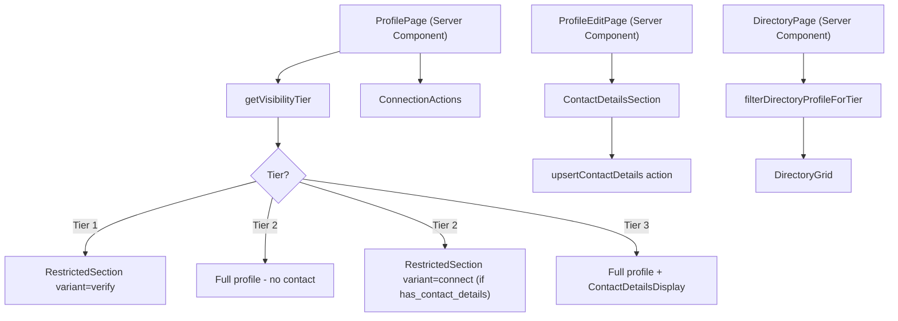
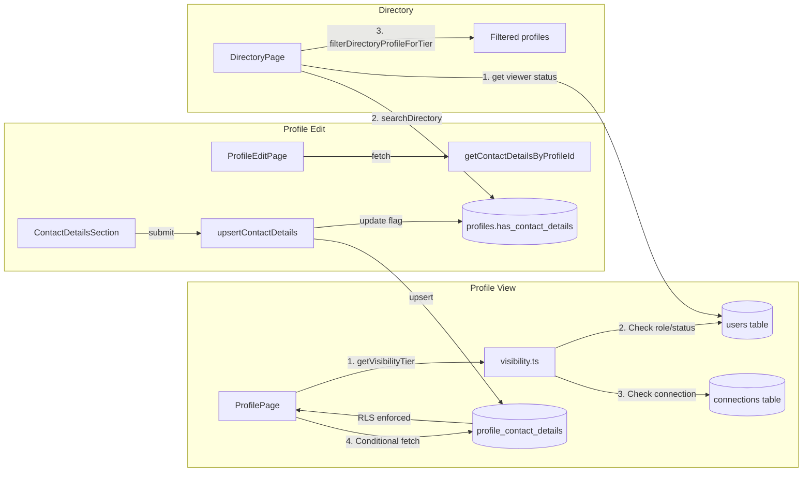
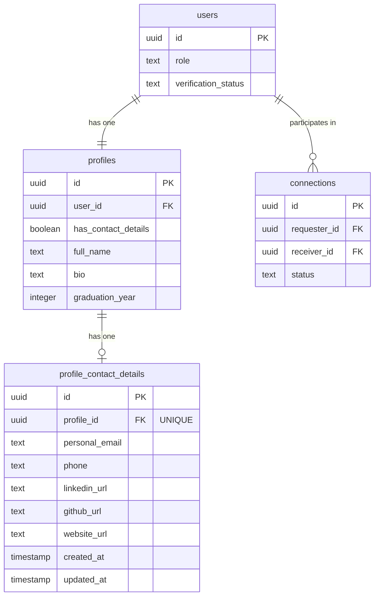
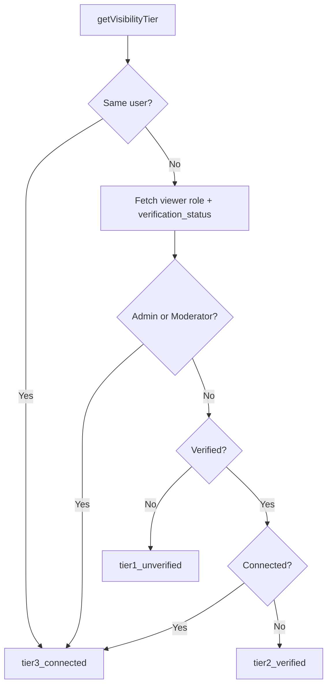

# Feature: Profile Visibility Controls

**Date Implemented**: 2026-03-09
**Status**: Complete
**Related ADRs**: ADR-006

## Overview

3-tier visibility system that controls what profile data each viewer can see, based on their verification status and connection relationship with the profile owner.

| Tier | Viewer | Can See | Contact Details |
|------|--------|---------|-----------------|
| Tier 1 | Unverified user | Name, photo, graduation year, primary industry | No |
| Tier 2 | Verified, not connected | Tier 1 + bio, location, career, education, tags, secondary industry | No |
| Tier 3 | Connected / owner / admin / moderator | Everything in Tier 2 + contact details | Yes |

## Architecture

### Component Hierarchy

### Data Flow

### Database Schema

### Visibility Tier Resolution

## Key Files

| File | Purpose |
|------|---------|
| `supabase/migrations/00013_create_profile_contact_details.sql` | Migration: table, `is_connected_to()` function, RLS policies |
| `src/lib/visibility.ts` | `getVisibilityTier()` + `filterDirectoryProfileForTier()` |
| `src/lib/queries/contact-details.ts` | `getContactDetailsByProfileId()` query |
| `src/app/(main)/profile/edit/contact-details-actions.ts` | `upsertContactDetails` + `deleteContactDetails` server actions |
| `src/app/(main)/profile/edit/contact-details-section.tsx` | Edit form for contact details |
| `src/app/(main)/profile/[id]/page.tsx` | Profile view with tier-based rendering |
| `src/app/(main)/profile/[id]/restricted-section.tsx` | CTAs for restricted content |
| `src/app/(main)/profile/[id]/contact-details-display.tsx` | Contact details display component |
| `src/app/(main)/directory/page.tsx` | Directory with tier filtering + unverified banner |
| `src/lib/profile-completeness.ts` | Updated weights (added 8pts for contact details) |

## RLS Policies

| Table | Policy | Roles | Description |
|-------|--------|-------|-------------|
| `profile_contact_details` | SELECT | Owner | `auth.uid() = profile.user_id` |
| `profile_contact_details` | SELECT | Connected | `is_connected_to(auth.uid(), profile.user_id)` |
| `profile_contact_details` | SELECT | Admin/Mod | `role IN ('admin', 'moderator')` |
| `profile_contact_details` | INSERT | Owner | `auth.uid() = profile.user_id` |
| `profile_contact_details` | UPDATE | Owner | `auth.uid() = profile.user_id` |
| `profile_contact_details` | DELETE | Owner | `auth.uid() = profile.user_id` |

## Postgres Functions

| Function | Purpose | Security |
|----------|---------|----------|
| `is_connected_to(user_a, user_b)` | Returns `true` if accepted connection exists | `SECURITY DEFINER` (bypasses RLS to check connections table) |

## Edge Cases and Error Handling

- **Unauthenticated visitor**: Defaults to `tier1_unverified` (only basic info shown).
- **Admin viewing any profile**: Always tier 3 — sees everything including contact details.
- **Pending connection**: Does NOT grant tier 3. Only `status = 'accepted'` connections upgrade to tier 3.
- **No contact details saved**: Contact info section simply doesn't render. Tier 2 viewers see the "Connect to see contact info" CTA only if `has_contact_details` is true.
- **Profile completeness rebalanced**: Weights redistributed to sum to 100 with new `has_contact_details` factor (8 points).

## Design Decisions

- **App-layer filtering for Tier 1 vs Tier 2**: RLS can't selectively null columns on the same table. Bio, location, career, education live on `profiles`/related tables where RLS grants authenticated SELECT. So Tier 1 filtering is done in `getVisibilityTier()` + `filterDirectoryProfileForTier()`.
- **Separate `profile_contact_details` table**: Enables strict RLS — only connected/owner/admin can SELECT the entire row. No risk of leaking contact data through partial column access.
- **`has_contact_details` flag on profiles**: Allows showing "Connect to see contact info" CTA without querying the RLS-protected table (which would return null for unauthorized viewers anyway).
- **`is_connected_to()` as SECURITY DEFINER**: Needs to read connections table regardless of caller's RLS context. Will be reused by Feature #18 (Messaging).

## Future Considerations

- **Feature #18 (Messaging)**: "1 message before connection accepted" rule for Tier 2 — not implemented here, deferred to messaging feature. `is_connected_to()` will be reused.
- **Feature #19 (Rate limiting)**: Applies to messaging, no interaction with visibility.
- **Custom visibility preferences**: Users could eventually choose which fields to share at each tier. Not in Phase 1.
