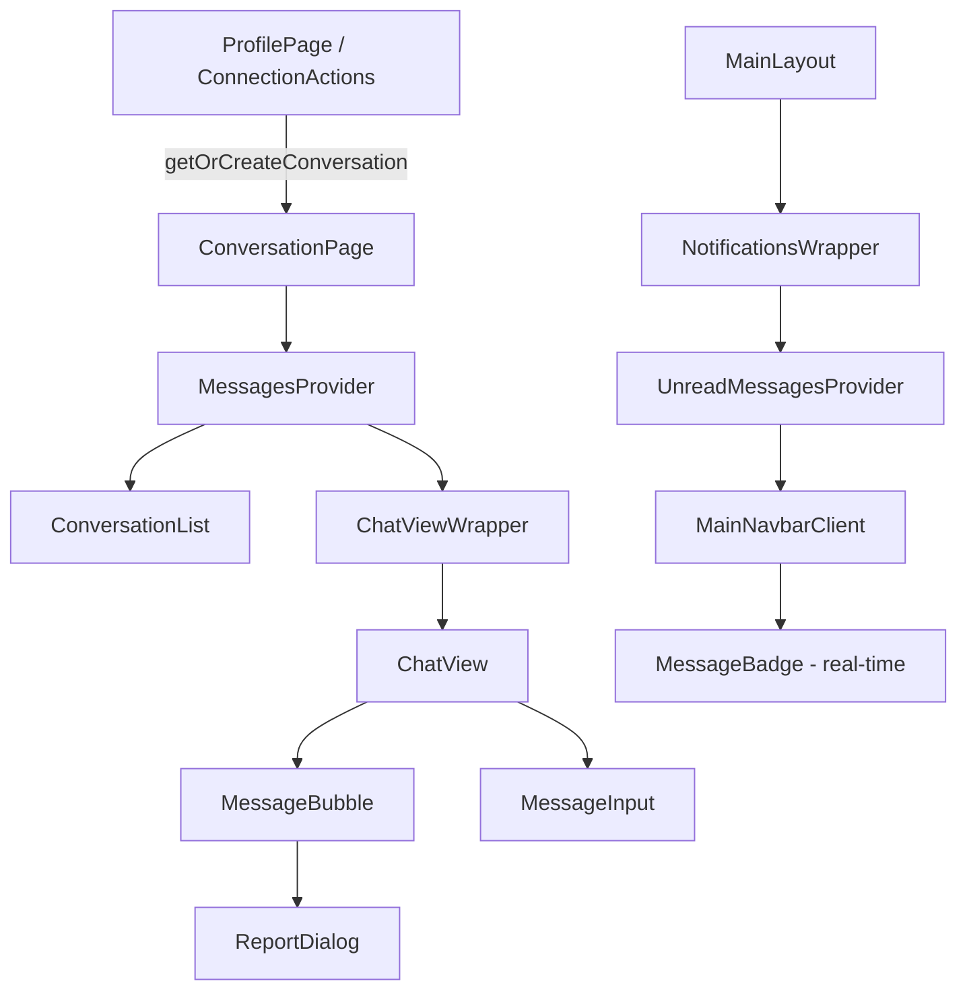
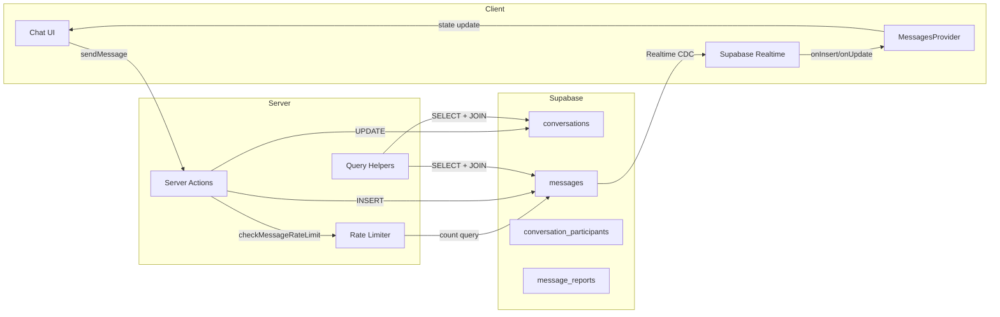
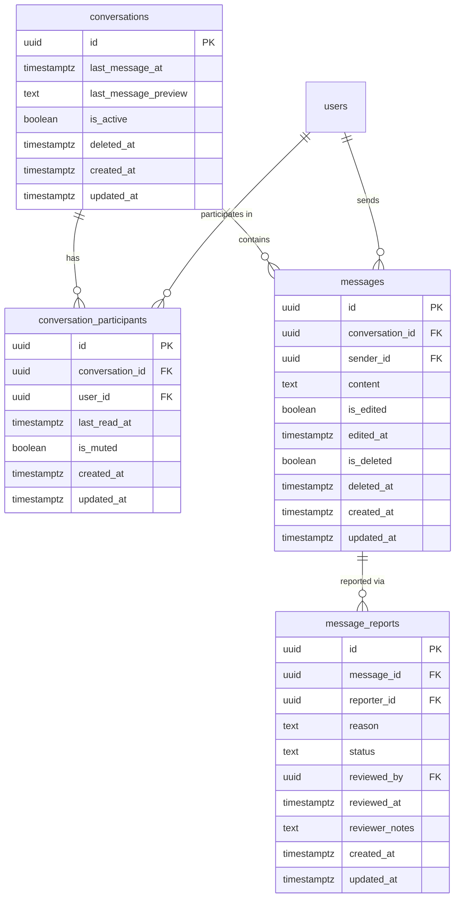
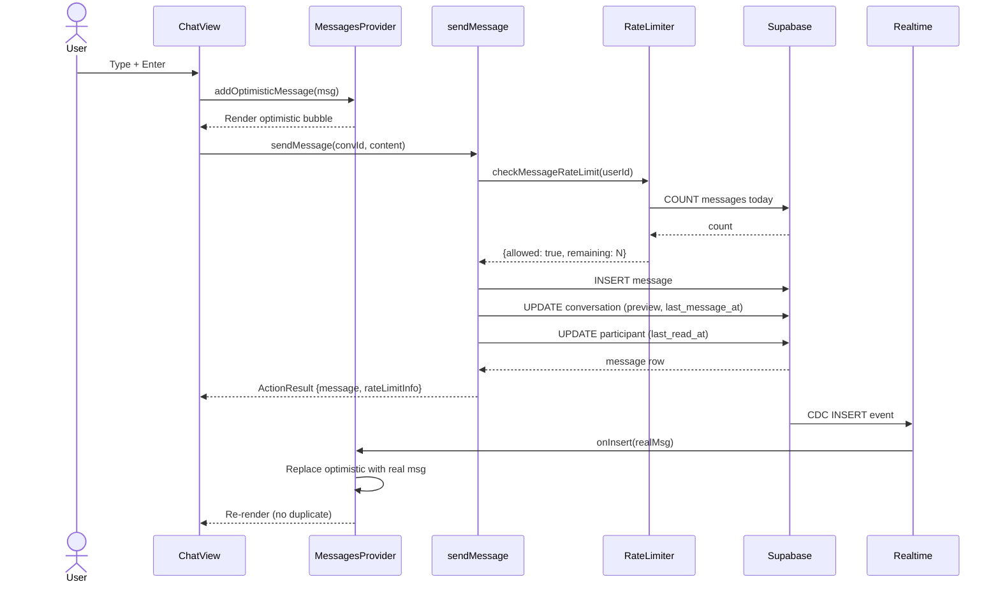
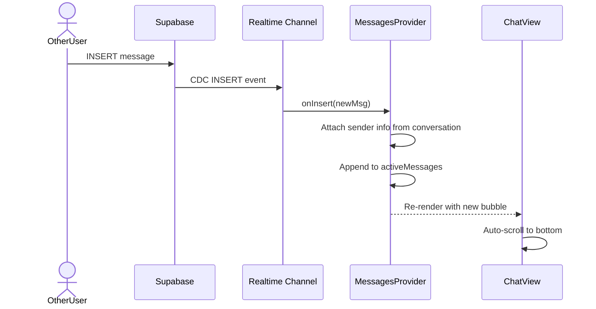

# Feature: Real-Time Messaging (F8)

**Date Implemented**: 2026-03-10
**Status**: Complete
**Related ADRs**: ADR-007, ADR-008

## Overview

1-on-1 real-time messaging between connected alumni. Powered by Supabase Realtime (WebSocket). Only verified users who are connected can message each other. Includes rate limiting, message editing/deletion, and anonymous message reporting to moderators.

## Architecture

### Component Hierarchy

### Data Flow

### Database Schema

### Sequence Diagram — Sending a Message

### Sequence Diagram — Real-Time Receive

## Key Files

| File | Purpose |
|------|---------|
| `supabase/migrations/00014_create_messaging_tables.sql` | Schema: 4 tables, indexes, RLS, realtime publication |
| `supabase/migrations/00015_fix_messaging_rls_policies.sql` | Fix: SECURITY DEFINER helpers for RLS subqueries |
| `src/lib/types.ts` | Messaging types (Conversation, Message, MessageReport, etc.) |
| `src/lib/rate-limit.ts` | Tier-based rate limiting (new/established/admin) |
| `src/lib/queries/messages.ts` | Query helpers: getConversations, getMessages, getTotalUnreadCount |
| `src/lib/utils.ts` | formatRelativeTime, formatMessageTime utilities |
| `src/app/(main)/messages/actions.ts` | 7 server actions (CRUD + report + mute) |
| `src/app/(main)/messages/page.tsx` | Conversation list page |
| `src/app/(main)/messages/[conversationId]/page.tsx` | Active chat page |
| `src/app/(main)/messages/components/messages-provider.tsx` | Real-time context + optimistic updates |
| `src/app/(main)/messages/components/chat-view.tsx` | Message area with 5-min timestamp grouping |
| `src/app/(main)/messages/components/message-bubble.tsx` | Bubble with tap-to-toggle timestamp |
| `src/app/(main)/messages/components/message-input.tsx` | Compose area with persistent focus |
| `src/app/(main)/messages/components/conversation-list.tsx` | Sidebar with unread badges |
| `src/app/(main)/messages/components/report-dialog.tsx` | Anonymous report modal |
| `src/app/(main)/messages/components/unread-messages-provider.tsx` | Real-time unread message count context (Supabase Realtime subscription) |
| `src/app/(main)/notifications-wrapper.tsx` | Server component: fetches initial unread counts (notifications + messages) in parallel |
| `src/components/navbar/main-navbar.tsx` | Navbar server component (no longer fetches unread messages — delegated to provider) |
| `src/components/navbar/main-navbar-client.tsx` | Navbar: Messages link + real-time blue badge via `useUnreadMessages()` |
| `src/app/(main)/profile/[id]/connection-actions.tsx` | "Message" button on connected profiles |

## RLS Policies

| Table | Policy | Who | Description |
|-------|--------|-----|-------------|
| `conversations` | SELECT | participant | `is_conversation_participant()` check |
| `conversations` | INSERT | verified | `is_verified_user()` SECURITY DEFINER |
| `conversations` | UPDATE | participant | Soft delete |
| `conversation_participants` | SELECT | participant | Same-conversation members |
| `conversation_participants` | INSERT | verified | `is_verified_user()` |
| `conversation_participants` | UPDATE | own | Own rows only (last_read_at, is_muted) |
| `messages` | SELECT | participant | `is_conversation_participant()` |
| `messages` | INSERT | participant+sender | sender_id = auth.uid(), active conversation |
| `messages` | UPDATE | sender | Own messages only (edit, soft-delete) |
| `message_reports` | SELECT own | reporter | Own reports |
| `message_reports` | SELECT all | moderator/admin | `is_moderator_or_admin()` |
| `message_reports` | INSERT | verified participant | Not own messages, in conversation |
| `message_reports` | UPDATE | moderator/admin | Status changes |

## Rate Limiting

| User Tier | Messages/Day | New Conversations/Day |
|-----------|-------------|----------------------|
| New (verified < 7 days) | 20 | 5 |
| Established (verified ≥ 7 days) | 500 | 20 |
| Admin | Unlimited | Unlimited |

- Uses UTC midnight-to-midnight 24h window
- Warning shown when ≤ 5 messages remaining
- Tier determined from `verification_requests.reviewed_at`

## Edge Cases and Error Handling

- **Disconnected users**: If a connection is removed while conversation exists, sending is blocked with "You are no longer connected" error. Conversation remains visible.
- **Blocked users**: Conversation hidden from blocked user. Blocker sees block state.
- **Rate limit reached**: Send button remains enabled but server rejects. Warning banner shows remaining count and reset time.
- **Edit window expired (>15 min)**: Edit option hidden in UI, server rejects if attempted.
- **Duplicate reports**: UNIQUE constraint (message_id, reporter_id) prevents double reports.
- **Double render prevention**: Optimistic messages use `optimistic-*` prefix IDs. Real-time INSERT event replaces the optimistic message with the real one instead of appending a duplicate.
- **RLS + RETURNING issue**: INSERT into conversations can't use `.select()` because the SELECT policy requires being a participant (which doesn't exist yet). Fixed by generating UUID server-side with `randomUUID()`.

## Design Decisions

- **Two-table schema** (conversations + messages) over single-table: Industry standard, O(1) conversation list queries. See ADR-007.
- **Optimistic UI**: Messages appear instantly. Real-time event replaces the optimistic shell. Instagram/Messenger-like UX.
- **5-min timestamp grouping**: Only the first message in a <5min cluster shows a centered timestamp. Individual timestamps shown on tap. Matches Messenger/Instagram pattern.
- **App-level rate limiting** over DB triggers: Better UX (user-friendly error messages, remaining count), easier to test and tune. RLS provides the security backstop.
- **SECURITY DEFINER helpers** for RLS policies that subquery `public.users`: Same pattern as ADR-002 (admin RLS fix). Prevents RLS recursion when checking verification status.
- **Real-time navbar badge via context provider**: Same pattern as `NotificationsProvider`. `UnreadMessagesProvider` subscribes to `messages` INSERT events globally and increments the count for non-self messages. Initial count fetched server-side in parallel with notification counts (single `getUser()` call). See ADR-022.

## Future Considerations

Documented and deferred for later phases:

### Phase 2: Enhanced Messaging
- **Typing indicators**: Supabase Broadcast on conversation channel, ephemeral (no DB). Throttle 1 event/3 sec.
- **Per-message read receipts**: `message_read_receipts(message_id, user_id, read_at)` table. Double-checkmark UI.
- **Media/file attachments**: `message_attachments` table + Supabase Storage bucket. Images, PDFs, docs. Max 10MB/file.
- **Message reactions**: `message_reactions(message_id, user_id, emoji)` table.
- **Link previews**: Server-side OG tag fetching, store in `messages.metadata` JSONB column.

### Phase 3: Scale to 10k+ Users
- **Connection pooling**: Switch to PgBouncer (Supabase toggle).
- **Message pagination optimization**: Composite covering index `(conversation_id, created_at DESC, id)`.
- **Conversation sharding**: Partition `messages` table by conversation_id hash.
- **Realtime fan-out**: Dedicated WebSocket service (Ably/Pusher) if broadcast latency increases.
- **Search within messages**: `tsvector` + GIN index on `messages.content`.
- **Archive old conversations**: Cold storage for messages > 1 year old.

### Phase 4: Group Messaging
- `conversations.type` column (`direct` vs `group`).
- Remove 2-participant constraint.
- `conversation_participants.role` (admin, member).
- Group creation, naming, member management.
- `@username` mentions with targeted notifications.
