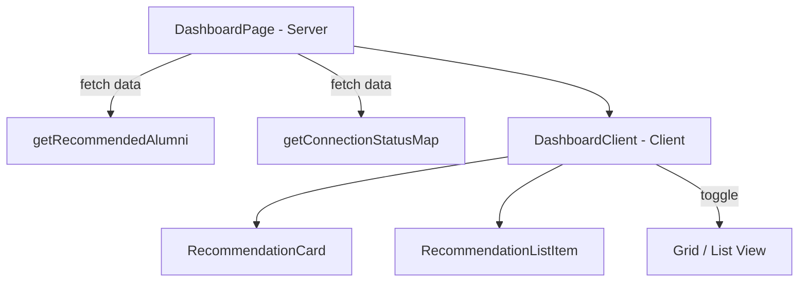
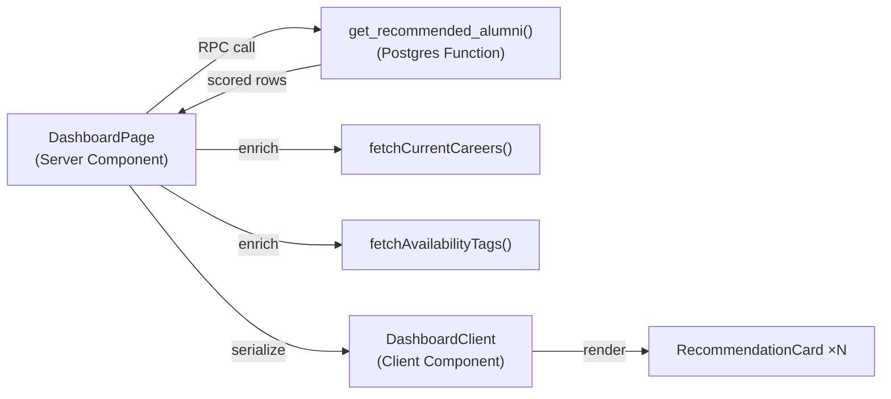
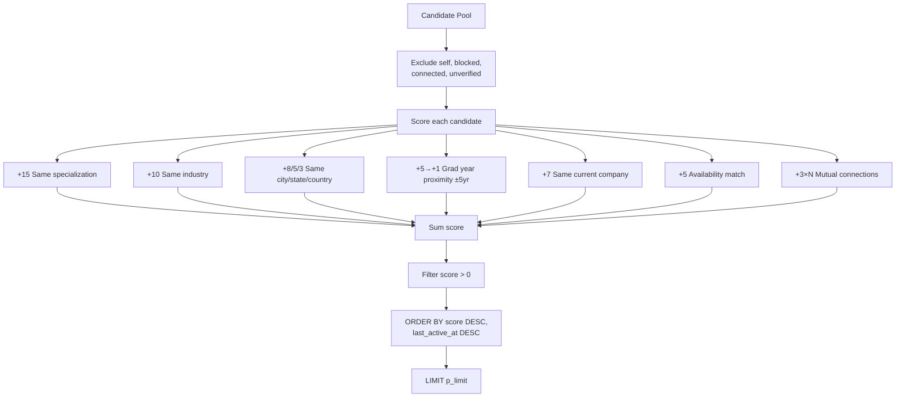

# Feature: Recommendation Engine (Rule-Based Scoring)

**Date Implemented**: 2026-03-10
**Status**: Complete
**Related ADRs**: ADR-010

## Overview

Suggests alumni to connect with based on profile similarity. Uses a weighted rule-based scoring system computed on-the-fly via a Postgres function. Displayed on the dashboard as "Suggested Alumni" with grid/list view toggle and match quality badges.

Serves: verified users with profiles. Falls back to recently active alumni for cold-start users.

## Architecture

### Component Hierarchy

### Data Flow

### Scoring Algorithm

### Availability Match Logic

| Current User Tag | Candidate Tag | Score |
|---|---|---|
| Open to mentoring | Looking for work / Open to coffee chats | +5 |
| Looking for work / Open to coffee chats | Open to mentoring | +5 |
| Hiring | Looking for work | +5 |
| Looking for work | Hiring | +5 |

### Cold-Start Fallback

When the scoring function returns zero results (new user with sparse profile, or no verified alumni match):
1. App-layer fallback queries recently active verified alumni
2. Returns them with `score: 0`
3. Dashboard displays them without match quality badges

## Key Files

| File | Purpose |
|------|---------|
| `supabase/migrations/00017_create_recommendation_function.sql` | Postgres scoring function |
| `src/lib/queries/recommendations.ts` | Query helper — RPC call + enrichment + fallback |
| `src/lib/types.ts` | `RecommendedProfile` type (extends `DirectoryProfile` + `score`) |
| `src/app/(main)/dashboard/page.tsx` | Server component — fetches recommendations |
| `src/app/(main)/dashboard/dashboard-client.tsx` | Client component — grid/list toggle, animations |
| `src/app/(main)/dashboard/recommendation-card.tsx` | Grid card with match badge, hover effects |
| `src/app/(main)/dashboard/recommendation-list-item.tsx` | List row with inline metadata |
| `src/app/(main)/dashboard/loading.tsx` | Skeleton loading state |

## RLS Policies

No new RLS policies. The Postgres function uses `SECURITY INVOKER` — it runs with the calling user's permissions. All underlying tables (profiles, connections, blocks, career_entries, availability tags) already have appropriate RLS policies for authenticated SELECT.

## UI Features

- **Grid/list view toggle** — pill-style toggle with active state shadow
- **Staggered entrance animations** — cards fade-in + slide-up with 50ms delay per card (grid) or 30ms (list), capped to prevent excessive delay
- **Match quality badges** — floating badge on cards: "Great match" (≥30, emerald), "Strong match" (≥20, blue), "Good match" (≥10, violet), "Match" (<10, gray)
- **Hover effects** — card lift (`-translate-y-0.5`), avatar scale, ring color transition, industry badge color shift, bottom gradient reveal
- **Profile completeness nudge** — amber banner for users with <70% profile completeness, links to edit page
- **Empty states** — distinct CTAs for no-profile vs no-recommendations scenarios
- **Responsive** — 1 col (mobile), 2 col (sm), 3 col (lg), 4 col (xl)

## Edge Cases and Error Handling

- **No profile**: Shows "Create your profile" CTA instead of recommendations
- **RPC error**: Logged server-side, returns empty array, dashboard shows empty state
- **No scored results**: Falls back to recently active verified alumni
- **Blocked users**: Excluded in both directions by the SQL function
- **Already connected**: Excluded from recommendations (they're already connections)
- **Self**: Excluded from candidate pool

## Design Decisions

- **Postgres function over app-layer loop**: Scoring in SQL is 10-100x faster than fetching all profiles to Node.js and scoring in a loop. Single round-trip.
- **`STABLE` function**: Tells the query planner the function returns the same results within a single transaction, allowing optimizations.
- **`SECURITY INVOKER`**: Runs with the caller's RLS context. No privilege escalation.
- **No new tables**: Scoring is stateless. No cache to invalidate. See ADR-010 for scaling path.
- **Reused directory card pattern**: Recommendation cards follow the same data shape (`DirectoryProfile`) and visual pattern as directory cards for consistency.

## Future Considerations

### Phase 2: Pre-Computed Recommendations
- Materialized view or `user_recommendations` table refreshed via `pg_cron`
- Targeted invalidation on profile/connection/tag changes
- Same function signature — callers don't change

### Phase 2: Embedding-Based Similarity
- `pgvector` extension for semantic matching
- Profile text → embedding via OpenAI/Anthropic API
- Hybrid score: `0.7 × rule_score + 0.3 × cosine_similarity`

### Phase 2: "Alumni Like You" on Profile Pages
- Show recommendations scoped to a specific profile's attributes
- Reuse the same scoring function with a different base profile

### Features #14-16: Cold-Start Improvements
- **#14 Onboarding quiz**: 3-4 questions post-signup to seed scoring before full profile
- **#15 Same-year classmates**: Default fallback using graduation year
- **#16 Popular/active profiles**: Most-connected or recently-active alumni carousel

### Performance Scaling
- Partial index on verified + active profiles
- Pre-computed mutual connection counts
- Coarse candidate filtering before scoring (same country, ±10 years)
- See ADR-010 for full scaling path
