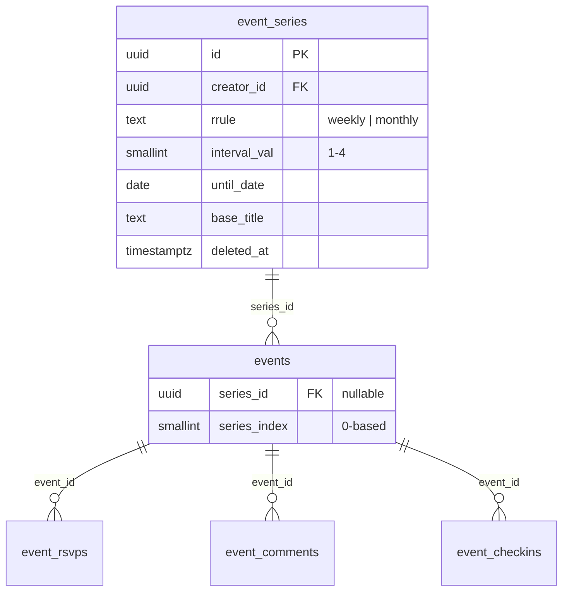
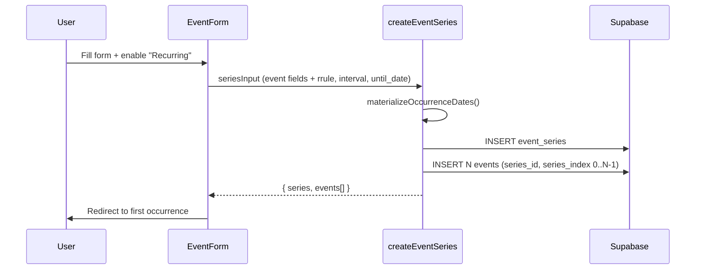
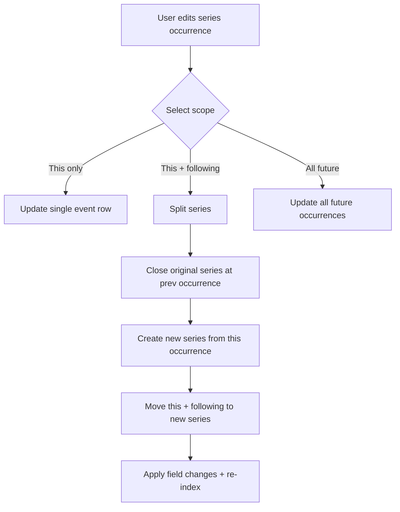
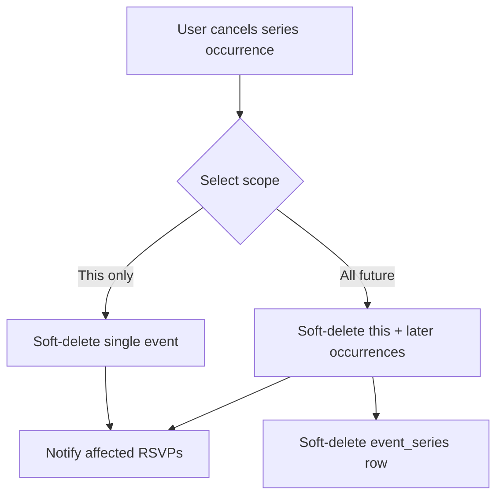

# F47d: Recurring Events (Weekly/Monthly)

## Overview

Allows organizers to create repeating events that materialize individual occurrence rows, each with independent RSVPs, comments, and check-ins. Supports scoped editing and cancellation.

## Architecture

### Materialized Row Strategy

Rather than virtual expansion (computing occurrences on-the-fly), the system creates real `events` rows at series creation time. This keeps all existing queries, RLS policies, and features (RSVP, comments, check-in, notifications) working unchanged.

### Data Flow

### Scoped Edit Flow

### Scoped Cancel Flow

## Key Files

| File | Purpose |
|------|---------|
| `supabase/migrations/00049_event_series_f47d.sql` | Schema, RLS, RPC |
| `src/lib/types.ts` | `EventSeriesRow`, updated `EventRow` |
| `src/app/(main)/events/schemas.ts` | `seriesInputSchema`, scope types |
| `src/app/(main)/events/series-actions.ts` | Create/edit/cancel series actions |
| `src/app/(main)/events/event-form.tsx` | Recurring toggle + edit scope UI |
| `src/app/(main)/events/[id]/host-actions.tsx` | Cancel scope dialog |
| `src/app/(main)/events/[id]/series-nav.tsx` | Prev/next occurrence navigation |

## Occurrence Generation

- **Weekly**: Advances by `7 * interval_val` days
- **Monthly**: Advances by `interval_val` months, clamping to last day (e.g. Jan 31 + 1mo = Feb 28)
- **Cap**: 52 occurrences maximum (`MAX_SERIES_OCCURRENCES`)
- **Minimum**: 2 occurrences required (otherwise use a single event)

## Edge Cases

- Monthly on 31st: clamped to last day of shorter months
- Past occurrences: never modified by "all" or "this_and_following" scope edits
- Series split: original series `until_date` set to day before the split point; new series inherits original `until_date`
- Cancel "all future": uses selected occurrence's `start_time` as cutoff (not `now()`), preserving earlier future occurrences
- Rate limit: series bypass the 3/7-day per-event limit but cap at 52 total occurrences
