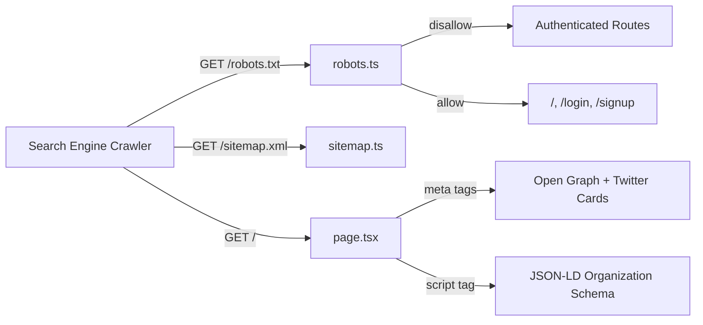

# Feature: SEO & Discoverability (F43)

**Date Implemented**: 2026-04-05
**Status**: Complete
**Related ADRs**: None (no schema changes or significant architectural decisions)

## Overview

Since most app content is behind authentication, SEO focuses on making **public-facing pages** discoverable. The goal is to help alumni find the platform via search engines when searching for their school's alumni network.

## Architecture

### File Structure

```mermaid
graph TD
    A[src/app/robots.ts] -->|generates| B[/robots.txt]
    C[src/app/sitemap.ts] -->|generates| D[/sitemap.xml]
    E[src/app/layout.tsx] -->|metadataBase + OG + Twitter| F[All pages inherit metadata]
    G[src/app/page.tsx] -->|page metadata + JSON-LD| H[Landing page SEO]
```

### SEO Data Flow



## Key Files

| File | Purpose |
|------|---------|
| `src/app/robots.ts` | Next.js convention file generating `/robots.txt`. Allows public pages, disallows all auth routes, API routes, and app routes. References sitemap URL. |
| `src/app/sitemap.ts` | Next.js convention file generating `/sitemap.xml`. Three static entries: landing (priority 1.0), signup (0.8), login (0.5). |
| `src/app/layout.tsx` | Root layout with `metadataBase`, `title.template` (`%s | PTNKAlum`), Open Graph (`og:type`, `og:locale`, `og:siteName`), and Twitter card metadata. |
| `src/app/page.tsx` | Landing page with page-specific `metadata` export (title, description, OG) and inline `<script type="application/ld+json">` for `Organization` schema. |

## Implementation Details

### robots.txt

- **Allowed**: `/` (public pages only — landing, login, signup)
- **Disallowed**: `/dashboard`, `/directory`, `/messages`, `/connections`, `/groups`, `/settings`, `/admin`, `/moderation`, `/onboarding`, `/verification`, `/reset-password`, `/account-deleted`, `/banned`, `/api/*`, `/auth/*`, `/notifications`, `/profile`, `/map`
- **Sitemap reference**: `https://ptnkalum.com/sitemap.xml`

### sitemap.xml

| URL | Priority | Change Frequency |
|-----|----------|-----------------|
| `/` | 1.0 | monthly |
| `/login` | 0.5 | yearly |
| `/signup` | 0.8 | yearly |

- `lastModified` set to build date via `new Date()`
- Base URL from `NEXT_PUBLIC_SITE_URL` env var (fallback: `https://ptnkalum.com`)

### Metadata

- **Root layout**: `metadataBase` enables automatic canonical URLs. Title template allows per-page titles (`%s | PTNKAlum`).
- **Landing page**: Standalone `metadata` export with `title`, `description`, and `openGraph` — overrides root defaults.
- **JSON-LD**: `Organization` schema with `name`, `url`, `description`. Rendered as `<script type="application/ld+json">` in the page component body.

## Design Decisions

- **Static sitemap only**: No dynamic entries since all user content is behind authentication. If public profiles are added later, the sitemap should be converted to dynamic generation.
- **Next.js convention files**: Used `robots.ts` and `sitemap.ts` (App Router conventions) instead of manual route handlers — simpler, auto-typed, and framework-idiomatic.
- **No OG image yet**: Can be added as a static `opengraph-image.png` in `src/app/` or generated with `next/og` (ImageResponse).

## Future Considerations

- Add `opengraph-image.png` for social sharing previews
- Google Search Console verification via DNS TXT record in Cloudflare (manual step)
- If public profiles are added, convert sitemap to dynamic generation with `generateSitemaps()`
