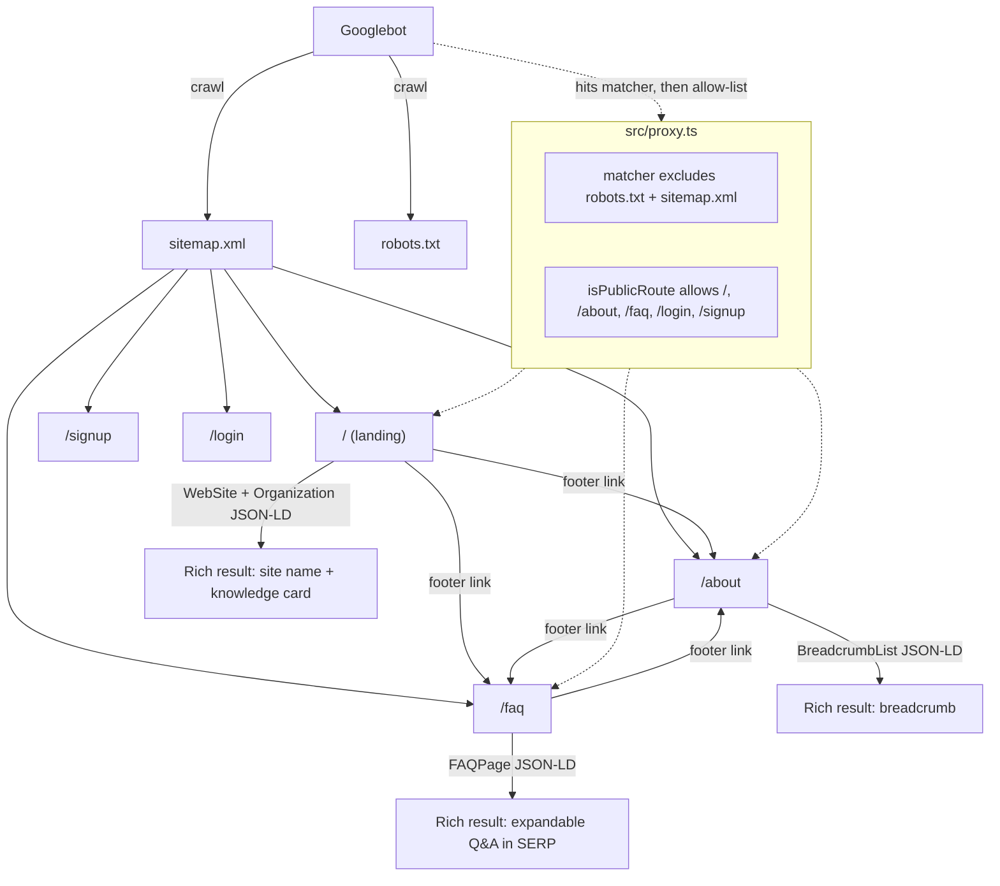
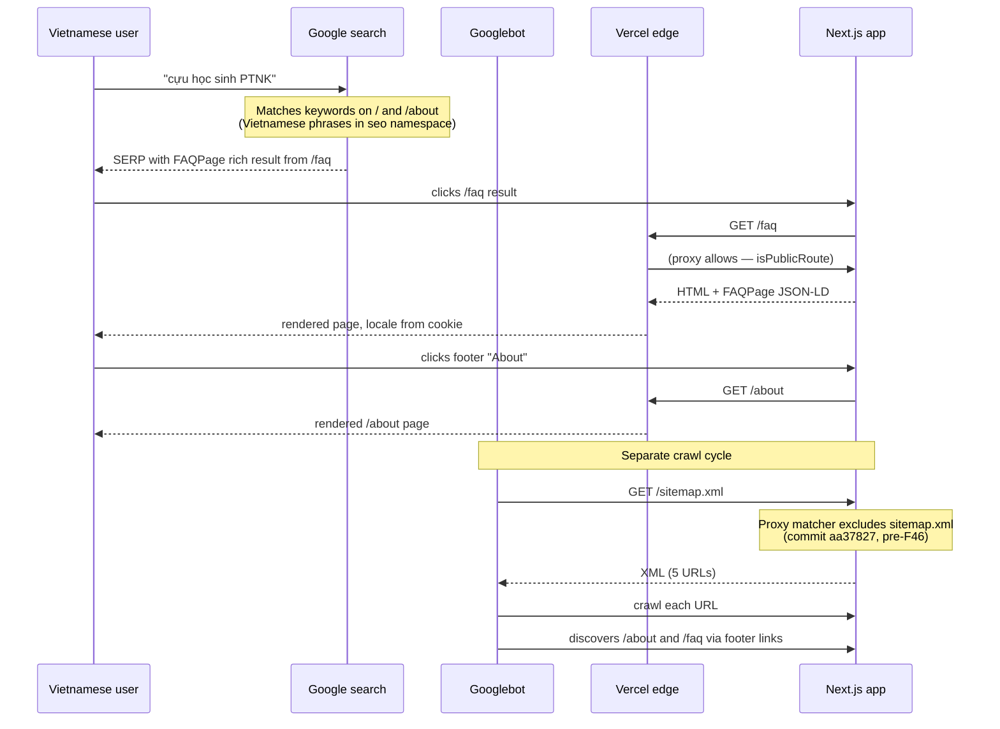

# Feature: SEO Phase 2 (F46)

**Status**: Shipped 2026-04-07
**ADR**: [026-seo-phase-2-content-and-structured-data.md](../adrs/026-seo-phase-2-content-and-structured-data.md)
**Related**: F43 (basic SEO), F44 (indigo theme — OG image palette)

## Summary

Doubles the indexable surface (3 → 5 URLs), unifies the brand name to `PTNKAlum`, and layers in bilingual metadata plus structured data so Google can match Vietnamese queries (`cựu học sinh PTNK`, `Phổ thông Năng khiếu`) to content-rich pages instead of the thin homepage-only index from F43.

## Architecture

## Files touched

### New
- `src/app/about/page.tsx` — Server Component, bilingual via `next-intl`, BreadcrumbList JSON-LD
- `src/app/faq/page.tsx` — Server Component, native `
` accordion (no client JS), FAQPage + BreadcrumbList JSON-LD
- `src/app/opengraph-image.tsx` — dynamic 1200×630 OG image via `next/og` `ImageResponse`, indigo gradient, bilingual tagline
- `src/components/public-footer.tsx` — shared footer used on `/`, `/about`, `/faq` (internal linking for SEO)
- `docs/adrs/026-seo-phase-2-content-and-structured-data.md`
- `docs/features/seo-phase-2.md` (this file)

### Modified
- `src/app/layout.tsx` — `export const metadata` → `generateMetadata()`, reads from new `seo` translation namespace, adds `keywords`, `alternates.languages` (hreflang), `verification.google` meta
- `src/app/page.tsx` — dropped inline metadata (inherits from root), replaced single `Organization` JSON-LD with enriched Organization + new WebSite schema, swapped inline footer for `<PublicFooter />`
- `src/app/sitemap.ts` — added `/about` and `/faq` entries (5 URLs total, new ordering: `/`, `/about`, `/faq`, `/signup`, `/login`)
- `src/proxy.ts` — `isPublicRoute` extended to include `/about` and `/faq`
- `src/app/(auth)/layout.tsx`, `src/app/(main)/layout.tsx`, `src/app/(admin)/layout.tsx` — each exports `metadata: { robots: { index: false, follow: false } }`
- `src/i18n/messages/en.json` — `AlumNet` → `PTNKAlum` (20 hits), added `seo`, `publicFooter`, `about`, `faq` namespaces (~80 new keys)
- `src/i18n/messages/vi.json` — same structural changes with Vietnamese copy
- `SPEC.md` — added F46 row, annotated F43 with proxy-bug fix note

## Data flow — how a Vietnamese alumnus finds PTNKAlum via Google

## JSON-LD schema catalog

| Page | Schema(s) | Purpose |
|---|---|---|
| `/` | `Organization` (enriched with `parentOrganization`, `contactPoint`), `WebSite` | Knowledge panel + site identity |
| `/about` | `BreadcrumbList` | Breadcrumb rendering in SERPs |
| `/faq` | `FAQPage` (10 Q&As), `BreadcrumbList` | Expandable Q&A rich result — biggest single SEO win in this feature |

## Translation namespace map

| Namespace | Purpose | Keys |
|---|---|---|
| `seo` | Root metadata (title, description, OG, keywords) | 5 |
| `publicFooter` | Shared footer on all public pages | 7 |
| `about` | `/about` page copy (hero, mission, school, network, contact, CTA) | 17 |
| `faq` | `/faq` page copy (hero + 10 Q&A pairs) | 25 |

All four namespaces exist in both `en.json` and `vi.json`. The Vietnamese copy uses natural phrasing for SEO query matching: `cựu học sinh PTNK`, `Trường Phổ thông Năng khiếu`, `mạng lưới cựu học sinh`, etc.

## Verification checklist

After deploy:

- [ ] `https://ptnkalum.com/` hero shows "PTNKAlum" not "AlumNet"
- [ ] `https://ptnkalum.com/about` loads in incognito (not redirected)
- [ ] `https://ptnkalum.com/faq` loads in incognito, accordion expands
- [ ] `https://ptnkalum.com/dashboard` still redirects to `/login` in incognito (regression)
- [ ] `https://ptnkalum.com/sitemap.xml` shows 5 URLs
- [ ] `https://ptnkalum.com/opengraph-image` renders a 1200×630 PNG
- [ ] View source on `/` shows WebSite + enriched Organization JSON-LD
- [ ] View source on `/faq` shows FAQPage JSON-LD with 10 questions
- [ ] Facebook Sharing Debugger on `/`, `/about`, `/faq` all show the new OG image
- [ ] [Google Rich Results Test](https://search.google.com/test/rich-results) on `/faq` validates the FAQPage schema
- [ ] Search Console → re-submit sitemap, confirm 5 URLs discovered
- [ ] Search Console → Request Indexing on `/about` and `/faq` individually
- [ ] Search Console → Request Indexing on `/` (to refresh stale "AlumNet" snippet)

## Known limitations

1. **Same URL for both locales** — hreflang declares `en` and `vi` both point to `/`. Google handles this but a proper routing-based i18n setup would be stronger. Tracked as Phase 3 candidate.
2. **OG image font** — uses `ImageResponse` default sans. Vietnamese diacritics render acceptably but not as cleanly as Be Vietnam Pro would. Swap in a fetched font if product feedback demands it.
3. **Contact email not operational** — `contact@ptnkalum.com` is advertised but inbound routing isn't configured. See follow-up #1 below.

## Follow-up tasks

1. **Set up `contact@ptnkalum.com` routing** — recommended: Cloudflare Email Routing (free tier, forwards to personal email, ~5 min setup). Alternative: Resend inbound, since Resend is already a project dependency.
2. **Search Console monitoring** — check the "Performance" tab at 1 week, 2 weeks, 4 weeks post-deploy. Look for Vietnamese impressions specifically (filter by country: Vietnam, or by query containing Vietnamese diacritics).
3. **Backlink outreach** — the single highest-impact off-page SEO move is a link from the official PTNK school site. Not code; tracked outside the feature.
4. **Logo for `Organization.logo` JSON-LD field** — currently omitted. Add once a canonical logo asset exists.
5. **Consider blog / alumni stories** as a Phase 3 feature if traffic from `/about` and `/faq` plateaus.
