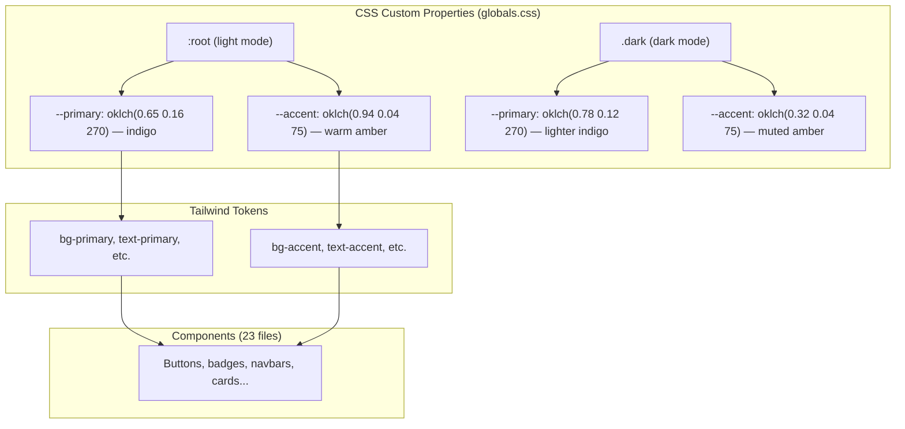

# Feature: Visual Refresh — Indigo + Warm Accent Theme (F44)

**Date Implemented**: 2026-04-05
**Status**: Complete
**Related ADRs**: ADR-024

## Overview

Complete color palette overhaul from the default neutral gray (shadcn/ui default) to an **indigo + warm amber** theme. Affects all pages for both authenticated and unauthenticated users, in both light and dark modes. The goal is a look that is elegant, youthful, and modern — suitable for an alumni network targeting young professionals.

## Architecture

### Color System

### Palette Summary

#### Light Mode (hue 270 — indigo)

| Token | Value | Purpose |
|-------|-------|---------|
| `--primary` | `oklch(0.65 0.16 270)` | Buttons, links, active states |
| `--primary-foreground` | `oklch(0.99 0 0)` | Text on primary |
| `--accent` | `oklch(0.94 0.04 75)` | Warm amber highlights |
| `--muted-foreground` | `oklch(0.45 0.03 270)` | Secondary text |
| `--border` | `oklch(0.92 0.012 270)` | Subtle indigo-tinted borders |
| `--background` | `oklch(0.995 0.002 270)` | Near-white with indigo tint |

#### Dark Mode

| Token | Value | Purpose |
|-------|-------|---------|
| `--primary` | `oklch(0.78 0.12 270)` | Lighter indigo for contrast |
| `--background` | `oklch(0.17 0.02 270)` | Deep indigo-tinted dark |
| `--accent` | `oklch(0.32 0.04 75)` | Muted warm amber |

#### Chart Colors (light / dark)

| Token | Light | Dark | Hue |
|-------|-------|------|-----|
| `--chart-1` | `oklch(0.68 0.14 270)` | `oklch(0.78 0.12 270)` | Indigo |
| `--chart-2` | `oklch(0.72 0.12 50)` | `oklch(0.78 0.10 50)` | Warm amber |
| `--chart-3` | `oklch(0.63 0.16 270)` | `oklch(0.72 0.14 270)` | Deep indigo |
| `--chart-4` | `oklch(0.70 0.10 300)` | `oklch(0.74 0.09 300)` | Purple |
| `--chart-5` | `oklch(0.74 0.12 35)` | `oklch(0.80 0.10 35)` | Warm orange |

## Key Files

| File | Purpose |
|------|---------|
| `src/app/globals.css` | All CSS custom properties (light + dark), gradient text, glassmorphism utility |
| `src/app/page.tsx` | Landing page — feature card gradient colors, button shadows |
| `src/app/(auth)/layout.tsx` | Auth pages — decorative gradient background with blurred orbs |
| 23 component files | Minor tweaks: rounded corners, backdrop blur, primary color hover states |

### Component Files Updated

- `connections/connections-tabs.tsx` — tab bar rounding, active state
- `connections/page.tsx` — page header
- `dashboard/dashboard-client.tsx` — section styling
- `dashboard/popular-card.tsx`, `recommendation-card.tsx` — card styling
- `directory/directory-empty-state.tsx`, `directory-filters.tsx`, `directory-grid.tsx`, `page.tsx` — filter and grid styling
- `groups/groups-empty-state.tsx`, `groups-grid.tsx`, `page.tsx` — group cards
- `messages/[conversationId]/page.tsx`, `conversation-list.tsx`, `page.tsx` — message UI
- `notifications/notification-item.tsx`, `notifications-page-client.tsx` — notification cards
- `profile/[id]/page.tsx` — profile view
- `settings/settings-nav.tsx` — settings navigation
- `verification/page.tsx` — verification status
- `navbar/admin-navbar.tsx`, `main-navbar-client.tsx` — navigation bars

## Custom CSS Utilities

### `.landing-gradient-text`
Gradient text flowing from indigo → violet → warm amber. Used for the hero accent text on the landing page.

### `.glass-card`
Glassmorphism effect with `backdrop-filter: blur(20px)` and semi-transparent background. Has both light and dark mode variants.

## Design Decisions

- **Indigo (hue 270)** chosen over pure blue (240) for a richer, more distinctive feel — avoids looking like every other SaaS product.
- **Warm amber accent (hue 75)** provides visual warmth and contrast against the cool indigo, making the palette feel approachable rather than cold.
- **oklch color space** used throughout for perceptually uniform lightness — ensures consistent contrast ratios across hues.
- **Lighter primary (`0.65` lightness)** chosen after user feedback that the initial deeper indigo (`0.55`) was too dark and hard to see.
- **Feature card icons** use individual color gradients (indigo, purple, emerald, teal, amber, rose) for visual variety while staying harmonious with the indigo base.

## Future Considerations

- OG image should use the indigo palette for brand consistency
- If a design system or component library is formalized, extract these tokens into a shared config
- Consider adding a warm accent color button variant for CTAs that need to stand out from the primary indigo
